## Table of Contents
- [Table of Contents](#table-of-contents)
- [IAM User 생성 및 콘솔 접속](#iam-user-생성-및-콘솔-접속)
  - [1. IAM User 생성](#1-iam-user-생성)
  - [2. IAM User 이용 AWS Management Console 접속 테스트](#2-iam-user-이용-aws-management-console-접속-테스트)
  - [3. IAM User 권한 테스트](#3-iam-user-권한-테스트)
- [Access key \& Secret key 생성 및 사용](#access-key--secret-key-생성-및-사용)
  - [1. Windows AWS CLI 설치](#1-windows-aws-cli-설치)
  - [2. IAM User ReadOnlyAccess 권한 할당](#2-iam-user-readonlyaccess-권한-할당)
  - [3. Access key \& Secret key 생성](#3-access-key--secret-key-생성)
  - [4. Access key \& Secret key 설정 및 테스트](#4-access-key--secret-key-설정-및-테스트)

## IAM User 생성 및 콘솔 접속

### 1. IAM User 생성

- **IAM 메인 콘솔 화면으로 이동**

    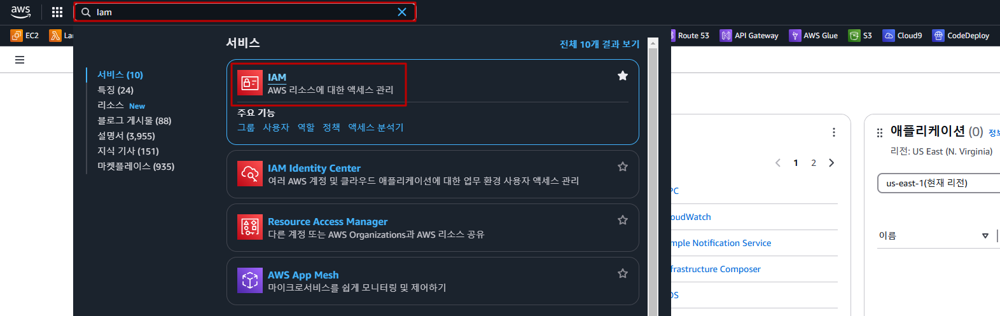

- `사용자` 리소스 탭으로 이동

    

- `사용자 생성` 버튼 클릭

    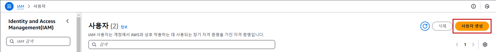

- IAM User 생성 정보 입력

    - 이름: lab-edu-iam-user-01

    - `AWS Management Console에 대한 사용자 액세스 권한 제공` 체크

    - `IAM 사용자를 생성하고 싶음` 선택

    - `사용자 지정 암호` 선택 → Password 입력

    - `사용자는 다음 로그인 시 새 암호를 생성해야 합니다 - 권장` 체크 해제 → `다음` 버튼 클릭

        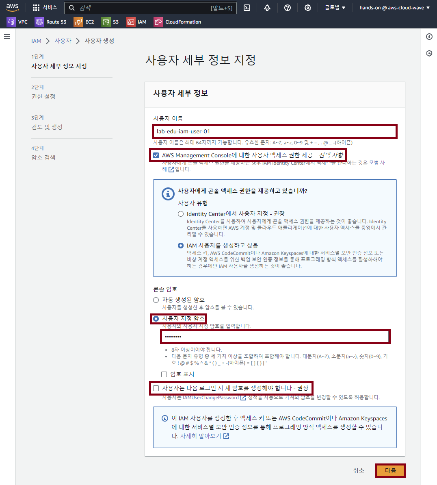

    - `직접 정책 연결` 선택 → 검색 창에 `AdministratorAccess` 입력 → `AdministratorAccess` 체크 → `다음` 버튼 클릭

        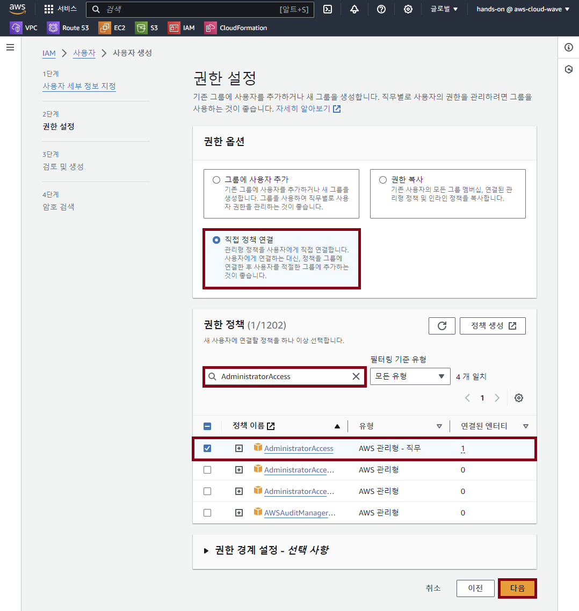

    - `사용자 생성` 버튼 클릭

### 2. IAM User 이용 AWS Management Console 접속 테스트

- **콘솔 화면 우측 상단 계정이름 클릭 → `계정 ID 복사` 버튼 클릭**

    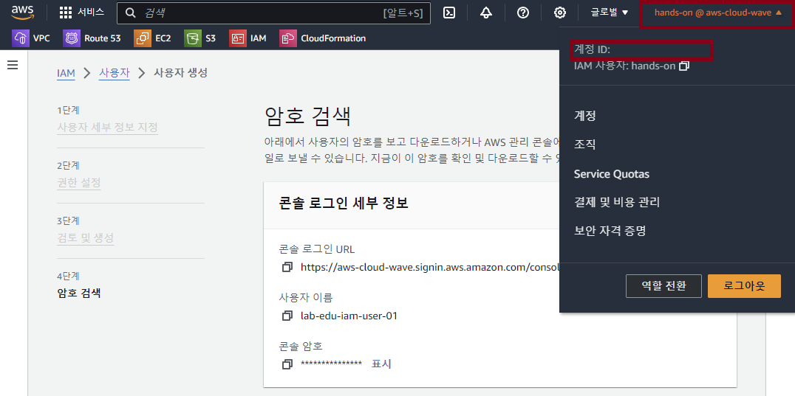

- 웹 브라우저 시크릿 모드 실행 (브라우저 화면에서 `Ctrl + Shift + n` 입력)

    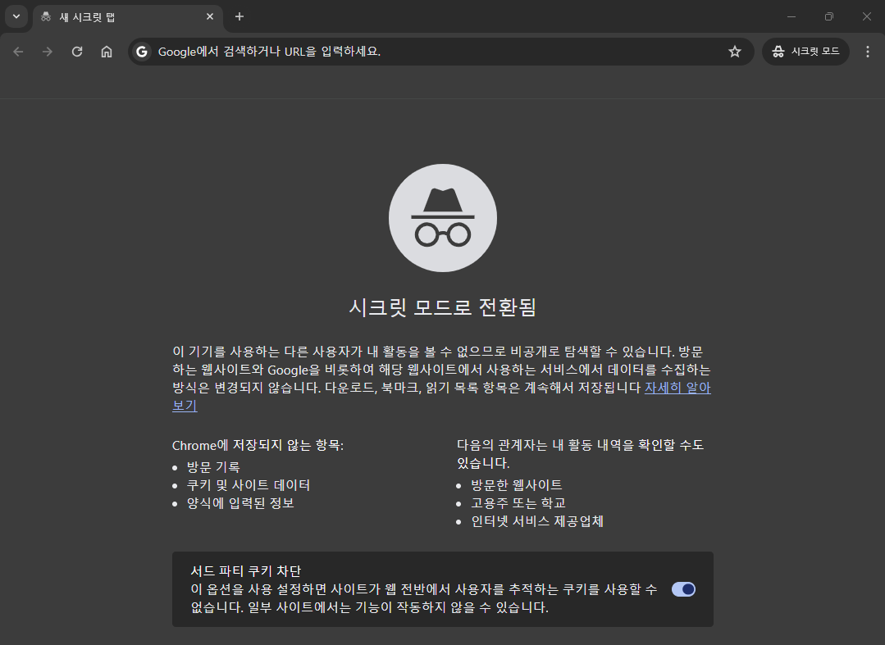

- **AWS 웹 사이트 *(https://aws.amazon.com/ko)* → 로그인 화면 이동**

    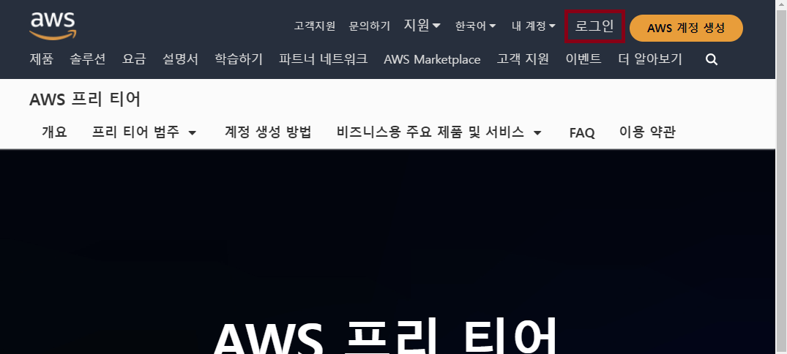

- 로그인 정보 입력

    - 계정 ID: 97********00 (앞에서 복사한 계정 Account ID 값 입력)

    - 사용자 이름: lab-edu-iam-user-01

    - 암호: ***PASSWORD*** (자신이 설정한 패스워드 입력)

    - `로그인` 버튼 클릭

        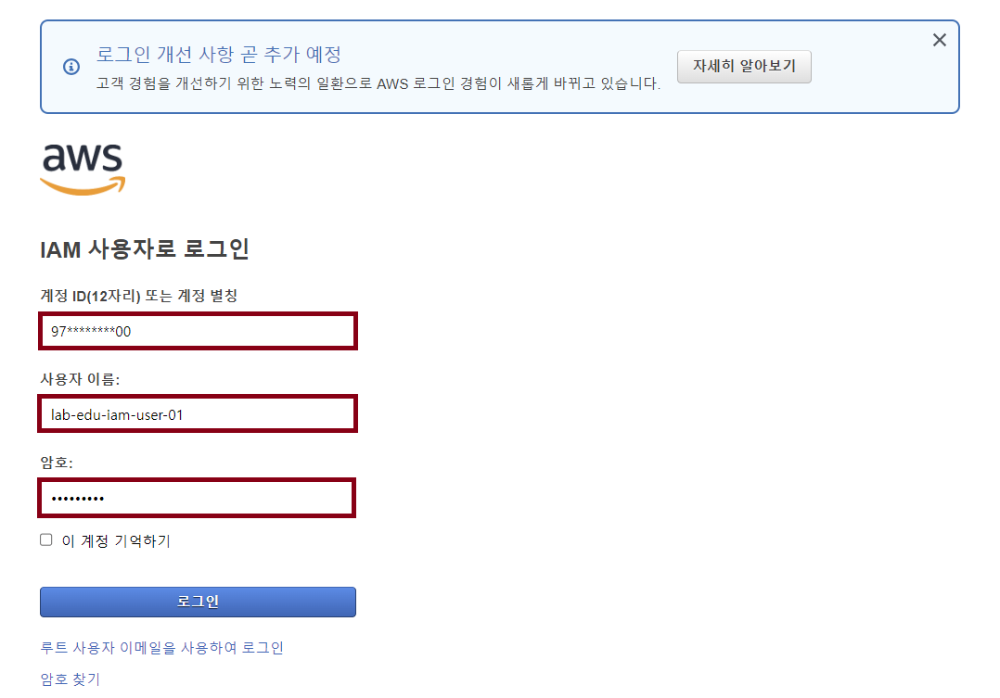

### 3. IAM User 권한 테스트

  > 💡 **현재 상태에서 EC2, VPC, IAM 등 콘솔 화면을 접속해서 리소스 목록들이 보이는지 확인**

- **IAM 메인 콘솔 화면 → 사용자 리소스 탭 → `lab-edu-iam-user-01` 클릭**

    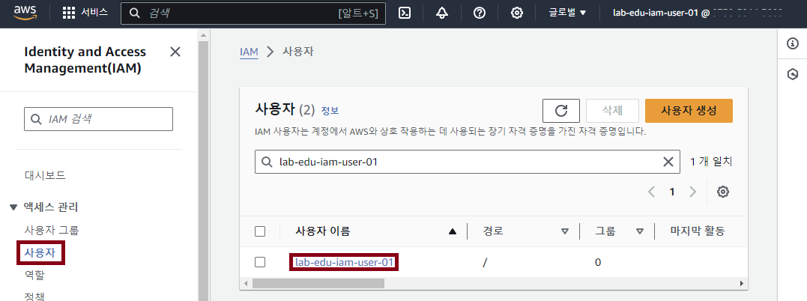

- **`AdministratorAccess` 체크박스 활성화 → `제거` 버튼 클릭 → `정책 제거` 버튼 클릭**

    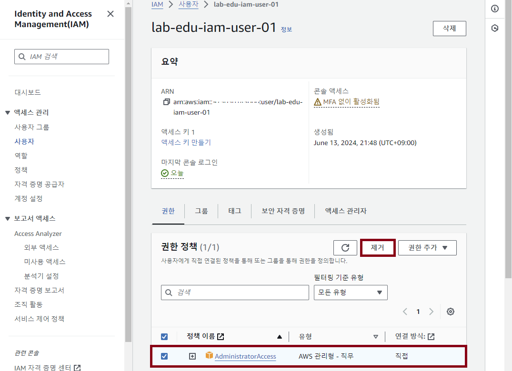

- EC2 메인 콘솔 화면으로 이동하여 리소스 정보 확인 ***(※ 권한이 없기 때문에 API 오류 발생)***

    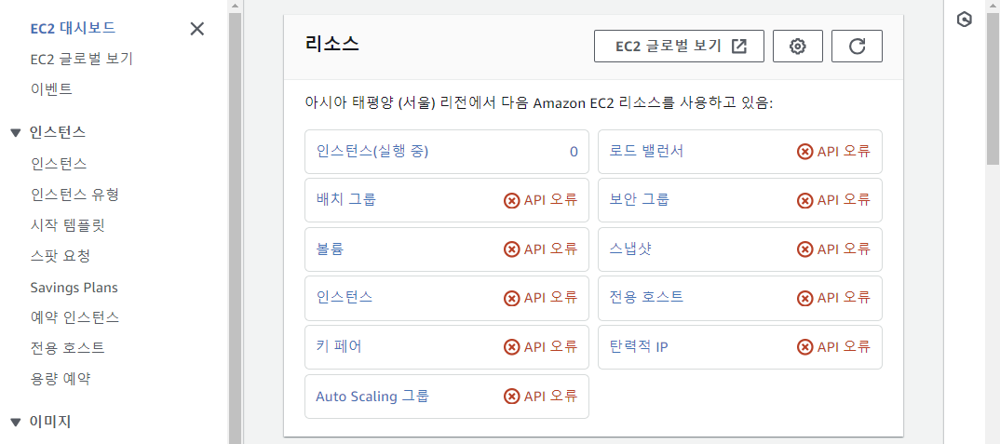

- 웹 브라우저 `시크릿 모드` 창을 닫고 원래 브라우저 창에서 다음 작업 이어서 진행

<br>


## Access key & Secret key 생성 및 사용

### 1. Windows AWS CLI 설치

- 웹 브라우저 검색 창에 "Windows AWS CLI install" 입력 → AWS CLI 설치 Documents 페이지 접속 *([AWS CLI 설치 페이지 링크](https://docs.aws.amazon.com/ko_kr/cli/latest/userguide/getting-started-install.html#getting-started-install-instructions))*

    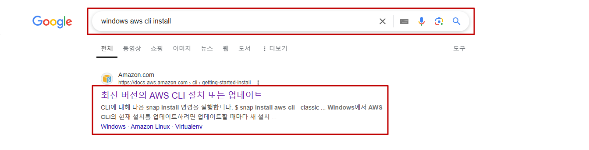

- `Windows` 클릭 → MSI 설치 관리자 다운로드

    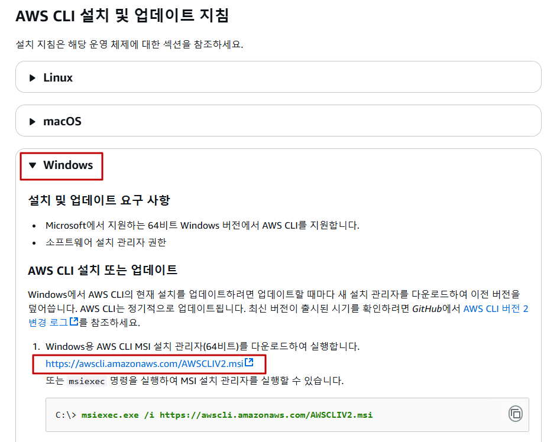

- 설치된 MSI 프로그램 실행 → `Next` 클릭 

    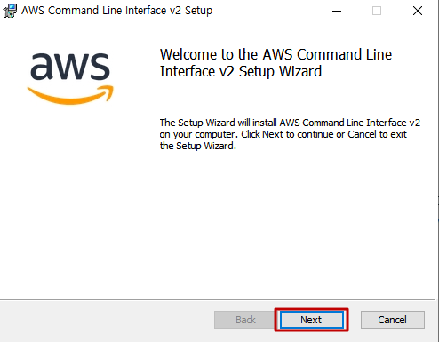

- `I accept the terms in the License Agreement` 체크 → `Next` 클릭 → `Next` 클릭 → `Install` 클릭

    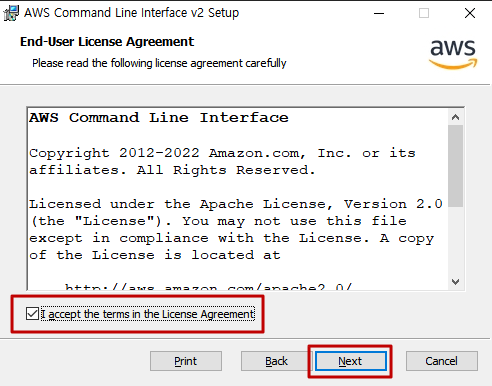

- 설치 완료 후 `CMD` 창 실행 → `aws --version` 명령어 실행

    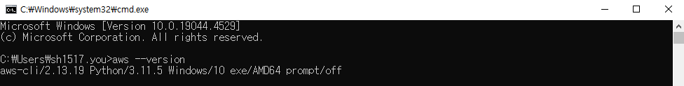

### 2. IAM User ReadOnlyAccess 권한 할당

- **IAM 메인 콘솔 화면 → 사용자 리소스 탭 → `lab-edu-iam-user-01` 클릭**

- `다음` 버튼 클릭 → `권한 추가` 버튼 클릭
  
    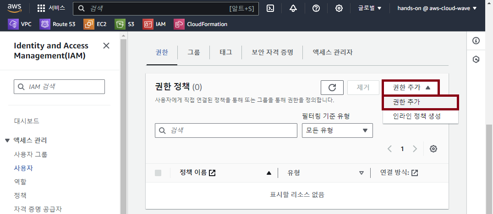

- `ReadOnlyAccess` 검색 → 필터링 기준 유형: `AWS 관리형 - 직무` 선택 → `ReadOnlyAccess` 권한 선택 → `다음` 버튼 클릭 → `권한 추가` 버튼 클릭

### 3. Access key & Secret key 생성

- **`보안 자격 증명` 탭으로 이동 → `액세스 키 만들기` 버튼 클릭**

    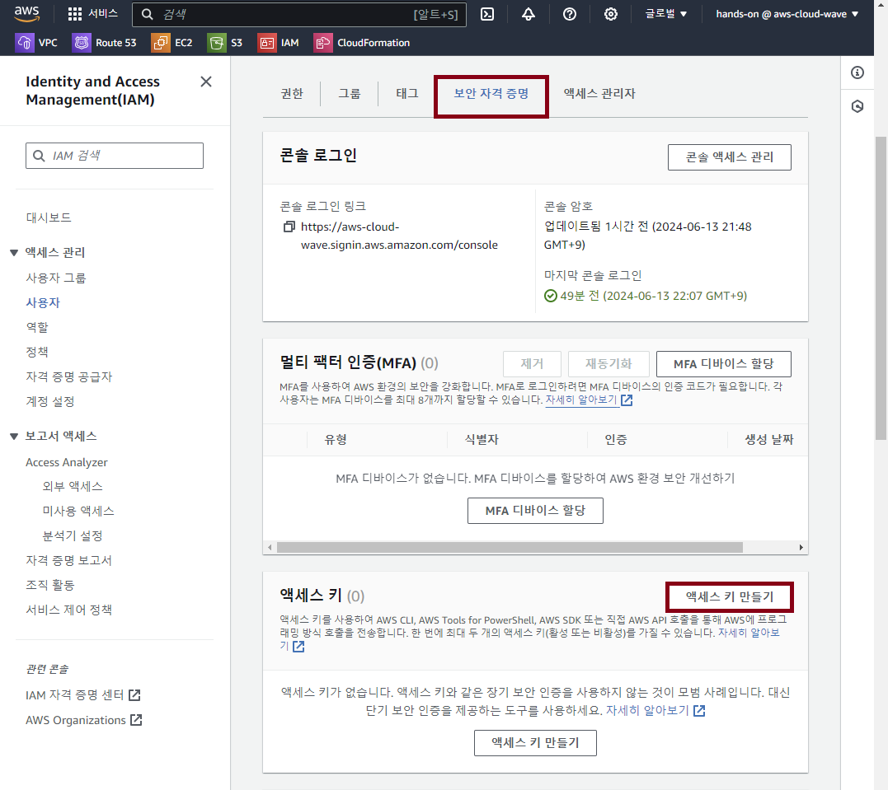

- `Command Line Interface (CLI)` 선택 → `위의 권장 사항을 이해했으며 액세스 키 생성을 계속하려고 합니다` 체크 → `다음` 버튼 클릭 

    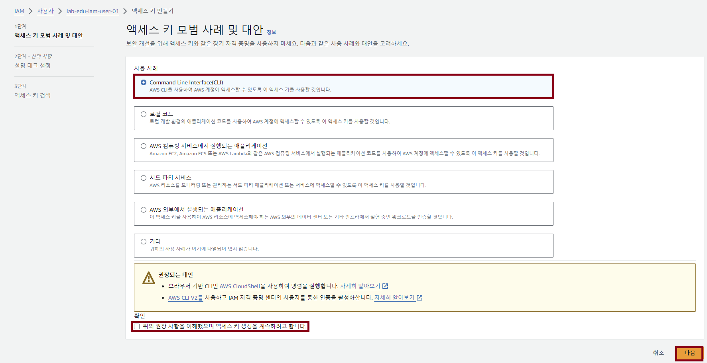

- `액세스 키 만들기` 버튼 클릭 

- `표시` 버튼 클릭 → Access key & Secret key 메모장에 저장 ***(※ 해당 페이지 이탈 후 다시 확인이 불가능하기 때문에 별도 저장 필요)***

    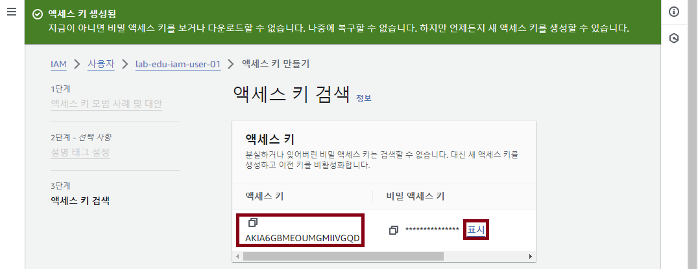

### 4. Access key & Secret key 설정 및 테스트

- `CMD` 창 실행 → `aws configure` 명령어 실행 → 설정 정보 입력

    - AWS Access Key ID : 메모장에 저장한 Access key

    - AWS Secret Access Key : 메모장에 저장한 Secret key

    - Default region name : ap-northeast-2

    - Default output format : json

        ```cmd
        C:\Users\sh1517.you> aws configure
        AWS Access Key ID [None]: AKI**************GQD
        AWS Secret Access Key [None]: cLu************************************vlo
        Default region name [None]: ap-northeast-2
        Default output format [None]: json
        ```

- Access & Secret Key 적용 여부 확인 → `aws sts get-caller-identity` 명령어 실행

    ```cmd
    C:\Users\sh1517.you> aws sts get-caller-identity
    ```
    
    ```cmd
    {
        "UserId": "AIDA6GBMEOUMBPJ5ZUVFO",
        "Account": "97********00",
        "Arn": "arn:aws:iam::97********00:user/lab-edu-iam-user-01"
    }
    ```

- Access & Secret Key에 할당된 권한 테스트 → `aws iam list-users --output table` 명령어 실행

    ```cmd
    C:\Users\sh1517.you> aws iam list-users --output table
    ----------------------------------------------------------------------------------------------------------------------------------------------------------------------------
    |                                                                                 ListUsers                                                                                |
    +--------------------------------------------------------------------------------------------------------------------------------------------------------------------------+
    ||                                                                                  Users                                                                                 ||
    |+-----------------------------------------------------+----------------------------+----------------------------+-------+------------------------+-----------------------+|
    ||                         Arn                         |        CreateDate          |     PasswordLastUsed       | Path  |        UserId          |       UserName        ||
    |+-----------------------------------------------------+----------------------------+----------------------------+-------+------------------------+-----------------------+|
    ||  arn:aws:iam::************:user/hands-on            |  2023-11-06T12:40:50+00:00 |  2025-01-06T01:38:07+00:00 |  /    |  AIDAYYN5TATBEGRKUNROA |  hands-on             ||
    ||  arn:aws:iam::************:user/lab-edu-iam-user-01 |  2024-12-20T06:23:38+00:00 |                            |  /    |  AIDAYYN5TATBP6KU7FGHE |  lab-edu-iam-user-01  ||
    |+-----------------------------------------------------+----------------------------+----------------------------+-------+------------------------+-----------------------+|
    ```

- IAM User 생성 명령어 실행

    ```cmd
    C:\Users\sh1517.you> aws iam create-user --user-name lab-edu-iam-user-02

    An error occurred (AccessDenied) when calling the CreateUser operation: User: arn:aws:sts::************:assumed-role/ec2-role-ssmcore/i-0983cd2eb3b997eb4 is not authorized to perform: iam:CreateUser on resource: arn:aws:iam::************:user/lab-edu-iam-user-02 because no identity-based policy allows the iam:CreateUser action
    ```