## Table of Contents
- [Table of Contents](#table-of-contents)
- [Network Baseline 생성 정보](#network-baseline-생성-정보)
- [VPC 생성](#vpc-생성)
  - [1. VPC 메인 콘솔 화면으로 이동](#1-vpc-메인-콘솔-화면으로-이동)
  - [2. VPC 리소스 탭으로 이동](#2-vpc-리소스-탭으로-이동)
  - [3. VPC 생성 버튼 클릭](#3-vpc-생성-버튼-클릭)
  - [4. VPC 생성 정보 입력](#4-vpc-생성-정보-입력)
- [Subnet 생성](#subnet-생성)
  - [1. Subnet 리소스 탭으로 이동](#1-subnet-리소스-탭으로-이동)
  - [2. "Subnet 생성" 버튼 클릭](#2-subnet-생성-버튼-클릭)
  - [3. Subnet 생성 정보 입력](#3-subnet-생성-정보-입력)
  - [4. Public Subnet 추가 설정](#4-public-subnet-추가-설정)
- [Routing Table 설정](#routing-table-설정)
  - [1. Public \& Private Routing Table 생성](#1-public--private-routing-table-생성)
  - [2. Public/Private Routing Table → Subnet associations 설정](#2-publicprivate-routing-table--subnet-associations-설정)
- [Internet Gateway 생성](#internet-gateway-생성)
  - [1. Internet Gateway 리소스 탭으로 이동](#1-internet-gateway-리소스-탭으로-이동)
  - [2. Internet Gateway 생성 정보 입력](#2-internet-gateway-생성-정보-입력)
  - [3. Internet Gateway → VPC 할당](#3-internet-gateway--vpc-할당)
  - [4. Public Routing Table에 Internet Gateway 경로 추가](#4-public-routing-table에-internet-gateway-경로-추가)
- [Nat Gateway 생성](#nat-gateway-생성)
  - [1. Nat Gateway 리소스 탭으로 이동 → `Nat Gateway 생성` 버튼 클릭](#1-nat-gateway-리소스-탭으로-이동--nat-gateway-생성-버튼-클릭)
  - [2. Private Routing Table 01에 NAT Gateway 경로 추가](#2-private-routing-table-01에-nat-gateway-경로-추가)

## Network Baseline 생성 정보

- **네트워크 자원 명세서:** 서울 리전 네트워크 리소스 생성 정보

    |     Region     |     VPC_Name      |    CIDR     |    Subnet_Name     |     CIDR     | Routing_Table_Name |
    | :------------: | :---------------: | :---------: | :----------------: | :----------: | :----------------: |
    | ap-northeast-2 | lab-edu-vpc-ap-01 | 10.0.0.0/16 | lab-edu-sub-pub-01 | 10.0.0.0/24  |  lab-edu-rtb-pub   |
    |                |                   |             | lab-edu-sub-pub-02 | 10.0.1.0/24  |  lab-edu-rtb-pub   |
    |                |                   |             | lab-edu-sub-pri-01 | 10.0.40.0/24 | lab-edu-rtb-pri-01 |
    |                |                   |             | lab-edu-sub-pri-02 | 10.0.41.0/24 | lab-edu-rtb-pri-02 |

- **라우팅 테이블 명세서**

    |     Table_Name     |            Assosiate Subnet            | Destination |             Target             |
    | :----------------: | :------------------------------------: | :---------: | :----------------------------: |
    |  lab-edu-rtb-pub   | lab-edu-sub-pub-01, lab-edu-sub-pub-02 | 10.0.0.0/16 |             Local              |
    |                    |                                        |  0.0.0.0/0  |    lab-edu-igw-ap (igw id)     |
    | lab-edu-rtb-pri-01 |           lab-edu-sub-pri-01           | 10.0.0.0/16 |             Local              |
    |                    |                                        |  0.0.0.0/0  | lab-edu-natgw-ap-01 (natgw id) |
    | lab-edu-rtb-pri-02 |           lab-edu-sub-pri-02           | 10.0.0.0/16 |             Local              |

 

## VPC 생성
### 1. VPC 메인 콘솔 화면으로 이동

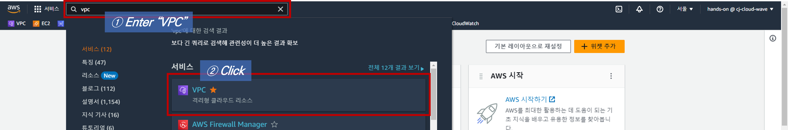

### 2. VPC 리소스 탭으로 이동

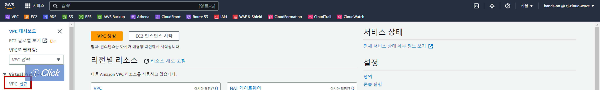

### 3. VPC 생성 버튼 클릭

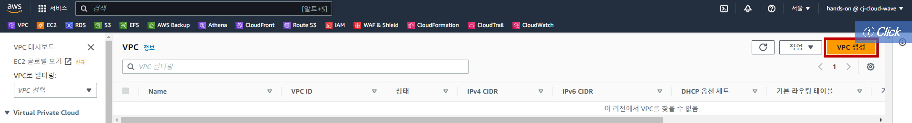

### 4. VPC 생성 정보 입력

- **생성할 리소스:** VPC만

- **이름 태그:** lab-edu-vpc-ap-01

- **IPv4 CIDR:** 10.0.0.0/16

    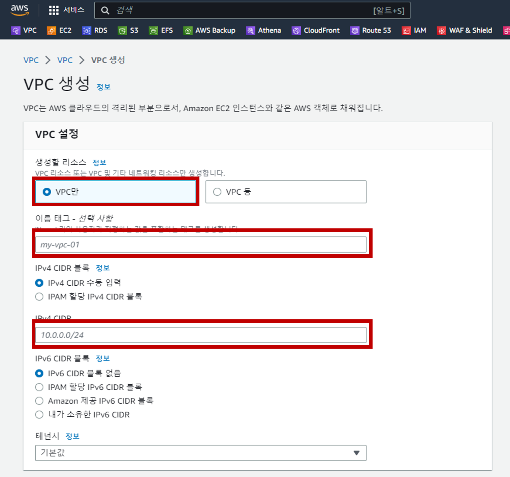

 

## Subnet 생성

### 1. Subnet 리소스 탭으로 이동

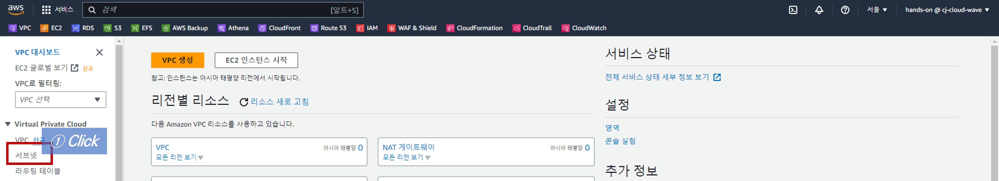

### 2. "Subnet 생성" 버튼 클릭

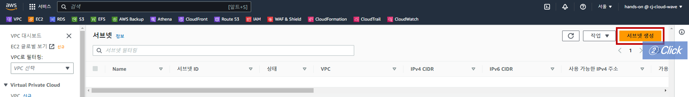

### 3. Subnet 생성 정보 입력

- 아래 서브넷 자원 명세서를 참고하여 생성 정보 입력

- 화면 하단의 `서브넷 추가` 버튼 이용 여러 개의 서브넷 정보 동시 입력 가능 

    |                   |  Public Subnet 01  |  Public Subnet 02  | Private Subnet 01  | Private Subnet 02  |
    | :---------------: | :----------------: | :----------------: | :----------------: | :----------------: |
    |      VPC_ID       | leb-edu-vpc-ap-01  | leb-edu-vpc-ap-01  | leb-edu-vpc-ap-01  | leb-edu-vpc-ap-01  |
    |    Subnet_Name    | lab-edu-sub-pub-01 | lab-edu-sub-pub-02 | lab-edu-sub-pri-01 | lab-edu-sub-pri-02 |
    | Availability_Zone |  ap-northeast-2a   |  ap-northeast-2c   |  ap-northeast-2a   |  ap-northeast-2c   |
    |     IPv4 CIDR     |    10.0.0.0/24     |    10.0.1.0/24     |    10.0.40.0/24    |    10.0.41.0/24    |

    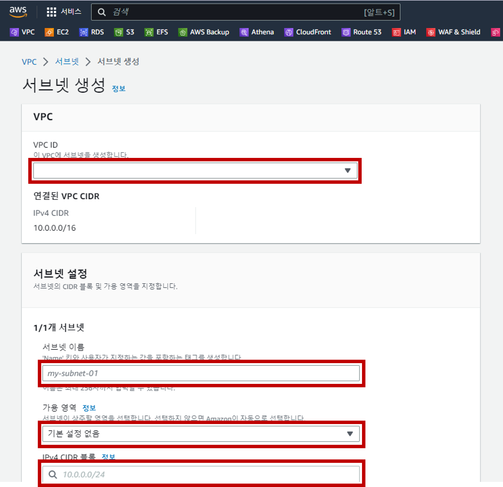

### 4. Public Subnet 추가 설정

> Public Subnet에 새로 생성되는 EC2 인스턴스에 자동으로 퍼블릭 IPv4 주소가 할당하기 위한 설정

- **Subnet 리소스 탭 → `lab-edu-sub-pub-01` 선택 → `작업` 버튼 클릭 → `서브넷 설정 편집` 버튼 클릭 → `퍼블릭 IPv4 주소 지정 할당` 활성화 → 저장**

- **`lab-edu-sub-pub-02` 서브넷도 동일하게 설정**

    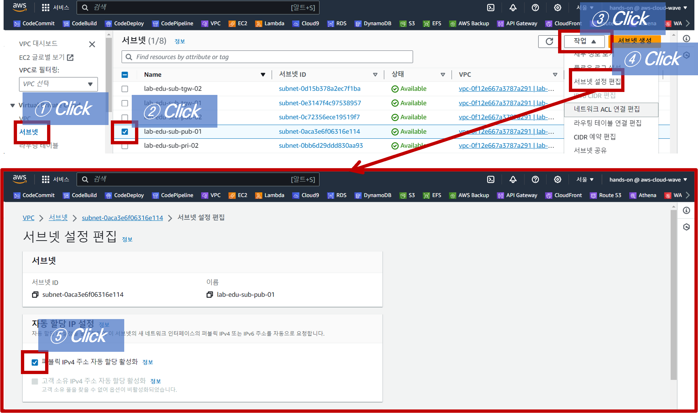

 

## Routing Table 설정

### 1. Public & Private Routing Table 생성

- 아래 라우팅 테이블 명세서를 참고하여 생성 정보 입력

    |       | Public Routing Table | Private Routing Table 01 | Private Routing Table 02 |
    | :---: | :------------------: | :----------------------: | :----------------------: |
    | Name  |   lab-edu-rtb-pub    |    lab-edu-rtb-pri-01    |    lab-edu-rtb-pri-02    |
    |  VPC  |  lab-edu-vpc-ap-01   |    lab-edu-vpc-ap-01     |    lab-edu-vpc-ap-01     |

    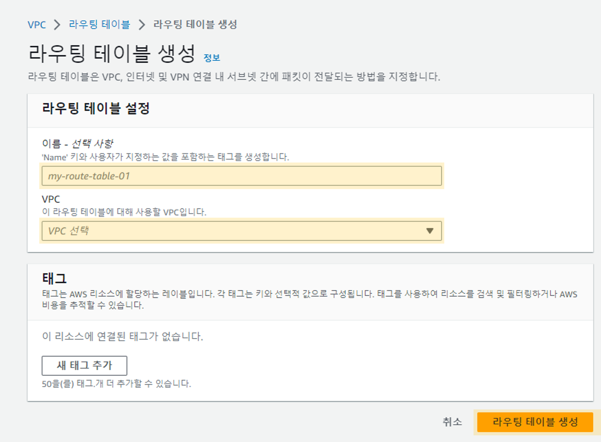

### 2. Public/Private Routing Table → Subnet associations 설정

- 아래 라우팅 테이블 명세서를 참고하여 각 서브넷을 해당 라우팅 테이블에 할당

    | routing table  | Public Routing Table | Private Routing Table 01 | Private Routing Table 02 |
    | :------------: | :------------------: | :----------------------: | :----------------------: |
    |   table name   |   lab-edu-rtb-pub    |    lab-edu-rtb-pri-01    |    lab-edu-rtb-pri-02    |
    | subnet name 01 |  lab-edu-sub-pub-01  |    lab-edu-sub-pri-01    |    lab-edu-sub-pri-02    |
    | subnet name 02 |  lab-edu-sub-pub-02  |            -             |            -             |

- **라우팅 테이블 리소스 탭 → `lab-edu-rtb-pub` 선택 → `서브넷 연결` 탭 선택 (화면 하단) → `서브넷 연결 편집` 버튼 클릭**

    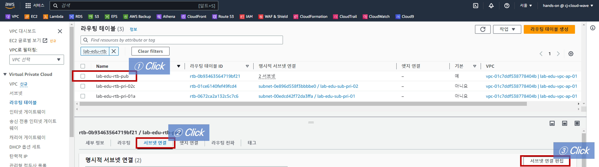

- **`lab-edu-sub-pub-01`, `lab-edu-sub-pub-02` 선택 → `연결 저장` 버튼 클릭**

    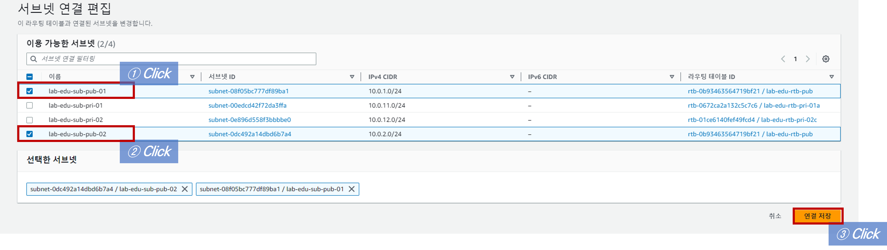

- **라우팅 테이블 리소스 탭 → `lab-edu-rtb-pri-01` 선택 → `서브넷 연결` 탭 선택 (화면 하단) → `서브넷 연결 편집` 버튼 클릭**

    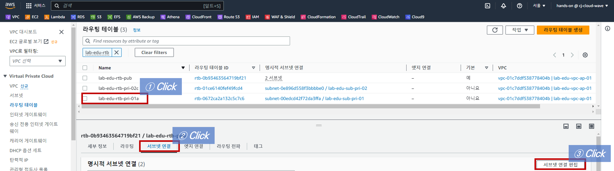

- **`lab-edu-sub-pri-01` 선택 → `연결 저장` 버튼 클릭**

    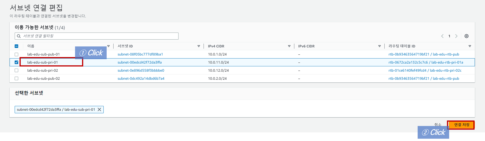

- **라우팅 테이블 리소스 탭 → `lab-edu-rtb-pri-02` 선택 → `서브넷 연결` 탭 선택 (화면 하단) → `서브넷 연결 편집` 버튼 클릭**

- **`lab-edu-sub-pri-02` 선택 → `연결 저장` 버튼 클릭**

 

## Internet Gateway 생성

### 1. Internet Gateway 리소스 탭으로 이동

- **인터넷 게이트웨이 리소스 탭 → `인터넷 게이트웨이 생성` 버튼 클릭**

    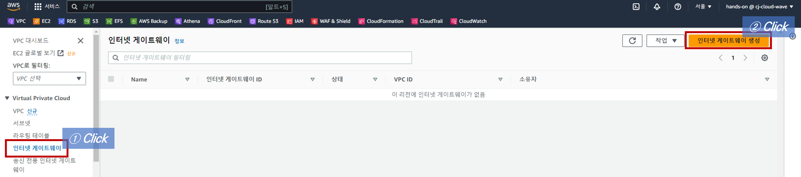

### 2. Internet Gateway 생성 정보 입력

- 인터넷 게이트웨이 이름: lab-edu-igw-ap

- VPC: lab-edu-vpc-ap-01

    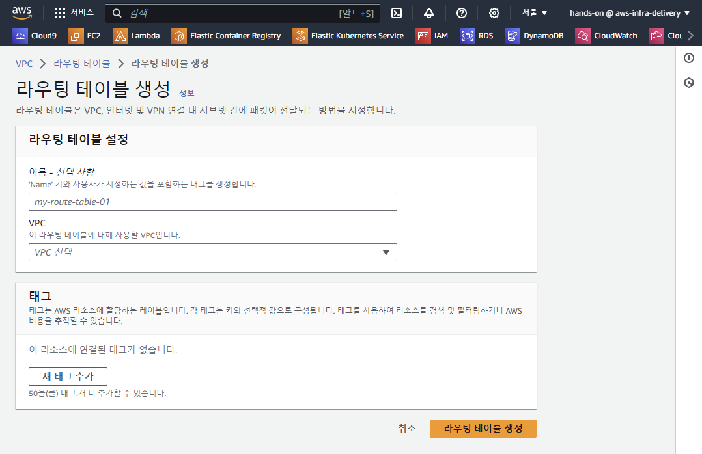

### 3. Internet Gateway → VPC 할당

- **Internet Gateway 세부 정보 화면 → 우측 상단 `작업` 버튼 클릭 → `VPC에 연결` 버튼 클릭**

- **사용 가능한 VPC 선택: `lab-edu-vpc-ap-01` → `인터넷 게이트웨이 연결` 버튼 클릭**

    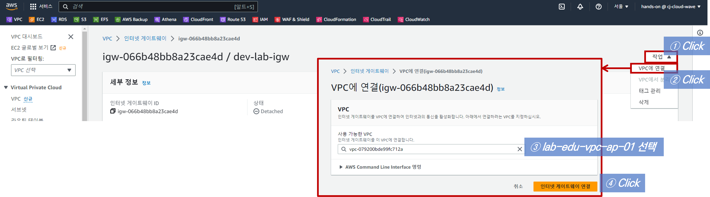

### 4. Public Routing Table에 Internet Gateway 경로 추가

- **`lab-edu-rtb-pub` 선택 → `라우팅` 탭 클릭(화면 하단) → `라우팅 편집` 버튼 클릭**

    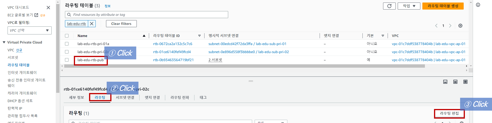

- 라우팅 경로 생성 정보 입력

    - `라우팅 추가` 버튼 클릭

    - 대상: 0.0.0.0/0

    - 대상: `internet gateway` 선택 → `lab-edu-igw-ap` 선택

    - `변경 사항 저장` 버튼 클릭

        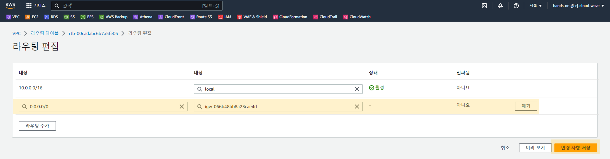

 

## Nat Gateway 생성

### 1. Nat Gateway 리소스 탭으로 이동 → `Nat Gateway 생성` 버튼 클릭

- Nat Gateway 생성 정보 입력

    - 이름: lab-edu-natgw-01

    - 서브넷: lab-edu-sub-pub-01 (Nat Gateway를 설치할 서브넷)

    - `탄력적 IP 할당` 버튼 클릭

        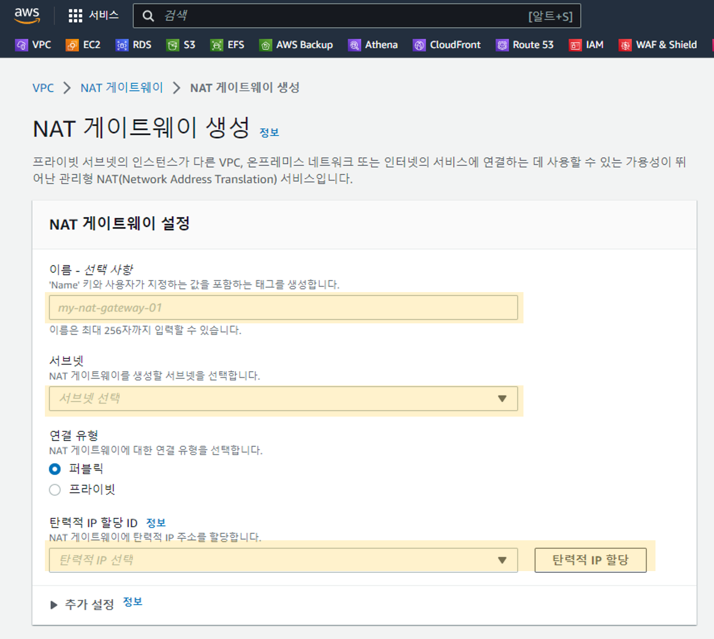

### 2. Private Routing Table 01에 NAT Gateway 경로 추가

> NAT Gateway 경로를 `lab-edu-rtb-pri-01` 에만 추가해서 의도적으로 `lab-edu-rtb-pri-02`에서는 인터넷 연결이 되지 않는 환경을 구성한다.

- **`lab-edu-rtb-pri-01` 선택 → `라우팅` 탭 클릭(화면 하단) → `라우팅 편집` 버튼 클릭**

    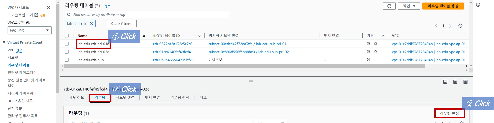

- 라우팅 경로 생성 정보 입력

    - `라우팅 추가` 버튼 클릭

    - 대상: 0.0.0.0/0

    - 대상: `NAT Gateway` 선택 → `lab-edu-natgw-01` 선택

    - `변경 사항 저장` 버튼 클릭

        

 