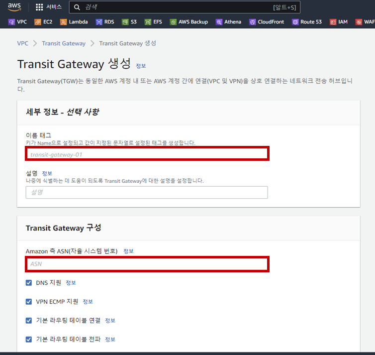
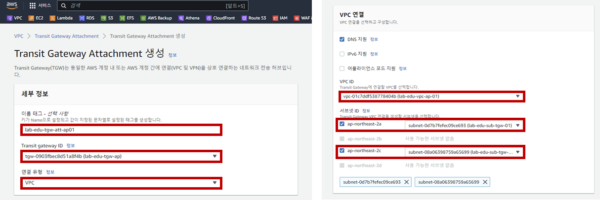
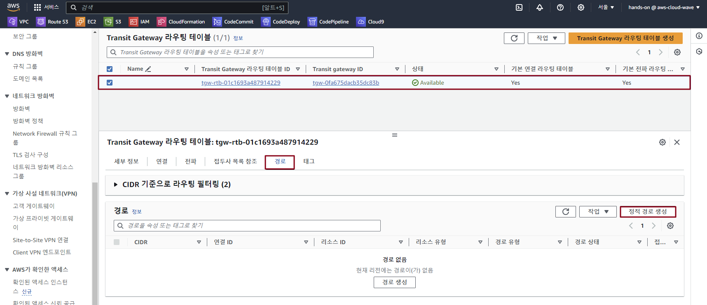

## Table of Contents
- [Table of Contents](#table-of-contents)
- [서울 리전 VPC 01 ↔ VPC 02 연동을 위한 Transit Gateway 설정](#서울-리전-vpc-01--vpc-02-연동을-위한-transit-gateway-설정)
  - [1. Transit Gateway 생성](#1-transit-gateway-생성)
  - [2. Transit Gateway Attachment 생성 (1/2)](#2-transit-gateway-attachment-생성-12)
  - [3. Transit Gateway Attachment 생성 (2/2)](#3-transit-gateway-attachment-생성-22)
  - [4. Transit Gateway Routing Table 설정](#4-transit-gateway-routing-table-설정)
  - [5. VPC Routing Table 수정](#5-vpc-routing-table-수정)
  - [6. Network 통신 테스트](#6-network-통신-테스트)

## 서울 리전 VPC 01 ↔ VPC 02 연동을 위한 Transit Gateway 설정

### 1. Transit Gateway 생성

- **VPC 콘솔 메인 화면 → Transit Gateway 리소스 탭 → `Transit Gateway 생성` 버튼 클릭**

- Transit Gateway 생성 정보 입력

    - 이름: lab-edu-tgw-ap

    - Amazon ASN: 64512

    - `Transit Gateway 생성` 버튼 클릭

      

### 2. Transit Gateway Attachment 생성 (1/2)

- **VPC 콘솔 메인 화면 → Transit Gateway Attachment 리소스 탭 → `Transit Gateway Attachment 생성` 버튼 클릭**

- Transit Gateway Attachment 생성 정보 입력

    - 이름: lab-edu-tgw-att-ap01

    - Transit Gateway ID: lab-edu-tgw-ap

    - 연결 유형: VPC

    - VPC ID: lab-edu-vpc-ap-01

    - Subnet ID: 

        - ap-northeast-2a: lab-edu-sub-tgw-01

        - ap-northeast-2c: lab-edu-sub-tgw-02

    - `Transit Gateway Attachment 생성` 버튼 클릭

        
            
### 3. Transit Gateway Attachment 생성 (2/2)

- **VPC 콘솔 메인 화면 → Transit Gateway Attachment 리소스 탭 → `Transit Gateway Attachment 생성` 버튼 클릭**

- Transit Gateway Attachment 생성 정보 입력

    - 이름: lab-edu-tgw-att-ap02

    - Transit Gateway ID: lab-edu-tgw-ap

    - 연결 유형: VPC

    - VPC ID: lab-edu-vpc-ap-02

    - Subnet ID: 

        - ap-northeast-2a: lab-edu-sub-tgw-01

        - ap-northeast-2c: lab-edu-sub-tgw-02

    - `Transit Gateway Attachment 생성` 버튼 클릭

### 4. Transit Gateway Routing Table 설정

- **VPC 콘솔 메인 화면 → Transit Gateway 라우팅 테이블 리소스 탭 → `Routing Table` 선택**

- `경로` 탭 → `정적 경로 생성` 버튼 클릭

    

- 정적 경로 생성 정보 입력 → `정적 경로 생성` 버튼 클릭

    - CIDR: 10.10.0.0/16

    - 연결 선택: lab-edu-tgw-att-ap02

### 5. VPC Routing Table 수정

- **VPC 콘솔 메인 화면 → 라우팅 테이블 탭 → `lab-edu-rtb-pri-01` 선택 → `라우팅` 탭 → `라우팅 편집` 버튼 클릭**

- 라우팅 테이블 경로 생성 정보 입력

    - `라우팅 추가` 버튼 클릭

    - 대상: 10.10.0.0/16

    - 대상: Trangit Gateway (lab-edu-tgw-att-ap01)

    - `변경 사항 저장` 버튼 클릭

- **VPC 콘솔 메인 화면 → 라우팅 테이블 탭 → `lab-edu-rtb-2nd-pri-01` 선택 → `라우팅` 탭 → `라우팅 편집` 버튼 클릭**

- 라우팅 테이블 경로 생성 정보 입력

    - `라우팅 추가` 버튼 클릭

    - 대상: 10.0.0.0/16

    - 대상: Trangit Gateway (lab-edu-tgw-att-ap02)

    - `변경 사항 저장` 버튼 클릭

### 6. Network 통신 테스트

- **EC2 메인 콘솔 화면으로 이동 → 인스턴스 리소스 탭 → `lab-edu-ec2-network-2nd-ap` 선택 → Private IP 주소 복사**

- VS Code Terminal에서 ssh 명령을 통해 Web Server 접속

    ```bash
    ssh web-server
    ```

- ICMP 통신 테스트 진행

    ```bash
    ping {2ND_VPC_NETWORK_SERVER_PRIVATE_IP}
    PING 10.10.40.140 (10.10.40.140) 56(84) bytes of data.
    64 bytes from 10.10.40.140: icmp_seq=1 ttl=254 time=0.990 ms
    64 bytes from 10.10.40.140: icmp_seq=2 ttl=254 time=0.926 ms
    64 bytes from 10.10.40.140: icmp_seq=3 ttl=254 time=0.907 ms
    64 bytes from 10.10.40.140: icmp_seq=4 ttl=254 time=0.946 ms
    ```

<br>