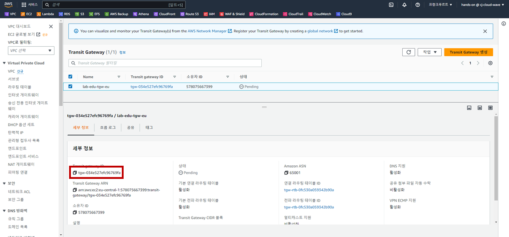
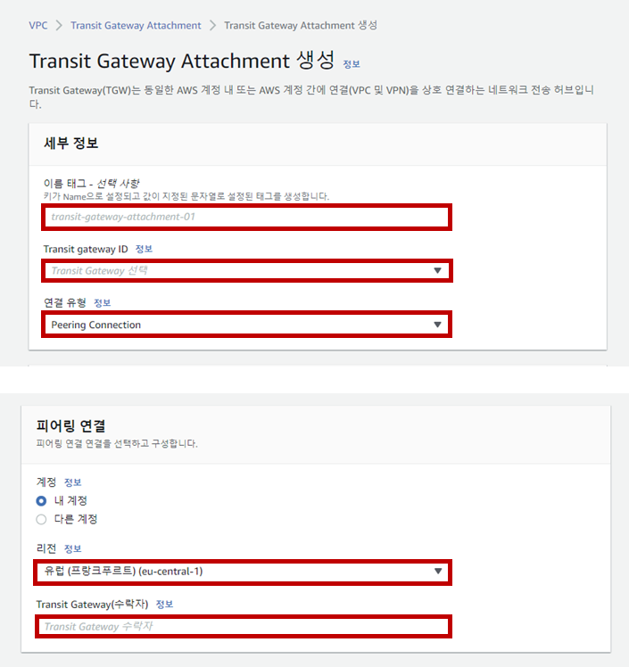
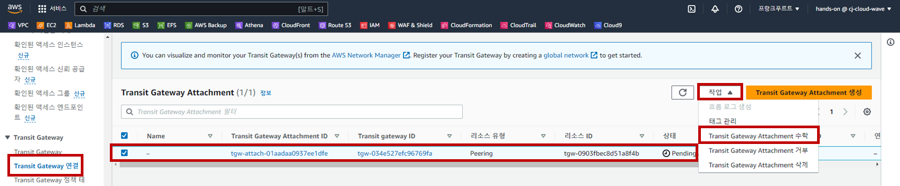

## Table of Contents
- [Table of Contents](#table-of-contents)
- [서울 리전 VPC 01 ↔ 프랑크푸르트 리전 VPC Transit Gateway Peering 설정](#서울-리전-vpc-01--프랑크푸르트-리전-vpc-transit-gateway-peering-설정)
  - [1. 프랑크푸르트 리전에 Transit Gateway 생성](#1-프랑크푸르트-리전에-transit-gateway-생성)
  - [2. 프랑크푸르트 리전 Transit Gateway Attachment 생성](#2-프랑크푸르트-리전-transit-gateway-attachment-생성)
  - [3. 서울 리전 Transit Gateway Attachment 생성](#3-서울-리전-transit-gateway-attachment-생성)
  - [4. 프랑크푸르트 리전 Transit Gateway Peering 수락](#4-프랑크푸르트-리전-transit-gateway-peering-수락)
  - [5. 서울 리전 Transit Gateway Routing Table 설정](#5-서울-리전-transit-gateway-routing-table-설정)
  - [6. 프랑크 프루트 리전 Transit Gateway Routing Table 설정](#6-프랑크-프루트-리전-transit-gateway-routing-table-설정)
  - [7. 서울 리전 VPC Routing Table 수정](#7-서울-리전-vpc-routing-table-수정)
  - [8. 프랑크푸르트 리전 VPC Routing Table 수정](#8-프랑크푸르트-리전-vpc-routing-table-수정)
  - [7. Network 통신 테스트](#7-network-통신-테스트)

## 서울 리전 VPC 01 ↔ 프랑크푸르트 리전 VPC Transit Gateway Peering 설정

### 1. 프랑크푸르트 리전에 Transit Gateway 생성

- **프랑크푸르트 리전으로 이동 → VPC 콘솔 메인 화면 → Transit Gateway 리소스 탭 → `Transit Gateway 생성` 버튼 클릭**

- Transit Gateway 생성 정보 입력

    - 이름: lab-edu-tgw-eu

    - Amazon ASN: 64513

    - `Transit Gateway 생성` 버튼 클릭

- Transit Gateway ID 정보 메모장에 저장

    

### 2. 프랑크푸르트 리전 Transit Gateway Attachment 생성

- **프랑크푸르트 리전으로 이동 → VPC 콘솔 메인 화면 → Transit Gateway Attachment 리소스 탭 → `Transit Gateway Attachment 생성` 버튼 클릭**

- Transit Gateway Attachment 생성 정보 입력

    - 이름: lab-edu-tgw-att-eu

    - Transit Gateway ID: lab-edu-tgw-eu

    - 연결 유형: VPC

    - VPC ID: lab-edu-vpc-eu-01

    - Subnet ID: 

        - ap-northeast-2a: lab-edu-sub-eu-tgw-01

        - ap-northeast-2c: lab-edu-sub-eu-tgw-02

    `Transit Gateway Attachment 생성` 버튼 클릭

### 3. 서울 리전 Transit Gateway Attachment 생성

- **서울 리전으로 이동 → VPC 콘솔 메인 화면 → Transit Gateway Attachment 리소스 탭 → `Transit Gateway Attachment 생성` 버튼 클릭**

- Transit Gateway Attachment 생성 정보 입력

    - 이름: lab-edu-tgw-att-peering-eu

    - Transit Gateway ID: lab-edu-tgw-ap

    - 연결 유형: Peering Connection

    - 리전: eu-central-1

    - Transit Gateway(수락자): {FRANKFURT_REGION_TRANGIT_GATEWAY_ID}

    - `Transit Gateway Attachment 생성` 버튼 클릭

        

### 4. 프랑크푸르트 리전 Transit Gateway Peering 수락

- **프랑크푸르트 리전으로 이동 → VPC 콘솔 메인 화면 → Transit Gateway Attachment 리소스 탭**

- `Peering Acceptance` 상태의 Attachmentment 선택 → 작업 → Transit Gateway Attachmentment 수락 → 수락

    

### 5. 서울 리전 Transit Gateway Routing Table 설정

- **서울 리전으로 이동 → VPC 콘솔 메인 화면 → Transit Gateway 라우팅 테이블 리소스 탭 → `Routing Table` 선택**

- `경로` 탭 → `정적 경로 생성` 버튼 클릭

- 정적 경로 생성 정보 입력 → `정적 경로 생성` 버튼 클릭

    - CIDR: 10.30.0.0/16

    - 연결 선택: lab-edu-tgw-att-peering-eu

### 6. 프랑크 프루트 리전 Transit Gateway Routing Table 설정

- **프랑크푸르트 리전으로 이동 → VPC 콘솔 메인 화면 → Transit Gateway 라우팅 테이블 리소스 탭 → `Routing Table` 선택**

- `경로` 탭 → `정적 경로 생성` 버튼 클릭

- 정적 경로 생성 정보 입력 → `정적 경로 생성` 버튼 클릭

    - CIDR: 10.0.0.0/16

    - 연결 선택: lab-edu-tgw-att-peering-eu

### 7. 서울 리전 VPC Routing Table 수정

- **서울 리전으로 이동 → VPC 콘솔 메인 화면 → 라우팅 테이블 탭 → `lab-edu-rtb-pri-01` 선택 → `라우팅` 탭 → `라우팅 편집` 버튼 클릭**

- 라우팅 테이블 경로 생성 정보 입력

    - `라우팅 추가` 버튼 클릭

    - 대상: 10.30.0.0/16

    - 대상: Trangit Gateway (lab-edu-tgw-att-ap01)

    - `변경 사항 저장` 버튼 클릭

### 8. 프랑크푸르트 리전 VPC Routing Table 수정

- **프랑크푸르트 리전으로 이동 → VPC 콘솔 메인 화면 → 라우팅 테이블 탭 → `lab-edu-rtb-eu-pri` 선택 → `라우팅` 탭 → `라우팅 편집` 버튼 클릭**

- 라우팅 테이블 경로 생성 정보 입력

    - `라우팅 추가` 버튼 클릭

    - 대상: 10.0.0.0/16

    - 대상: Trangit Gateway (lab-edu-tgw-att-eu)

    - `변경 사항 저장` 버튼 클릭

### 7. Network 통신 테스트

- **프랑크푸르트 리전으로 이동 → EC2 메인 콘솔 화면 → 인스턴스 리소스 탭 → `lab-edu-ec2-network-eu` 선택 → Private IP 주소 복사**

- VS Code Terminal에서 ssh 명령을 통해 Web Server 접속

    ```bash
    ssh web-server
    ```

- ICMP 통신 테스트 진행

    ```bash
    ping {FRANKFURT_REGION_NETWORK_SERVER_PRIVATE_IP}
    PING 10.30.40.56 (10.30.40.56) 56(84) bytes of data.
    64 bytes from 10.30.40.56: icmp_seq=1 ttl=252 time=241 ms
    64 bytes from 10.30.40.56: icmp_seq=2 ttl=252 time=240 ms
    64 bytes from 10.30.40.56: icmp_seq=3 ttl=252 time=239 ms
    64 bytes from 10.30.40.56: icmp_seq=4 ttl=252 time=239 ms
    ```
<br>