## Table of Contents
- [Table of Contents](#table-of-contents)
- [Bastion Server 생성](#bastion-server-생성)
  - [1. EC2 메인 콘솔 화면으로 이동](#1-ec2-메인-콘솔-화면으로-이동)
  - [2. EC2 인스턴스 설정 정보 입력 및 생성](#2-ec2-인스턴스-설정-정보-입력-및-생성)
- [Bastion Server 접속 테스트](#bastion-server-접속-테스트)
  - [1. Putty 다운로드](#1-putty-다운로드)
  - [2. KEY-PAIR 확장자 변경: pem → ppk](#2-key-pair-확장자-변경-pem--ppk)
  - [3. Putty 이용 Bastion 서버 접속](#3-putty-이용-bastion-서버-접속)

## Bastion Server 생성

### 1. EC2 메인 콘솔 화면으로 이동

- **인스턴스 리소스 탭 → `인스턴스 시작` 버튼 클릭**

    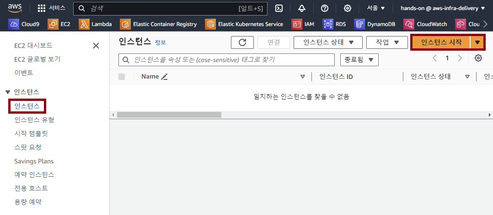

### 2. EC2 인스턴스 설정 정보 입력 및 생성

- 인스턴스 생성 정보 입력

    - **이름:** *lab-edu-ec2-bastion*

    - **AMI:** *Amazon Linux 2023*

    - **인스턴스 유형:** *t3.micro*

    - **키 페어:** `새 키 페어 생성` 버튼 클릭 → 키 페어 이름 입력: *lab-edu-key-ec2* → `키 페어 생성` 버튼 클릭

        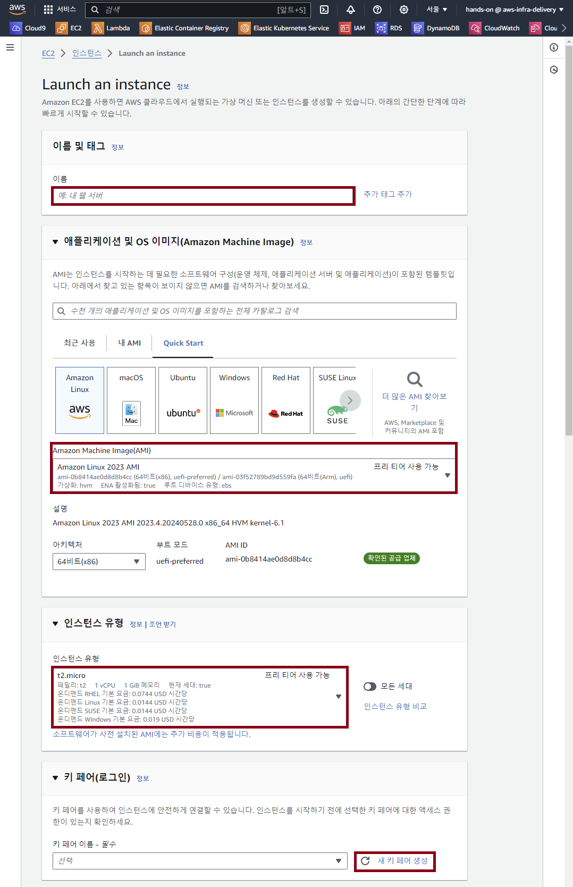

    - **네트워크 설정:**

        - `편집` 버튼 클릭

        - VPC: *lab-edu-vpc-ap-01*

        - 서브넷: *lab-edu-sub-pub-01*

        - 퍼블릭 IP 자동 할당: 활성화

        - 방화벽(보안 그룹): `보안 그룹 생성` 선택

        - 보안 그룹 이름: *lab-edu-sg-bastion*

        - 보안 그룹 규칙 01

            - 유형: ssh

            - 소스 유형: 내 IP

        - `보안 그룹 규칙 추가` 버튼 클릭

        - 보안 그룹 규칙 02

            - 유형: http

            - 소스 유형: 내 IP

                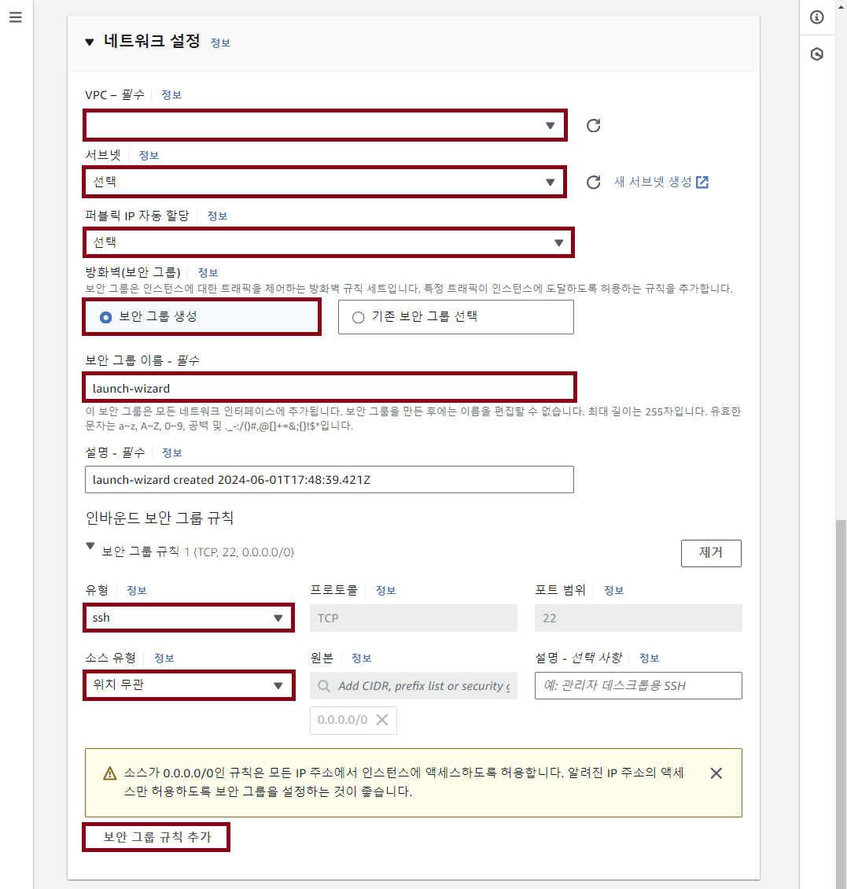

- `인스턴스 시작` 버튼 클릭

 

## Bastion Server 접속 테스트

### 1. Putty 다운로드

- **다운로드 URL:** https://www.chiark.greenend.org.uk/~sgtatham/putty/latest.html

- MSI (Windows Installer) 64-bit x86 다운로드

    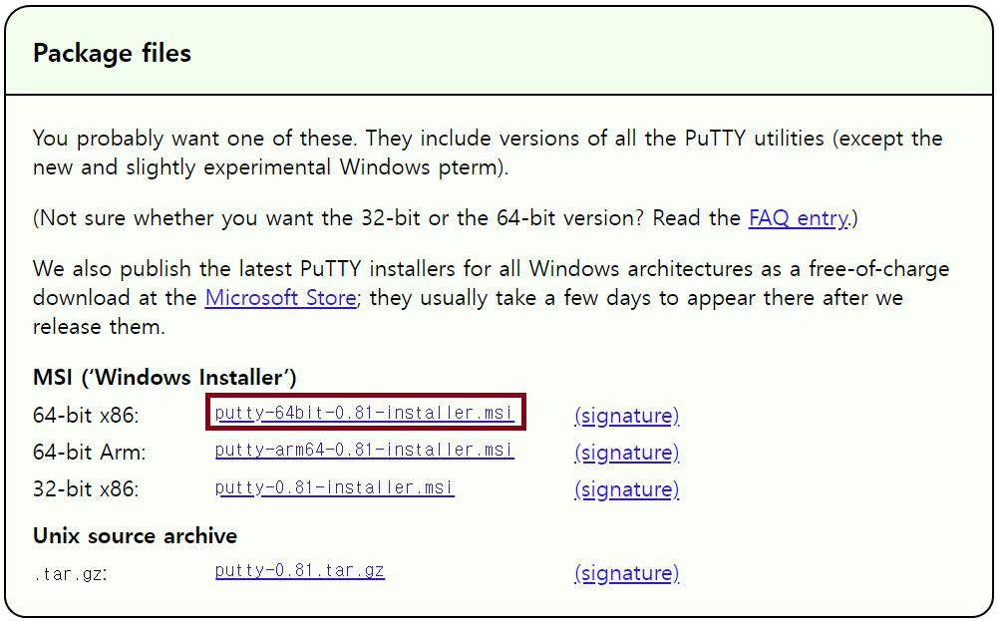

- MSI 파일 실행 → `next` 버튼 클릭 → `next` 버튼 클릭 → `Install` 버튼 클릭 → `Finish` 버튼 클릭

### 2. KEY-PAIR 확장자 변경: pem → ppk

- PuTTYgen 실행 

    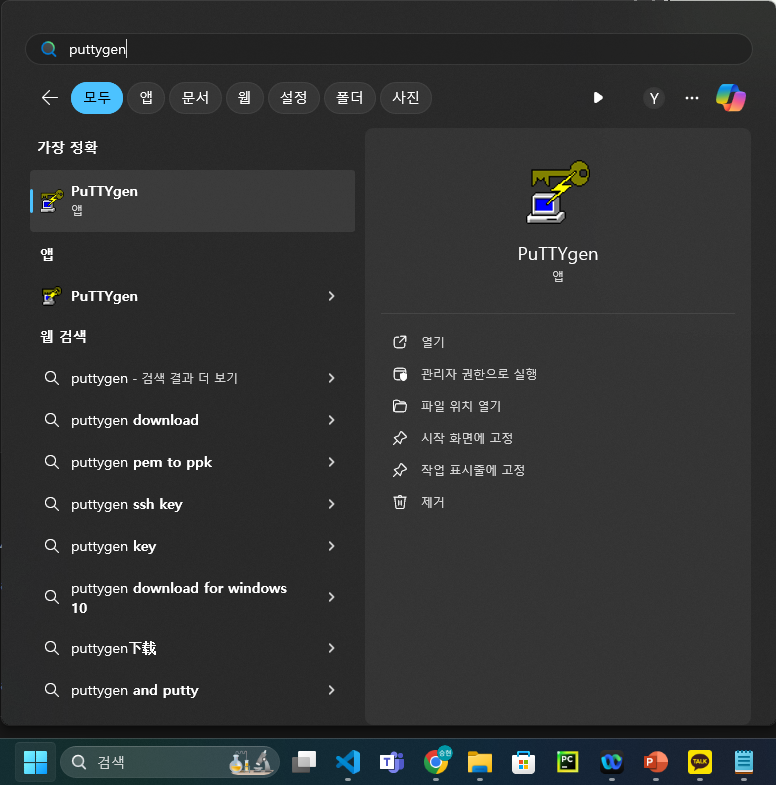

- `Load` 버튼 클릭 → pem 키 파일 다운로드 받은 폴더로 이동 → 확장자 명 변경: All Files (\*.\*) → pem 키 파일 선택

    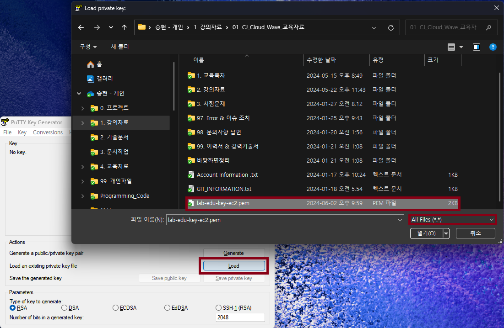

- `save private key` 버튼 클릭 → `예` 버튼 클릭

    

- 파일 이름 `lab-edu-key-ec2` 입력 → `저장` 버튼 클릭

    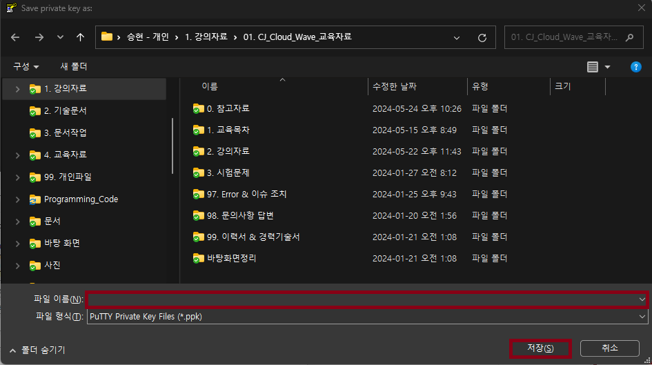

### 3. Putty 이용 Bastion 서버 접속

- EC2 접속 정보 확인: 인스턴스 메인 콘솔 화면 이동 → `인스턴스` 탭으로 이동 → `lab-edu-ec2-bastion` 선택 → 퍼블릭 IPv4 주소 복사

    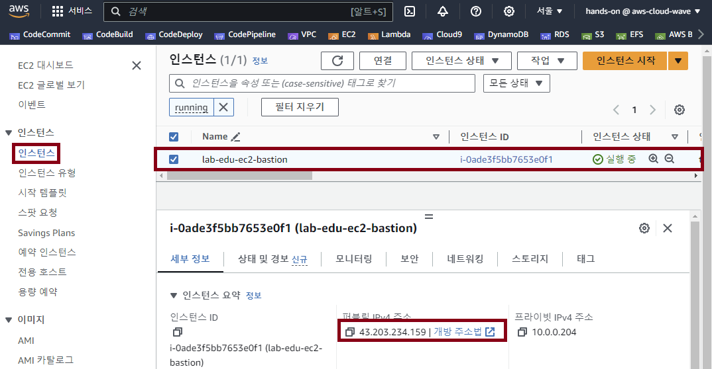

- Putty 실행 → SSH 클릭 → Auth 클릭 → Credentials 클릭 → Browser 클릭 → 'lab-edu-key-ec2.ppk' 선택

    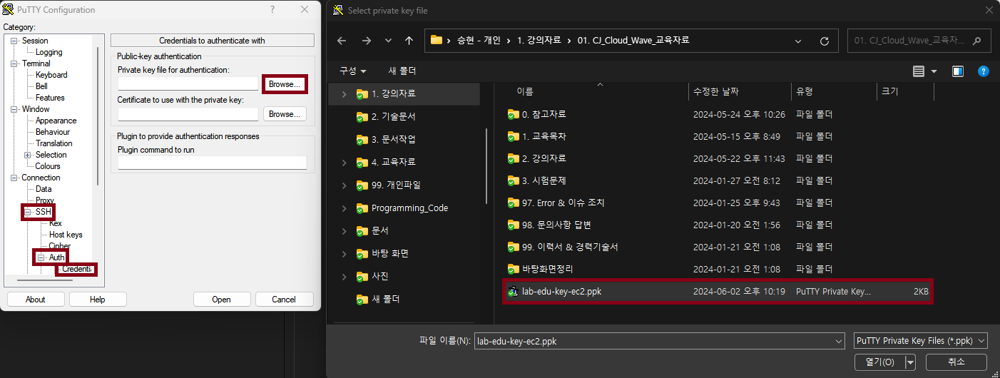

- Session 클릭 → Host Name: 'ec2-user@*{BASTION_SERVER_PUBLIC_IP}* 입력 → Save Sessions: 'lab-edu-ec2-bastion' 입력

    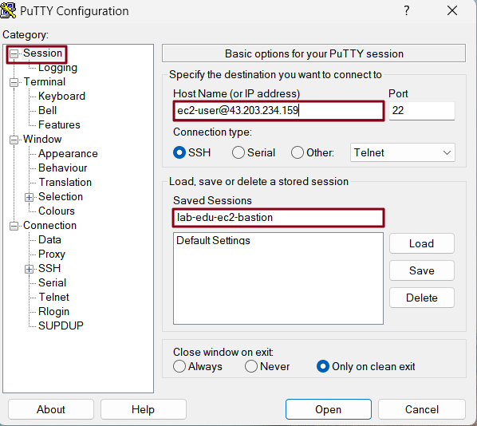

- 'Save' 버튼 클릭 → 'Open' 버튼 클릭

    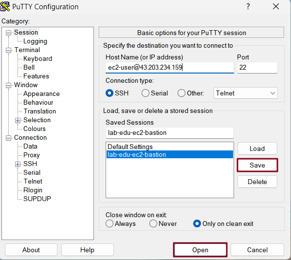

- 접속 성공 화면

    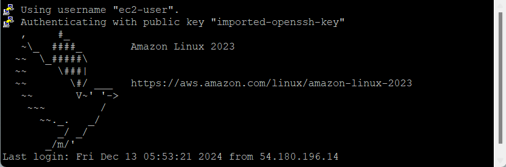

 