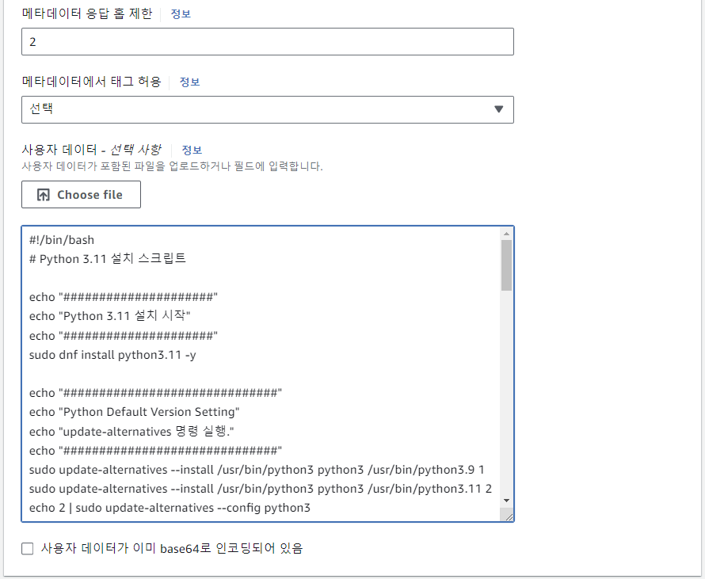
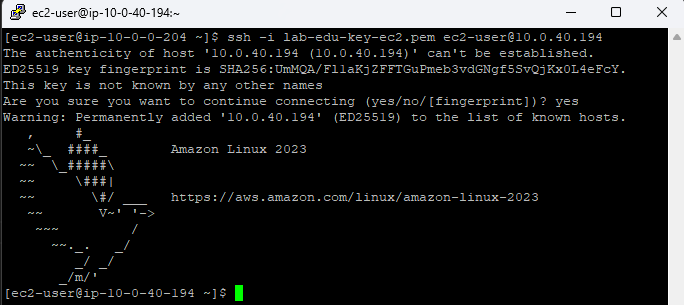

## Table of Contents
- [Table of Contents](#table-of-contents)
- [Web Server 생성](#web-server-생성)
  - [1. EC2 메인 콘솔 화면으로 이동](#1-ec2-메인-콘솔-화면으로-이동)
  - [2. EC2 인스턴스 설정 정보 입력 및 생성](#2-ec2-인스턴스-설정-정보-입력-및-생성)
  - [3. Web 서버 접속](#3-web-서버-접속)
- [Web 서비스 접속 테스트](#web-서비스-접속-테스트)
  - [1. Proxy Server 설정](#1-proxy-server-설정)
    - [1.1 Bastion 서버 접속](#11-bastion-서버-접속)
    - [1.2 Proxy Setting Script 실행](#12-proxy-setting-script-실행)
  - [2. Web 서비스 접속 테스트](#2-web-서비스-접속-테스트)
  - [3. Instance Profile (IAM Role) 이용 EC2 인스턴스에 권한 할당](#3-instance-profile-iam-role-이용-ec2-인스턴스에-권한-할당)
    - [3.1 IAM Role 생성](#31-iam-role-생성)
    - [3.2 EC2 instance profile 할당 (IAM Role → EC2 할당)](#32-ec2-instance-profile-할당-iam-role--ec2-할당)
    - [3.3 Web Server Terminal 접속](#33-web-server-terminal-접속)
  - [4. Web 서비스 접속 테스트](#4-web-서비스-접속-테스트)

## Web Server 생성

### 1. EC2 메인 콘솔 화면으로 이동

- **인스턴스 리소스 탭 → `인스턴스 시작` 버튼 클릭**

### 2. EC2 인스턴스 설정 정보 입력 및 생성

- 인스턴스 생성 정보 입력

    - **이름:** *lab-edu-ec2-web*

    - **AMI:** *Amazon Linux 2023*

    - **인스턴스 유형:** *t3.micro*

    - **키 페어:** *lab-edu-key-ec2*

    - **네트워크 설정:**

        - `편집` 버튼 클릭

        - VPC: *lab-edu-vpc-ap-01*

        - 서브넷: *lab-edu-sub-pri-01*

        - 퍼블릭 IP 자동 할당: 비활성화

        - 방화벽(보안 그룹): `보안 그룹 생성` 선택

        - 보안 그룹 이름: *lab-edu-sg-web*

        - 보안 그룹 규칙 01

            - 유형: ssh

            - 소스 유형: 사용자 지정

            - 원본: 10.0.0.0/16

        - '보안 그룹 규칙 추가' 버튼 클릭

        - 보안 그룹 규칙 02

            - 유형: http

            - 소스 유형: 사용자 지정

            - 원본: 10.0.0.0/16

        - **고급 세부 정보 확장**

            - "02. Computin Service - EC2/scripts/install_python.sh" 파일 내용 복사
                
                

            - 사용자 데이터 필드에 입력

                

- `인스턴스 시작` 버튼 클릭

### 3. Web 서버 접속

- Bastion 서버 접속

    - Putty 실행 → `Saved Session` 필드에 `lab-edu-ec2-bastion` 더블 클릭

        

- pem 키 페어 Bastion 서버에 저장

    - pem 파일 notepad로 실행 → 전체 복사

        

    - Bastion 서버에서 vim Editor 이용 파일로 내용 저장 (파일명: *lab-edu-key-ec2.pem*)

        

    - pem 키 파일 권한 설정

        ```bash
        chmod 600 lab-edu-key-ec2.pem
        ```

- Web 서버 EC2 접속 정보 확인: 인스턴스 메인 콘솔 화면 이동 → `인스턴스` 탭으로 이동 → `lab-edu-ec2-web` 선택 → 프라이빗 IPv4 주소 복사

- Bastion 서버를 접속 한 PuTTY 콘솔 화면에서 다음 명령어 실행

    ```bash
    ssh -i lab-edu-key-ec2.pem ec2-user@*{WEB_SERVER_PRIVATE_IP}*
    ```

    

<br>


## Web 서비스 접속 테스트

### 1. Proxy Server 설정

> Bastion 서버를 Proxy 서버로 이용해서 Private Subnet에 구성된 Web 서버의 Web Application에 접근하기 위한 설정

#### 1.1 Bastion 서버 접속

- Putty 실행 → `Saved Session` 필드에 `lab-edu-ec2-bastion` 더블 클릭

#### 1.2 Proxy Setting Script 실행

- "02. Computin Service - EC2/scripts/setting_bastion.sh" 파일 내용 복사

    

- Bastion 서버 Putty 콘솔 화면에서 vim Editor 이용 파일로 내용 저장 (파일명: *setting_bastion.sh*)

- Script 파일 권한 설정 

    ```bash
    sudo chmod +x setting_bastion.sh
    ```

- Script 실행

    ```bash
    ./setting_bastion.sh
    ```
    
<br>


### 2. Web 서비스 접속 테스트 

> Bastion 서버 Public IP로 브라우저에서 접속하면, Web Server로 연결


***※ Web Server에는 EC2 관련 데이터 접근을 위한 IAM 권한이 없어 에러 페이지 반환***  

<br>


### 3. Instance Profile (IAM Role) 이용 EC2 인스턴스에 권한 할당

#### 3.1 IAM Role 생성

- **IAM 메인 콘솔 화면 → `역할` 리소스 탭 → `역할 생성` 버튼 클릭**

- IAM Role 생성 정보 입력

    - 신뢰할 수 있는 엔터티 유형: `AWS 서비스` 라디오 박스 선택 

    - 사용 사례: `EC2` → `다음` 버튼 클릭

        

    - 검색 창에 `AmazonEC2FullAccess` 입력 → `AmazonEC2FullAccess` 체크박스 활성 → `다음` 버튼 클릭

    - 역할 이름: lab-edu-role-ec2

    - `역할 생성` 버튼 클릭

#### 3.2 EC2 instance profile 할당 (IAM Role → EC2 할당)

- **EC2 메인 콘솔 화면 → `인스턴스` 리소스 탭 → `lab-edu-ec2-web` 선택 → `작업` → `보안` → `IAM 역할 수정`**

    

- IAM 역할: `lab-edu-role-ec2` 선택 → `IAM 역할 업데이트` 버튼 클릭

    

- `lab-edu-ec2-web` 선택 → `인스턴스 상태` → `인스턴스 재부팅` 클릭

    

#### 3.3 Web Server Terminal 접속

- Bastion 서버 접속

    - Putty 실행 → `Saved Session` 필드에 `lab-edu-ec2-bastion` 더블 클릭

- Bastion 서버를 접속 한 PuTTY 콘솔 화면에서 다음 명령어 실행

    ```bash
    ssh -i lab-edu-key-ec2.pem ec2-user@*{WEB_SERVER_PRIVATE_IP}*
    ```

- Web Service 실행 여부 확인 및 실행 명령어 입력

    - streamlit의 80번 포트 LISTEN 상태 여부 체크

        ```bash
        netstat -ntlp
        Active Internet connections (only servers)
        Proto Recv-Q Send-Q Local Address           Foreign Address         State       PID/Program name
        tcp        0      0 0.0.0.0:22              0.0.0.0:*               LISTEN      1500/sshd: /usr/sbi
        tcp6       0      0 :::22                   :::*                    LISTEN      1500/sshd: /usr/sbi
        ```
    
    - 80번 포트 LISTENING 상태가 아닌 경우 다음 명령어 실행

        ```bash
        cd /root/streamlit-project/
        ```
        
        ```bash
        streamlit run main.py --server.port 80
        ```

### 4. Web 서비스 접속 테스트 

> 권한 할당 완료 후 정상적으로 EC2 Infromation 정보가 확인 되는지 체크


