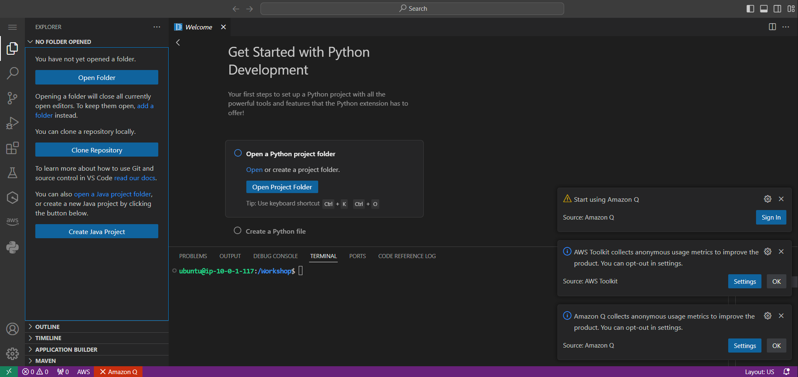

## Table of Contents
- [Table of Contents](#table-of-contents)
- [VS Code Server 생성](#vs-code-server-생성)
  - [1. EC2 메인 콘솔 화면으로 이동](#1-ec2-메인-콘솔-화면으로-이동)
  - [2. EC2 인스턴스 설정 정보 입력 및 생성](#2-ec2-인스턴스-설정-정보-입력-및-생성)
- [VS Code Web IDE 접속](#vs-code-web-ide-접속)
  - [1. Web IDE 접속](#1-web-ide-접속)
  - [2. Workspace Settings](#2-workspace-settings)
    - [2.1 VS Code Terminal Open](#21-vs-code-terminal-open)
    - [2.2 Workspace Setting](#22-workspace-setting)
    - [2.3 Sample Source Code 다운로드](#23-sample-source-code-다운로드)
    - [2.3 VS Code `Open Folder`](#23-vs-code-open-folder)
  - [3. SSH Config 설정](#3-ssh-config-설정)
    - [3.1 Pem 키 파일 업로드](#31-pem-키-파일-업로드)
    - [3.2 SSH Config 설정](#32-ssh-config-설정)

## VS Code Server 생성

### 1. EC2 메인 콘솔 화면으로 이동

- **인스턴스 리소스 탭 → `인스턴스 시작` 버튼 클릭**

### 2. EC2 인스턴스 설정 정보 입력 및 생성

- 인스턴스 생성 정보 입력

    - **이름:** *lab-edu-ec2-vscode*

    - **AMI:** <span style="color:orange">*Ubuntu 24.04 LTS*</span>

    - **인스턴스 유형:** *c7i.2xlarge*

    - **키 페어:** *lab-edu-key-ec2*

    - **네트워크 설정:**

        - `편집` 버튼 클릭

        - VPC: *lab-edu-vpc-ap-01*

        - 서브넷: *lab-edu-sub-pub-02*

        - 퍼블릭 IP 자동 할당: 활성화

        - 방화벽(보안 그룹): `보안 그룹 생성` 선택

        - 보안 그룹 이름: *lab-edu-sg-vscode*

        - 보안 그룹 규칙 01

            - 유형: ssh

            - 소스 유형: 내 IP

        - '보안 그룹 규칙 추가' 버튼 클릭

        - 보안 그룹 규칙 02

            - 유형: 사용자 지정 TCP

            - 포트 범위: <span style="color:orange">8080</span>
            
            - 소스 유형: 내 IP

        - 스토리지 구성

            - 볼륨: 100GiB
            
            - Type: gp3

        - **고급 세부 정보 확장**

            - "02. Computin Service - EC2/scripts/install_vscode.sh" 파일 내용 복사
                
                

            - 사용자 데이터 필드에 입력

                > <span style="color:green">**※ NOTE:**</span> `AWS_CCOUNT_ID`, `PASSWORD` 를 각자 환경에 맞춰서 수정

                

<br>


## VS Code Web IDE 접속

### 1. Web IDE 접속

- VS Code 서버 EC2 접속 정보 확인: 인스턴스 메인 콘솔 화면 이동 → `인스턴스` 탭으로 이동 → `lab-edu-ec2-vscode` 선택 → 퍼블릭 IPv4 주소 복사

- 웹 브라우저에서 `{VS_CODE_SERVER_PUBLIC_IP}:8080` 접속

    

- 설정한 `PASSWORD` 입력 후 WEB IDE 화면으로 이동

    

### 2. Workspace Settings

#### 2.1 VS Code Terminal Open

- 좌측 상단 `메뉴바` 클릭 → `Terminal` 클릭 → `New Terminal` 클릭

    

#### 2.2 Workspace Setting

- Workspace 폴더 권한 설정
  
    ```bash
    sudo chown -R ubuntu:ubuntu /Workshop
    ```

#### 2.3 Sample Source Code 다운로드

- Defaul Git Branch의 이름을 'main'으로 설정

    ```bash
    git config --global init.defaultBranch main
    ```

- Git Local 저장소 초기화

    ```bash
    git init
    ```

- Remote 저장소 지정

    ```bash
    git remote add origin https://github.com/CJ-CloudWave-Public-Hands-on-Lab/streamlit-project.git
    ```

- Remote 저장소에서 데이터 풀링

    ```bash
    git pull origin main
    ```

- Remote 저장소 정보 삭제

    ```bash
    rm -rf ./.git
    ```
    
#### 2.3 VS Code `Open Folder`

- 좌측 상단의 `Open Folder` 버튼 클릭 → 검색 창에 `/Workshop` 입력 → `Enter` 입력

    

- Source Code 화면 확인

    

### 3. SSH Config 설정

> VS Code Terminal에서 Bastion, Web Server에 SSH로 접속하기 위한 설정

#### 3.1 Pem 키 파일 업로드

- pem 파일 notepad로 실행 → 전체 복사

- VS Code 서버에서 vim Editor 이용 파일로 내용 저장 (파일명: *lab-edu-key-ec2.pem*)

- pem 키 파일 권한 설정

    ```bash
    chmod 600 lab-edu-key-ec2.pem
    ```

- pem 키 파일 이동

    ```bash
    mv ./lab-edu-key-ec2.pem ~/.ssh/
    ```

#### 3.2 SSH Config 설정

- VS Code 서버 Terminal Command로 config 파일 생성 

    ```bash
    touch config
    ```

- WEB IDE 좌측 패널의 'config' 파일 더블 클릭 → 설정 값 입력

    

- Config 설정 값 입력

    ```bash
    Host bastion
        HostName {BASTION_SERVER_PRIVATE_IP}
        User ec2-user
        IdentityFile ~/.ssh/lab-edu-key-ec2.pem

    Host web-server
        HostName {WEB_SERVER_PRIVATE_IP}
        User ec2-user
        IdentityFile ~/.ssh/lab-edu-key-ec2.pem
    ```

    

- Bastion, WEB Server Private IP 주소 확인 → SSH config 설정 값 수정 → 저장 ***(Ctrl + S)***

    ```bash
    Host bastion
        HostName 10.0.0.94 #예시
        User ec2-user
        IdentityFile ~/.ssh/lab-edu-key-ec2.pem

    Host web-server
        HostName 10.0.40.27 #예시
        User ec2-user
        IdentityFile ~/.ssh/lab-edu-key-ec2.pem
    ```

- Config 파일 ssh 폴더로 이동

    ```bash
    mv config ~/.ssh/config
    ```

- VS Code Terminal에서 ssh 명령을 통해 Web Server 접속

    ```bash
    ssh web-server
    ```