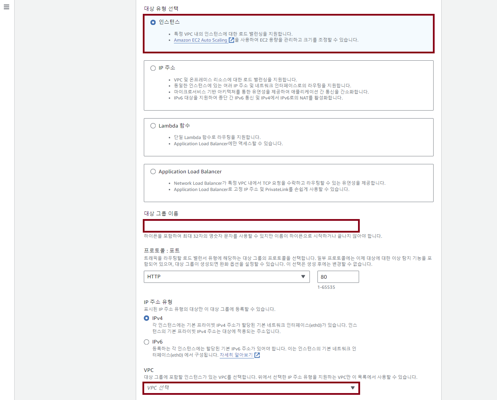
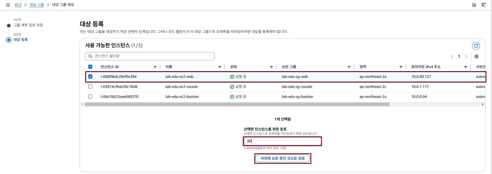
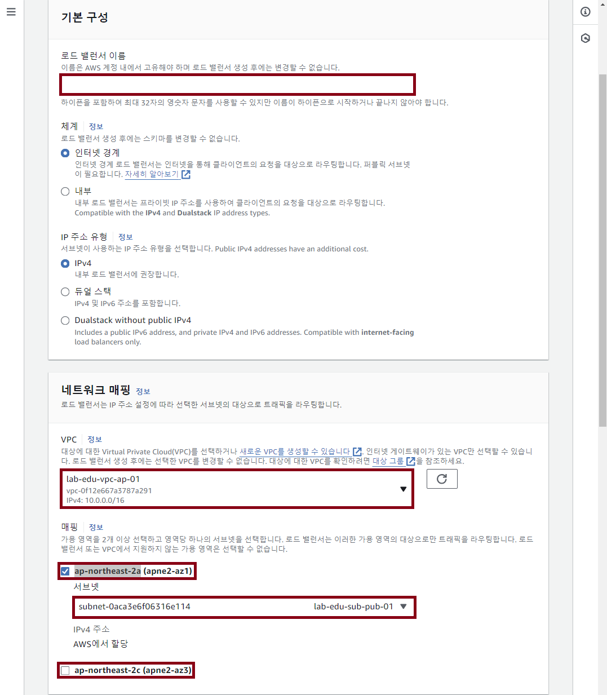
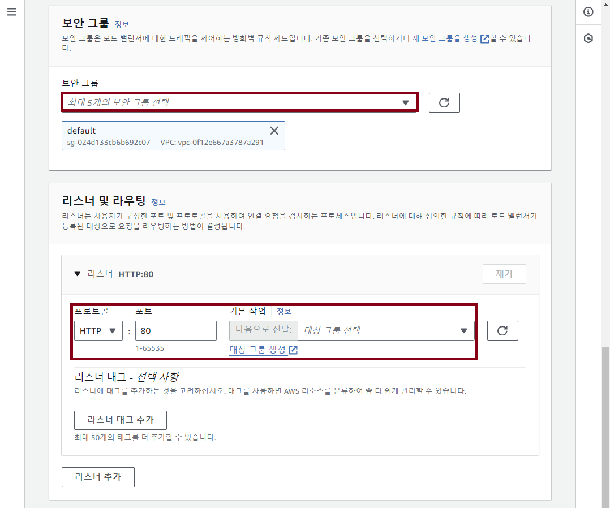
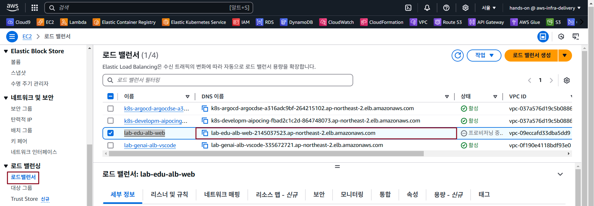
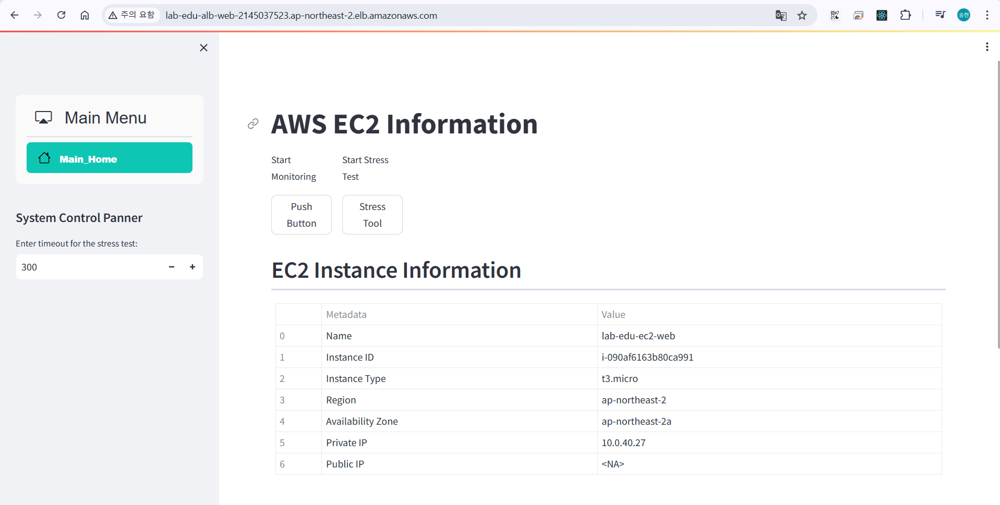

## Table of Contents
- [Table of Contents](#table-of-contents)
- [Load Balancer 생성](#load-balancer-생성)
  - [1. Security Group 생성](#1-security-group-생성)
  - [2. Load Balancer Target Group 생성](#2-load-balancer-target-group-생성)
  - [3. Load Balancer 생성](#3-load-balancer-생성)
- [Load Balancer DNS 정보로 웹 서비스 접속 테스트](#load-balancer-dns-정보로-웹-서비스-접속-테스트)
  - [1 Application Load Balancer 접속 정보 확인](#1-application-load-balancer-접속-정보-확인)
  - [2 Web Application 접속 테스트](#2-web-application-접속-테스트)

## Load Balancer 생성

### 1. Security Group 생성

- **EC2 메인 콘솔 화면 → `보안 그룹` 탭 → `보안그룹 생성` 버튼 클릭**

- 아래 **보안그룹 자원 명세서** 정보 참고하여 생성 정보 입력

    | Security Group Name |     VPC_Name      |   Rule   | port  | Protocol |  Source   |
    | :-----------------: | :---------------: | :------: | :---: | :------: | :-------: |
    |   lab-edu-sg-alb    | lab-edu-vpc-ap-01 | In-bound |  80   |   HTTP   | 0.0.0.0/0 |
    |                     |                   | In-bound |  443  |  HTTPS   | 0.0.0.0/0 |

### 2. Load Balancer Target Group 생성

- **EC2 메인 콘솔 화면 → 대상 그룹 탭 → `Create Target Group` 버튼 클릭**

- 아래 **타겟 그룹 자원 정보** 참고하여 정보 입력

    - **대상 유형 선택 :** *인스턴스*

    - **대상 그룹 이름:** *lab-edu-tg-web*

    - **VPC:** *lab-edu-vpc-ap-01*

    - '**Next**' 버튼 클릭

        

    - **대상 등록 설정**

        - **`lab-edu-ec2-web`** 서버 체크박스 활성화

        - 선택한 인스턴스를 위한 포트: *80*

        - **`아래에 보류 중인 것으로 포함`** 버튼 클릭

             

    - `대상 그룹 생성` 버튼 클릭
      
### 3. Load Balancer 생성

- **EC2 메인 콘솔 화면 → `로드밸런서` 탭 → `로드밸런서 생성` 버튼 클릭 → `Application Load Balancer` 선택**

- 아래 **로드밸런서 자원 정보** 참고하여 정보 입력

    - **로드밸런서 이름:** *lab-edu-alb-web*

    - **VPC:** *lab-edu-vpc-ap-01*

    - **`ap-northeast-2a`** 체크박스 활성화 → **`lab-edu-sub-pub-01`** 선택

    - **`ap-northeast-2c`** 체크박스 활성화 → **`lab-edu-sub-pub-02`** 선택

        

    - **보안 그룹:** `lab-edu-sg-alb`

    - **리스너** 

        - **Protocol:** HTTP
        
        - **Port:** 80

        - **Default Action:** `lab-edu-tg-web`

        

    - 나머지 설정은 **Default** 값으로 유지하고 `로드 밸런서 생성` 버튼 클릭

## Load Balancer DNS 정보로 웹 서비스 접속 테스트

### 1 Application Load Balancer 접속 정보 확인

- 인스턴스 메인 콘솔 화면 이동 → `로드밸런서` 탭 → `lab-edu-alb-web` DNS 이름 주소 복사 버튼 클릭

    

### 2 Web Application 접속 테스트

> **※ NOTE:** 로드밸런서 DNS 정보로 브라우저에서 접속

