## Table of Contents
- [Table of Contents](#table-of-contents)
- [AMI(Amazon Machine Image) 생성 및 EC2 생성](#amiamazon-machine-image-생성-및-ec2-생성)
  - [1. Web Application 자동 재실행 설정](#1-web-application-자동-재실행-설정)
    - [1.1 Web Server 접속](#11-web-server-접속)
    - [1.2 rc.local 파일 설정 스크립트 실행](#12-rclocal-파일-설정-스크립트-실행)
  - [2. Web Server AMI 생성](#2-web-server-ami-생성)
- [Auto Scaling 생성 및 Application Load Balancer 연동](#auto-scaling-생성-및-application-load-balancer-연동)
  - [1. 시작 템플릿(Launch Template) 생성](#1-시작-템플릿launch-template-생성)
  - [2. Auto Scaling Group 생성](#2-auto-scaling-group-생성)
  - [3. Web Service 접속 및 Auto Scaling Out 테스트](#3-web-service-접속-및-auto-scaling-out-테스트)
    - [3.1 Application Load Balancer 접속 정보 확인](#31-application-load-balancer-접속-정보-확인)
    - [3.2 Web Application 접속](#32-web-application-접속)
    - [3.3 Scale Out 테스트](#33-scale-out-테스트)

## AMI(Amazon Machine Image) 생성 및 EC2 생성

### 1. Web Application 자동 재실행 설정

> 시스템이 재부팅 되어도 자동으로 재실행 될 수 있도록 system deamon 설정

#### 1.1 Web Server 접속

- VS Code Terminal에서 ssh 명령을 통해 Web Server 접속

    ```bash
    ssh web-server
    ```

#### 1.2 rc.local 파일 설정 스크립트 실행

- `streamlit-project` 폴더 이동

    ```bash
    cd /root/streamlit-project
    ```

- `setting_rc-local.sh` 파일 스크립트 실행

    ```bash
    sh scripts/setting_rc-local.sh
    ```


### 2. Web Server AMI 생성

- **EC2 콘솔 메인 화면 → `인스턴스 리소스` 탭 → `lab-edu-ec2-web` 선택 → `작업` → `이미지 및 템플릿` → `이미지 생성` 클릭**

    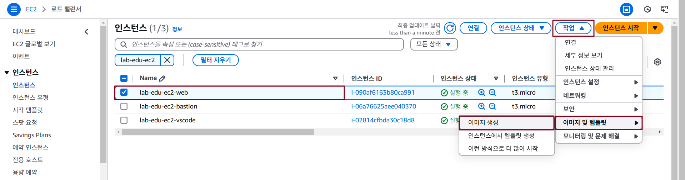

- AMI 생성 정보 입력

    - 이미지 이름: lab-edu-ami-web-v1-{YYMMDD}

    - `재부팅 안 함` 체크 박스 활성화

    - `생성` 버튼 클릭

        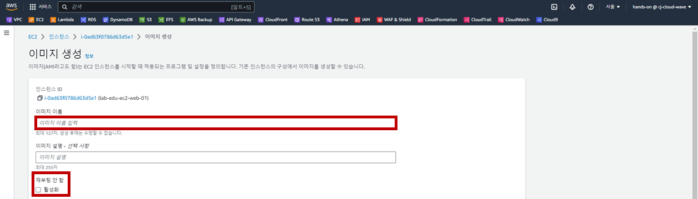

- EC2 콘솔 메인 화면 → `AMI 리소스` 탭 → AMI 생성 결과 확인 

    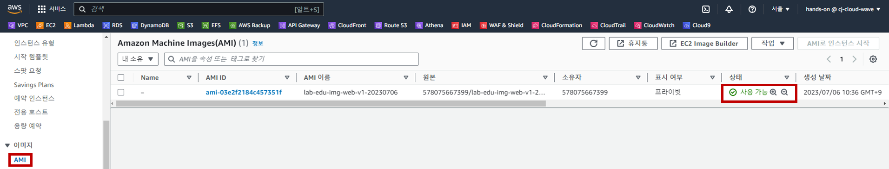

<br>


## Auto Scaling 생성 및 Application Load Balancer 연동

### 1. 시작 템플릿(Launch Template) 생성

- **EC2 메인 콘솔 화면 → `시작 템플릿` 리소스 탭 → `시작 템플릿 생성` 버튼 클릭**

- 시작 템플릿 생성 정보 입력

    - **시작 템플릿 이름:** *lab-edu-template-autoscaling-web*

    - `Auto Scaling 지침 체크 박스 활성화`

        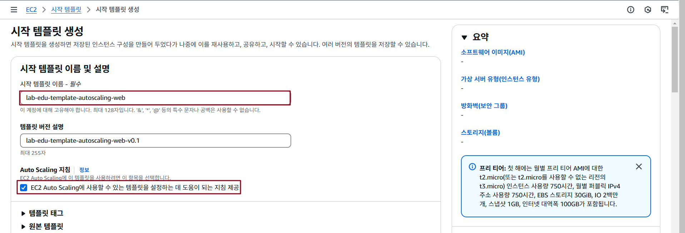

    - 애플리케이션 및 OS 이미지: lab-edu-ami-web-v1-{YYMMDD}

        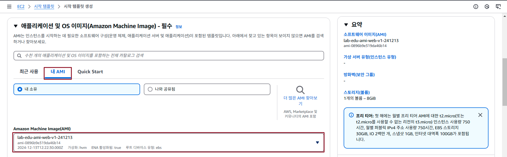

    - 인스턴스 유형: t3.micro

    - 키 페어: lab-edu-key-ec2

        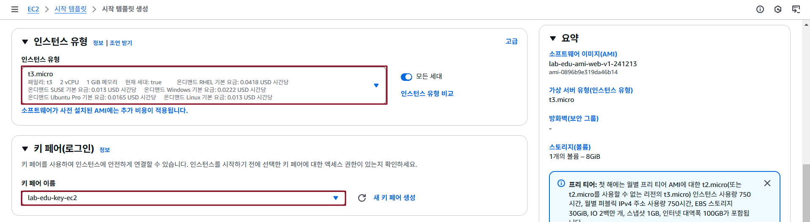

    - 서브넷: 시작 템플릿에 포함하지 않음

    - 보안 그룹: `기존 보안 그룹 선택` → `lab-edu-sg-web` 선택

        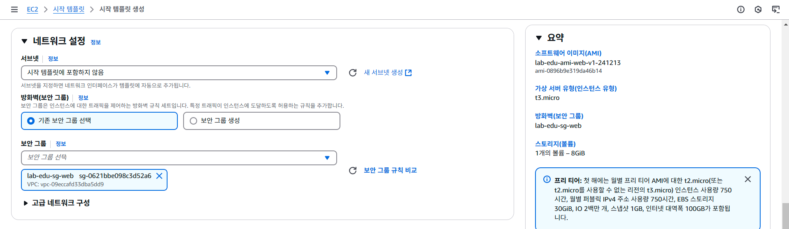

    - 태그:

        - Key: Name

        - Value: lab-edu-ec2-web

    - `고급 세부 정보` 확장 → IAM 인스턴스 프로파일: `lab-edu-role-ec2`

    - `호스트 이름 유형` → `IP 이름` 선택

    - `리소스 기반 IPv4(A레코드) DNS 요청 활성화` 선택

    - `시작 템플릿 생성` 버튼 클릭

        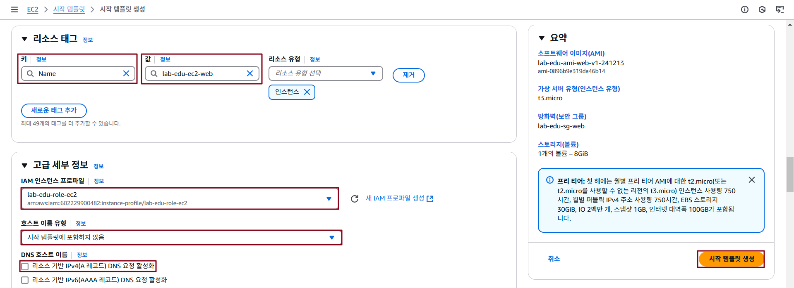

### 2. Auto Scaling Group 생성

- **EC2 메인 콘솔 화면 → `Auto Scaling Group` 리소스 탭 → `Auto Scaling Group 생성` 버튼 클릭**

- Auto Scaling Group 생성 정보 입력

    - Auto Scaling Group 이름: lab-edu-asg-web

    - 시작 템플릿: *lab-edu-template-autoscaling-web*

    - `다음` 버튼 클릭

        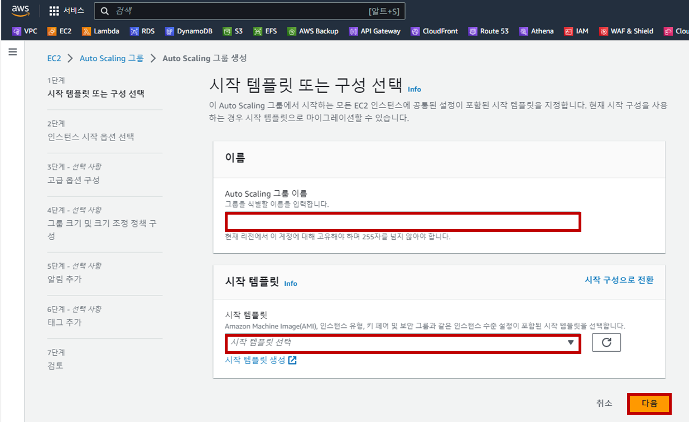

    - VPC: lab-edu-vpc-ap-01

    - 가용 영역, 서브넷: 
  
        - lab-edu-sub-pri-01

        - lab-edu-sub-pri-02

    - `다음` 버튼 클릭

        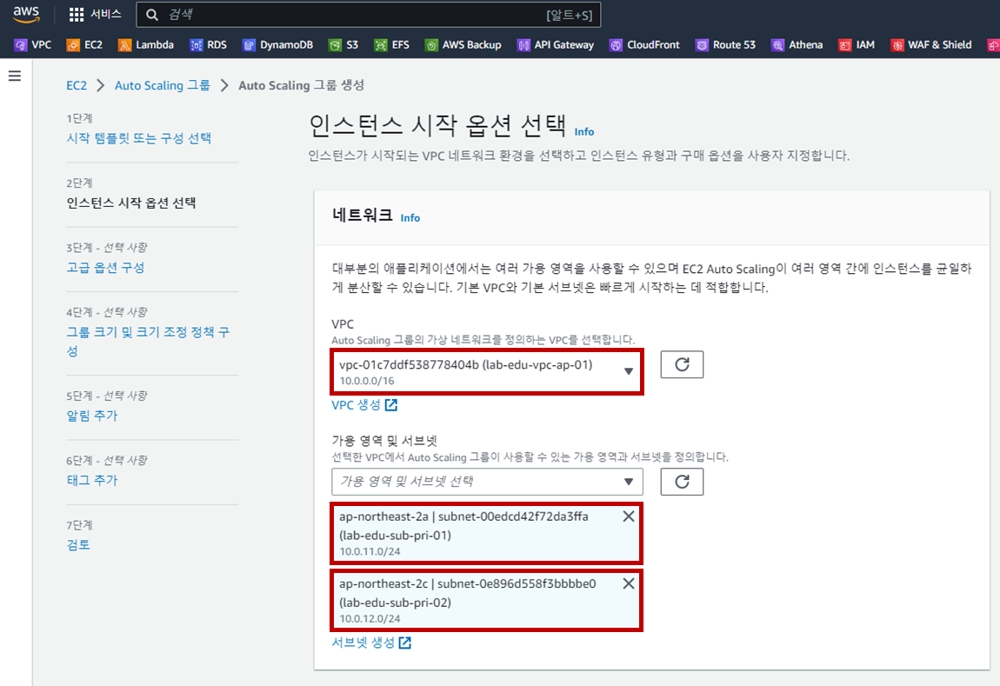

    - `기존 로드 밸런서에 연결` 버튼 클릭

    - 기존 로드 밸런서 대상 그룹: lab-edu-alb-web

    - `Elastic Load Balancer 상태 확인 켜기` 체크 박스 활성화

    - `다음` 버튼 클릭

        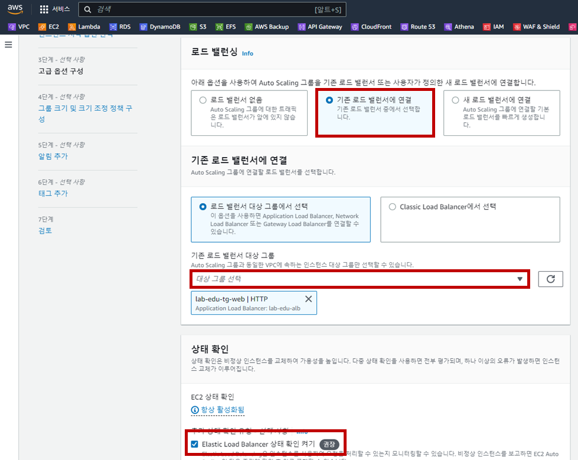

    - 그룹 크기 설정

        - 원하는 용량: 1

        - 최소 용량: 1

        - 최대 용량: 4

            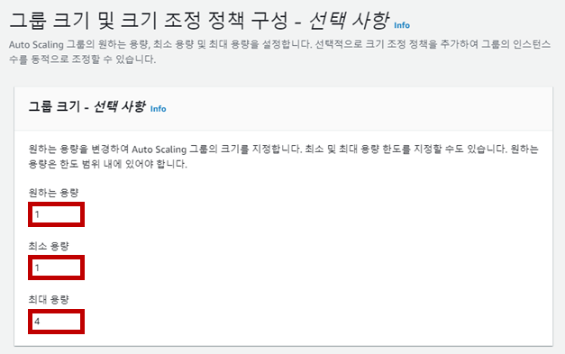

    - `대상 추적 크기 조정 정책` 선택

        - 크기 조정 정책 이름: Target Tracking Policy

        - 지표 유형: 평균 CPU 사용률

        - 대상 값: 30

            

    - `다음` 버튼 클릭

    - `다음` 버튼 클릭

    - 태그 값 추가

        - Key: Name

        - Value: lab-edu-asg-web

    - `다음` 버튼 클릭

    - `Auto Scaling 생성` 버튼 클릭

### 3. Web Service 접속 및 Auto Scaling Out 테스트

#### 3.1 Application Load Balancer 접속 정보 확인

- 인스턴스 메인 콘솔 화면 이동 → `로드밸런서` 탭 → `lab-edu-alb-web` DNS 이름 주소 복사 버튼 클릭

#### 3.2 Web Application 접속

> <span style="color:green">**※ NOTE:**</span> 로드밸런서 DNS 정보로 브라우저에서 접속

- 서비스 접속 후 `EC2 Instance Information` 테이블 정보에서 Name 값 `lab-edu-asg-web` 인지 확인

    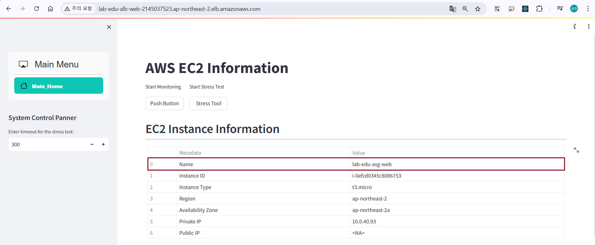

#### 3.3 Scale Out 테스트

- 서버 부하 발생을 위해 `Stress Tool` 클릭

    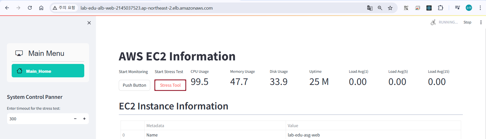

- **EC2 메인 콘솔 화면 → 'Auto Scaling Group' 리소스 탭 → 'lab-edu-asg-web' 클릭 → 모니터링 탭으로 이동**

    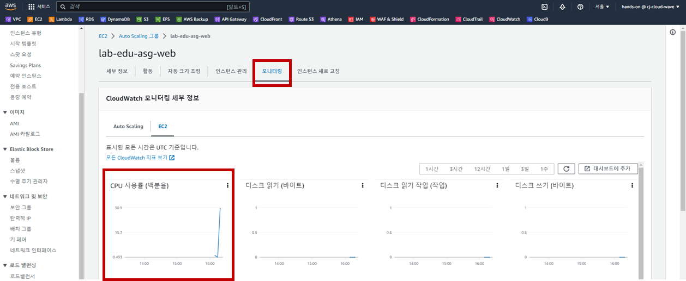

- '활동' 탭으로 이동 → 인스턴스 작업 기록 확인

    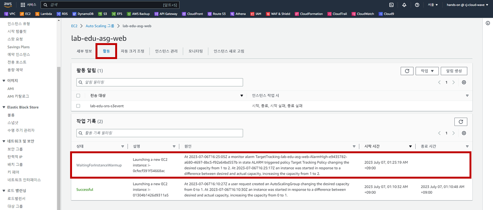

- '인스턴스 관리' 탭으로 이동 → 신규 EC2 확인

    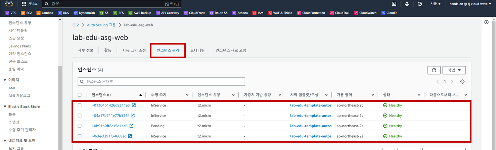