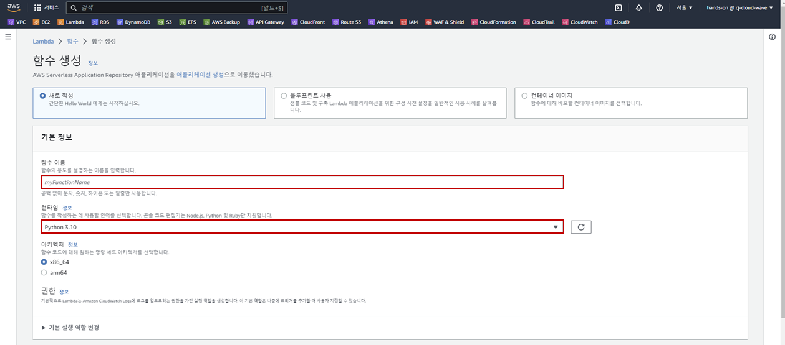
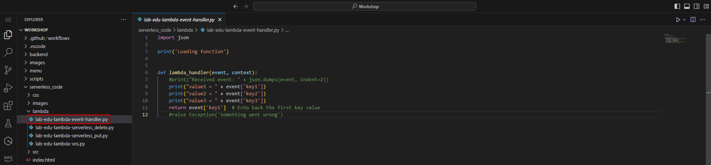
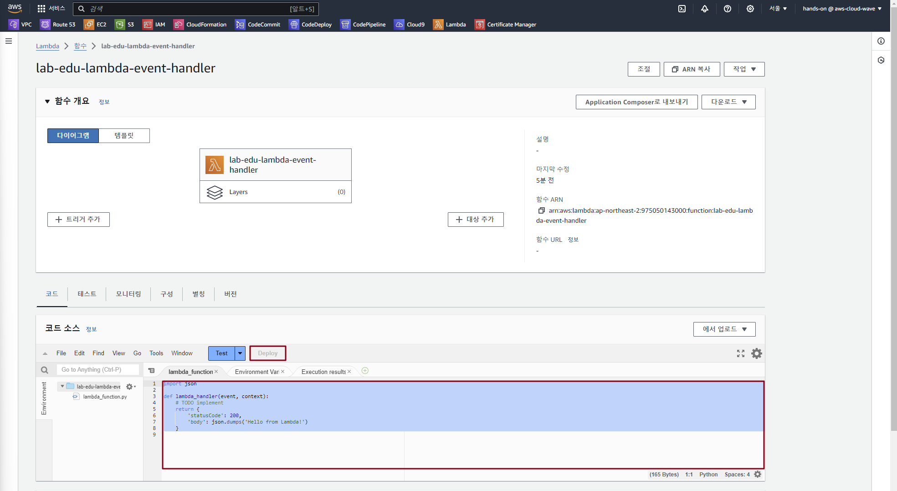
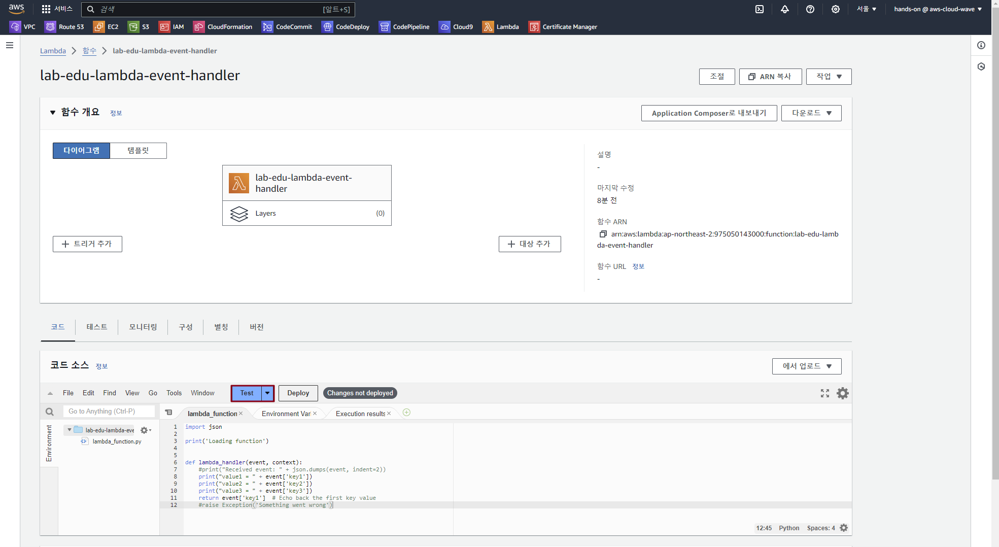
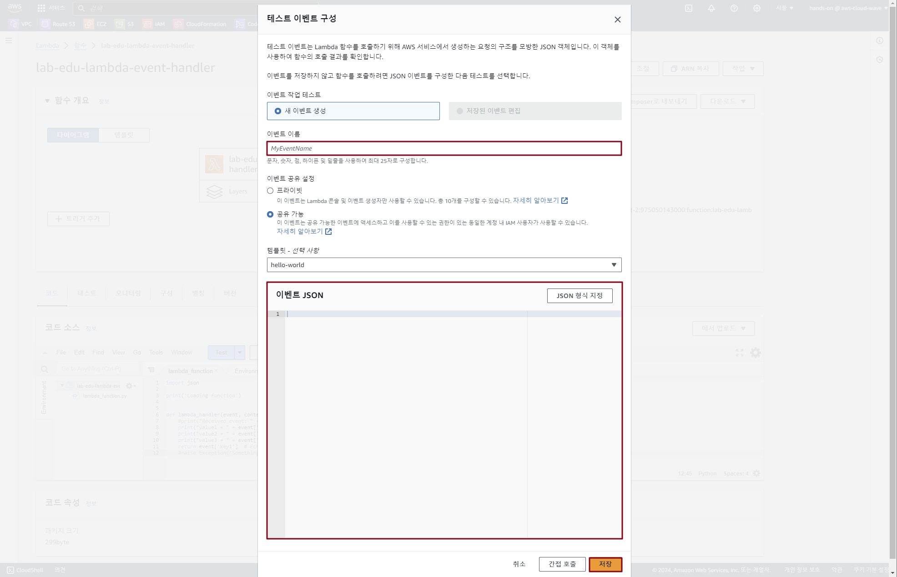
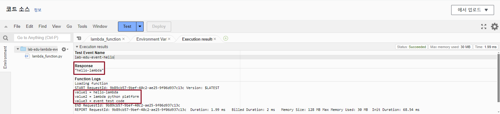

## Table of Contents
- [Table of Contents](#table-of-contents)
- [Lambda 생성 및 기본 사용방법](#lambda-생성-및-기본-사용방법)
  - [1. Lambda 함수 생성 및 코드 수정](#1-lambda-함수-생성-및-코드-수정)
  - [2. Test Event 구성 및 테스트](#2-test-event-구성-및-테스트)

## Lambda 생성 및 기본 사용방법 

### 1. Lambda 함수 생성 및 코드 수정

- **Lambda 메인 콘솔 화면 → `함수 생성` 버튼 클릭**

- 함수 생성 정보 입력

    - 함수 이름: lab-edu-lambda-event-handler

    - 런타임: python 3.10

    - `함수 생성` 버튼 클릭

        

- VS Code IDE Terminal 화면으로 이동 → 폴더 구조 확인

    ```bash
    Workshop/
    ├── ...
    ├── images
    ├── scripts
    ├── serverless_code
    │   ├── css
    │   ├── images
    │   ├── index.html
    │   ├── lambda
    │   │   ├── lab-edu-lambda-event-handler.py
    │   │   ├── lab-edu-lambda-serverless_delete.py
    │   │   ├── lab-edu-lambda-serverless_put.py
    │   │   └── lab-edu-lambda-sns.py
    │   └── src
    ├── support_files
    └── ...
    ```

- `serverless_code/lambda` 폴더의 `lab-edu-lambda-event-handler.py` 파일 열기 → 코드 복사

    

- **Lambda 메인 콘솔 화면 → `lab-edu-lambda-event-handler` 선택 → 코드 소스 항목에 붙여넣기 → `Deploy` 버튼 클릭**

    

### 2. Test Event 구성 및 테스트 

- `Test` 버튼 클릭

    

- 이벤트 생성 정보 입력

    - 이벤트 이름: lab-edu-event-hello

    - 이벤트 JSON:

        ```json
        {
            "key1": "hello-lambda",
            "key2": "lambda python platform",
            "key3": "event test code"
        }
        ```

    - `저장` 버튼 클릭

        

- `Test` 버튼 클릭 → 출력 결과 확인

    


