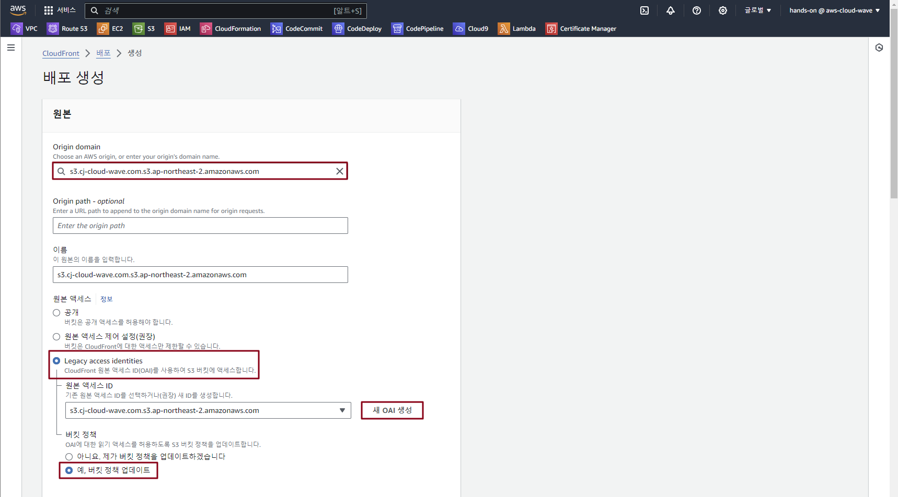
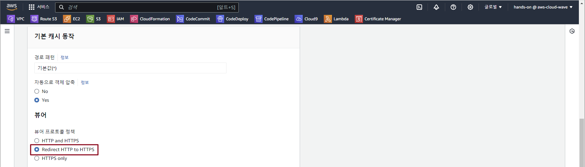
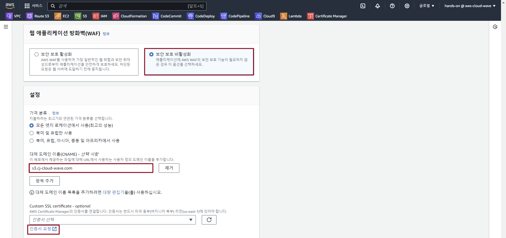
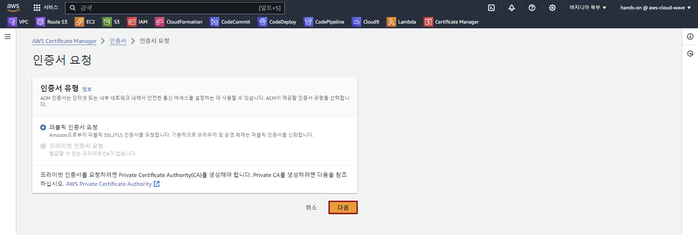
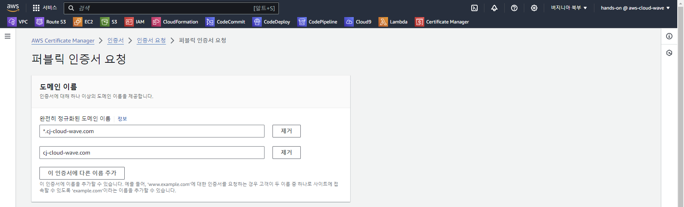
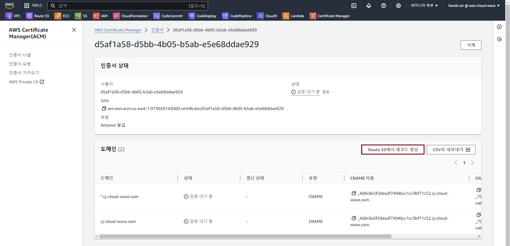
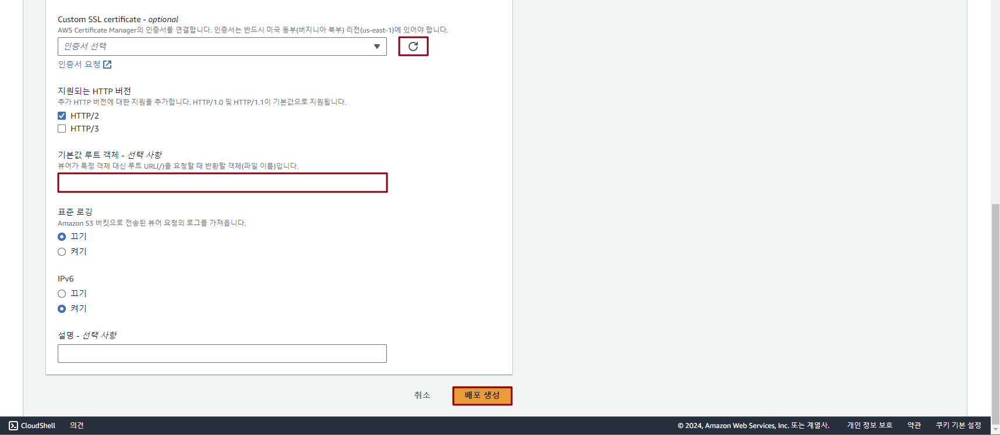
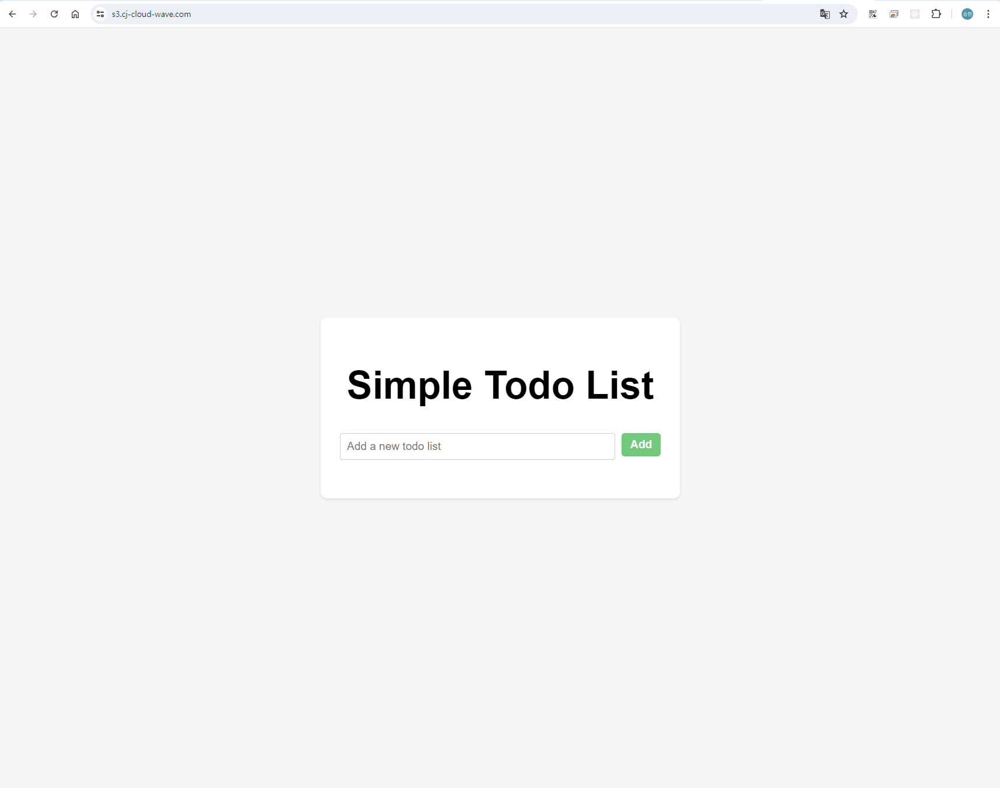

## Table of Contents
- [Table of Contents](#table-of-contents)
- [Amazon S3 생성 및 웹 호스팅 설정](#amazon-s3-생성-및-웹-호스팅-설정)
  - [1. Web Hosting Bucket 생성](#1-web-hosting-bucket-생성)
  - [2. 웹 소스 업로드](#2-웹-소스-업로드)
- [CloudFront 생성 및 Route 53 도메인 연동](#cloudfront-생성-및-route-53-도메인-연동)
  - [1. CloudFront 생성 및 연동](#1-cloudfront-생성-및-연동)
  - [2. Route53 레코드 생성](#2-route53-레코드-생성)
- [Serverless Frontend 접속 테스트 (http://s3.{st01~30}.cj-cloud-wave.com)](#serverless-frontend-접속-테스트-https3st0130cj-cloud-wavecom)

## Amazon S3 생성 및 웹 호스팅 설정

### 1. Web Hosting Bucket 생성

- **S3 콘솔 메인 화면 → `버킷 만들기` 버튼 클릭**

- S3 버킷 생성 정보 입력

    - 버킷 이름: s3.*{st01~30}*.cj-cloud-wave.com

    - `버킷 생성` 버튼 클릭

- **S3 콘솔 메인 화면 → `버킷 만들기` 버튼 클릭**

- S3 버킷 생성 정보 입력

    - 버킷 이름: *{st01 ~ 30}*.cj-cloud-wave.com

    - `버킷 생성` 버튼 클릭

### 2. 웹 소스 업로드 

- VS Code IDE Terminal 화면으로 이동 → Frontend 소스 코드 업로드

    ```bash
    cd /Workshop
    aws s3 sync ./ s3://s3.{st01~30}.cj-cloud-wave.com
    ```

<br>

## CloudFront 생성 및 Route 53 도메인 연동

### 1. CloudFront 생성 및 연동

- **CloudFront 콘솔 메인 화면 → `배포 생성` 버튼 클릭**

- CloudFront 생성 정보 입력

    - 원본 도메인: s3.{st01~30}.cj-cloud-wave.com.s3.ap-northeast-2.amazonaws.com

    - 원본 액세스: Legacy Access identities

        - 원본 액세스 ID: 새 OAI 생성

        - 버킷 정책: 예, 버킷 정책 업데이트

    

    - 뷰어 프로토콜 정책: Redirect HTTP to HTTPS

        

    - WAF: 보안 보호 비활성화

    - 대체 도메인 이름: s3.{st01~30}.cj-cloud-wave.com

    - 사용자 정의 인증서: 인증서 요청

        

    - `다음` 버튼 클릭

        

    - 퍼블릭 인증서 도메인 이름 설정
  
        - 완전히 정규화된 도메인 이름: *.{st01~30}.cj-cloud-wave.com

        - `이 인증서에 다른 이름 추가` 버튼 클릭

        - 완전히 정규화된 도메인 이름: {st01~30}.cj-cloud-wave.com

        - `생성` 버튼 클릭

            

    - `Route 53에서 레코드 생성` 버튼 클릭 → `레코드 생성` 버튼 클릭

        

    - Cloudfront 생성 정보 입력 화면으로 복귀

    - Custom SSL certificate `새로고침` 버튼 클릭 → `*.{st01~30}.cj-cloud-wave.com` 인증서 선택

    - 기본 루트 객체: index.html

    - `배포 생성` 버튼 클릭

        

### 2. Route53 레코드 생성

- **Route 53 메인 콘솔 화면 → 호스팅 영역 리소스 탭 → *`{st01~30}.cj-cloud-wave.com`* 클릭 → `레코드 생성` 버튼 클릭**

- 레코드 생성 정보 입력

    - 레코드 이름:s3.{st01~30}.cj-cloud-wave.com

    - `별칭` 버튼 활성화

    - 트래픽 라우팅 대상: CloudFront 배포에 대한 별칭

    - `s3.{st01~30}.cj-cloud-wave.com` 선택

    - `저장` 버튼 클릭

<br>

## Serverless Frontend 접속 테스트 (http://s3.{st01~30}.cj-cloud-wave.com)

