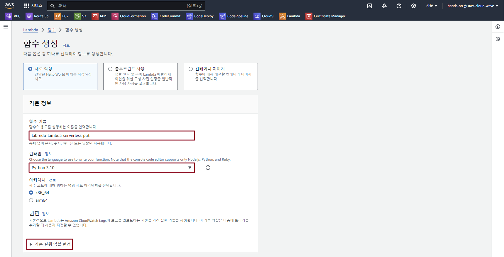
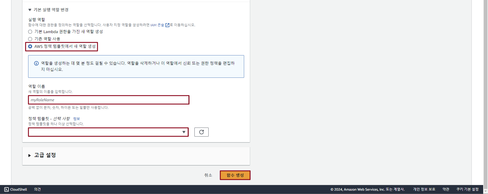
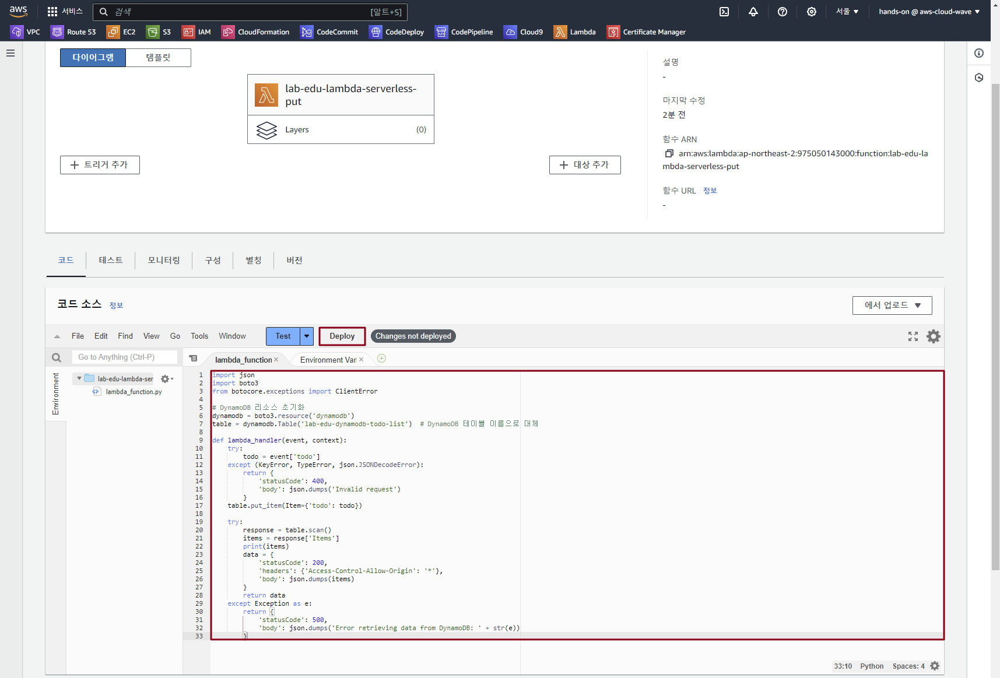
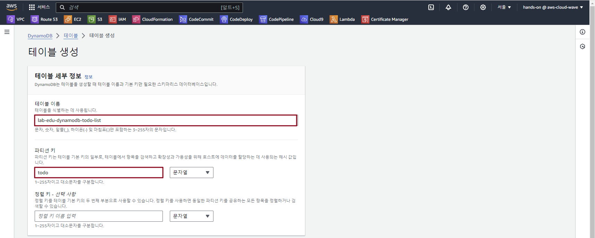

## Table of Contents
- [Table of Contents](#table-of-contents)
- [Application Function 생성](#application-function-생성)
  - [1. Data Input Function 생성](#1-data-input-function-생성)
  - [2. Data Delete Function 생성](#2-data-delete-function-생성)
- [Data Repository 생성](#data-repository-생성)
  - [1. Dynamo DB 생성](#1-dynamo-db-생성)

## Application Function 생성

### 1. Data Input Function 생성

- **Lambda 메인 콘솔 화면 → `함수 생성` 버튼 클릭**

- 함수 생성 정보 입력

    - 함수 이름: lab-edu-lambda-serverless-put

    - 런타임: python 3.10

    - `기본 실행 역할 변경` 확장

        

    - 실행 역할 생성 정보 입력

        - `AWS 정책 템플릿에서 새 역할 생성` 라디오 버튼 클릭

        - 역할 이름: lab-edu-role-lambda

        - 정책 템플릿: `단순 마이크로 서비스 권한`

            

    - `함수 생성` 버튼 클릭

- VS Code IDE Terminal 화면으로 이동 → 폴더 구조 확인

    ```bash
    Workshop/
    ├── ...
    ├── images
    ├── scripts
    ├── serverless_code
    │   ├── css
    │   ├── images
    │   ├── index.html
    │   ├── lambda
    │   │   ├── lab-edu-lambda-event-handler.py
    │   │   ├── lab-edu-lambda-serverless_delete.py
    │   │   ├── lab-edu-lambda-serverless_put.py
    │   │   └── lab-edu-lambda-sns.py
    │   └── src
    ├── support_files
    └── ...
    ```

- `serverless_code/lambda` 폴더의 `lab-edu-lambda-serverless_put.py` 파일 열기 → 코드 복사

    ```python
    import json
    import boto3
    from botocore.exceptions import ClientError

    # DynamoDB 리소스 초기화
    dynamodb = boto3.resource('dynamodb')
    table = dynamodb.Table('lab-edu-dynamodb-todo-list')  # DynamoDB 테이블 이름으로 대체

    def lambda_handler(event, context):
        try:
            todo = event['todo']
        except (KeyError, TypeError, json.JSONDecodeError):
            return {
                'statusCode': 400,
                'body': json.dumps('Invalid request')
            }
        table.put_item(Item={'todo': todo})    
        
        try:
            response = table.scan()
            items = response['Items']
            print(items)
            data = {
                'statusCode': 200,
                'headers': {'Access-Control-Allow-Origin': '*'},
                'body': json.dumps(items)
            }
            return data
        except Exception as e:
            return {
                'statusCode': 500,
                'body': json.dumps('Error retrieving data from DynamoDB: ' + str(e))
            }
    ```

- **Lambda 메인 콘솔 화면 → `lab-edu-lambda-serverless-put` 선택 → 코드 소스 항목에 붙여넣기 → `Deploy` 버튼 클릭**

    

### 2. Data Delete Function 생성

- **Lambda 메인 콘솔 화면 → `함수 생성` 버튼 클릭**

- 함수 생성 정보 입력

    - 함수 이름: lab-edu-lambda-serverless-delete

    - 런타임: python 3.10

    - `기본 실행 역할 변경` 확장

    - 실행 역할 생성 정보 입력

        - `기존 역할 사용` 라디오 버튼 클릭

        - 역할 이름: lab-edu-role-lambda

    - `함수 생성` 버튼 클릭

- VS Code IDE Terminal 화면으로 이동 → 폴더 구조 확인

    ```bash
    Workshop/
    ├── ...
    ├── images
    ├── scripts
    ├── serverless_code
    │   ├── css
    │   ├── images
    │   ├── index.html
    │   ├── lambda
    │   │   ├── lab-edu-lambda-event-handler.py
    │   │   ├── lab-edu-lambda-serverless_delete.py
    │   │   ├── lab-edu-lambda-serverless_put.py
    │   │   └── lab-edu-lambda-sns.py
    │   └── src
    ├── support_files
    └── ...
    ```

- `serverless_code/lambda` 폴더의 `lab-edu-lambda-serverless_delete.py` 파일 열기 → 코드 복사

    ```python
    import json
    import boto3

    # DynamoDB 초기화
    dynamodb = boto3.resource('dynamodb')
    table = dynamodb.Table('lab-edu-dynamodb-todo-list')

    def lambda_handler(event, context):
        try:
            # 요청 본문에서 삭제할 항목의 키 추출
            todo = event['todo']

            # DynamoDB에서 항목 삭제
            table.delete_item(
                Key={'todo': todo}
            )

            return {
                'statusCode': 200,
                'body': json.dumps('Item deleted successfully')
            }
        except Exception as e:
            return {
                'statusCode': 500,
                'body': json.dumps('Error deleting item')
            }
    ```

- **Lambda 메인 콘솔 화면 → `lab-edu-lambda-serverless-delete` 선택 → 코드 소스 항목에 붙여넣기 → `Deploy` 버튼 클릭**

<br>


## Data Repository 생성

### 1. Dynamo DB 생성

- **Dynamo DB 콘솔 메인 화면 → `테이블 생성` 버튼 클릭**

- 테이블 생성 정보 입력

    - 테이블 이름: lab-edu-dynamodb-todo-list
    
    - 파티션 키: todo

    - `테이블 생성` 버튼 클릭

        

