## Table of Contents
- [Table of Contents](#table-of-contents)
- [API Gateway 생성](#api-gateway-생성)
  - [1. Rest API 생성](#1-rest-api-생성)
  - [2. API Resource 및 Methods 생성](#2-api-resource-및-methods-생성)
  - [3. Frontend ↔ Backend CORS 설정](#3-frontend--backend-cors-설정)
  - [4. API Resource 배포](#4-api-resource-배포)
- [Serverless Frontend에 Backend API 정보 수정](#serverless-frontend에-backend-api-정보-수정)
- [웹 호스팅 접속 테스트 (http://s3.{st01~30}.cj-cloud-wave.com/)](#웹-호스팅-접속-테스트-https3st0130cj-cloud-wavecom)


## API Gateway 생성

### 1. Rest API 생성

- **API Gateway 메인 콘솔 화면 → REST API 영역의 `구축` 버튼 클릭**

    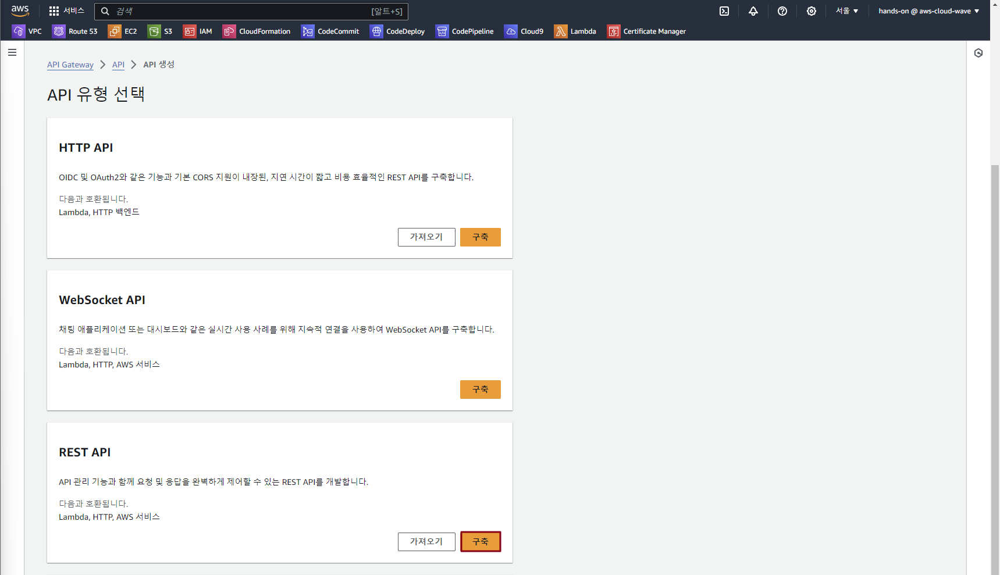

- REST API 생성 정보 입력

    - `새 API` 선택

    - API 이름: lab-edu-apigw-serverless

    - `API 생성` 버튼 클릭

        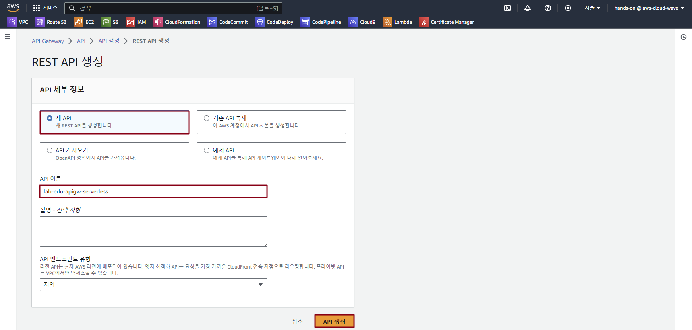

### 2. API Resource 및 Methods 생성

- `리소스 생성` 버튼 클릭

    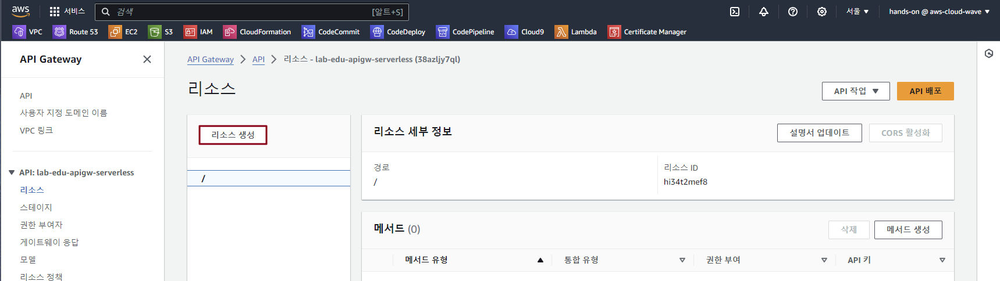

- 리소스 생성 정보 입력

    - 리소스 이름: insert

    - `오리진 간 리소스 공유(CORS)` 체크박스 클릭

    - `리소스 생성` 버튼 클릭

        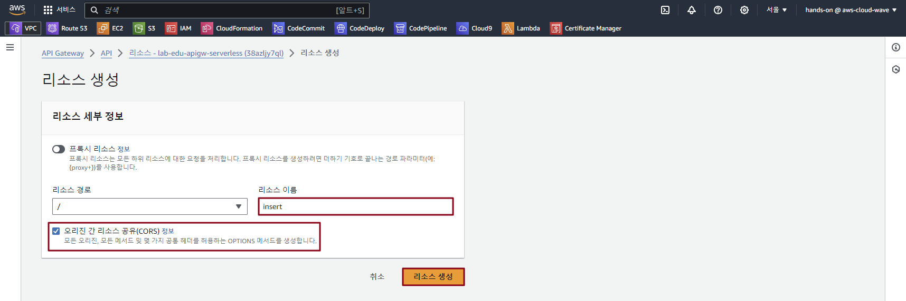

- `메서드 생성` 버튼 클릭

    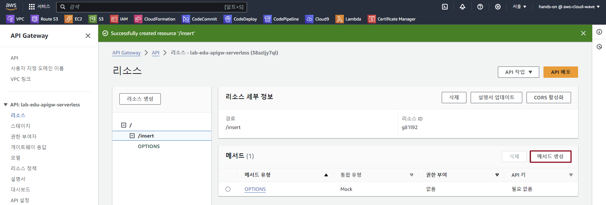

- 메서드 생성 정보 입력

    - 메서드 유형: POST

    - 통합 유형: Lambda

    - Lamdba 함수: lab-edu-lambda-serverless-put

        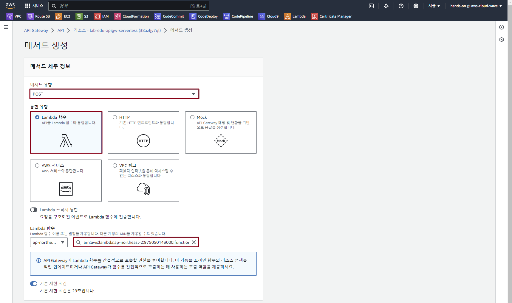

### 3. Frontend ↔ Backend CORS 설정

- 리소스의 `/insert` 항목 클릭 → `CORS` 활성화 버튼 클릭

    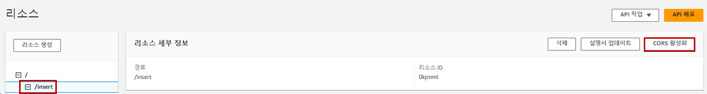

- Access-Control-Allow-Methods 수정
 
    - OPTION 활성화
    
    - POST 활성화 

    - `저장` 버튼 클릭

        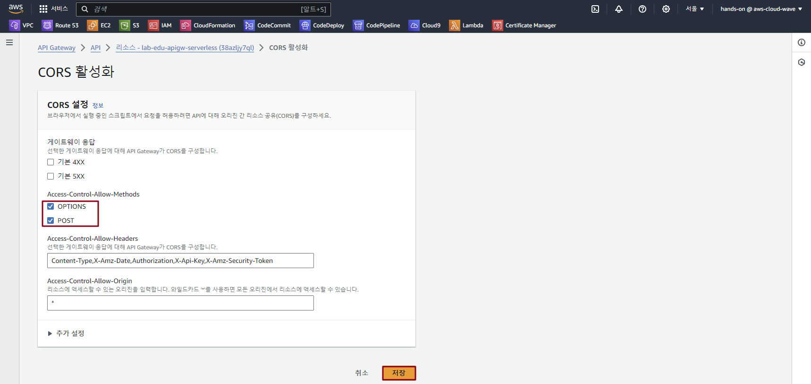

### 4. API Resource 배포

- `API 배포` 버튼 클릭

    - 스테이지: new

    - 스테이지 이름: dev

        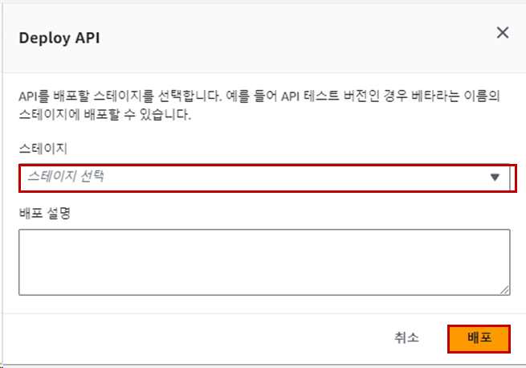

- API `URL 호출` 정보 복사

    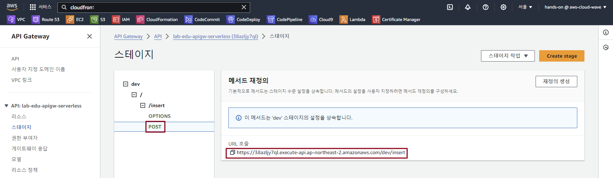

<br>

## Serverless Frontend에 Backend API 정보 수정

- VS Code IDE Terminal 화면으로 이동 → 폴더 구조 확인

    ```bash
    Workshop/
    ├── ...
    ├── images
    ├── scripts
    ├── serverless_code
    │   ├── css
    │   ├── images
    │   ├── index.html
    │   ├── lambda
    │   └── src
    │       └── script.js
    ├── support_files
    └── ...
    ```

- `serverless_code/src` 폴더의 `script.js` 파일 열기 → 코드 수정

    ```javascript
    document.getElementById('addBtn').addEventListener('click', addTodo)

    function addTodo() {
        const todoInput = document.getElementById('todoInput').value;

        if(todoInput) {
            fetch('{API_GATEWAAY_INSERT_URL}', {    // API 'URL 호출' 정보로 치환
                method: 'POST',
                body: JSON.stringify({ todo: todoInput }),
                headers: { 'Content-Type': 'application/json' }
            })
            .then(response => response.json())
            .then(data => {
                addListItem(data.body);
            })
            .catch((error) => {
                console.error('Error:', error);
            });
        };
    };
    ```

- VS Code IDE Terminal 화면으로 이동 → Frontend 소스 코드 업로드

    ```bash
    cd /Workshop
    aws s3 sync ./ s3://s3.{st01~30}.cj-cloud-wave.com
    ```

<br>

## 웹 호스팅 접속 테스트 (http://s3.{st01~30}.cj-cloud-wave.com/)

- http://s3.{st01~30}.cj-cloud-wave.com/ 접속 → 데이터 입력 → `Add` 버튼 클릭

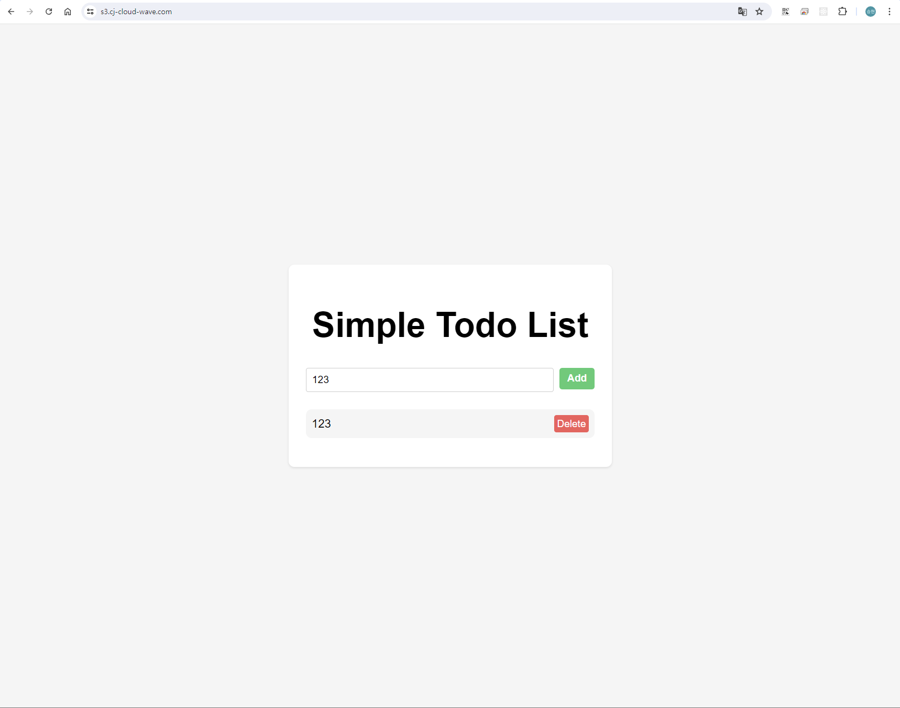

- 동작하지 않는 경우 CloudFront 캐시 무효화 처리 진행

- CloudFront 콘솔 메인 화면 → 대체 도메인: `s3.{st01~30}.cj-cloud-wave.com` 클릭 → `무효화` 탭 → `무효화 생성` 버튼 클릭

    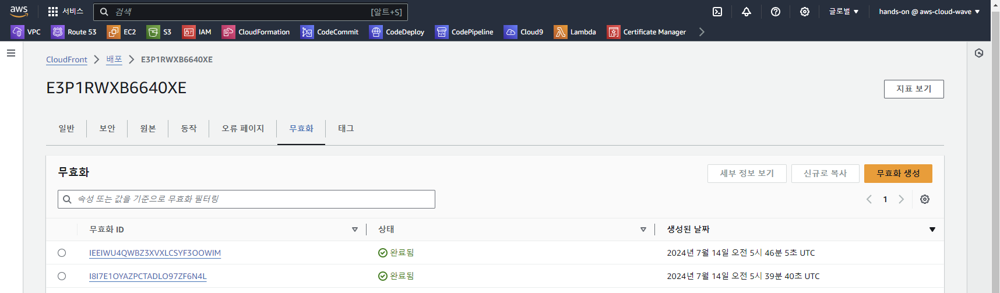

- `.*` 입력 → `무효화 생성` 버튼 클릭

<br>