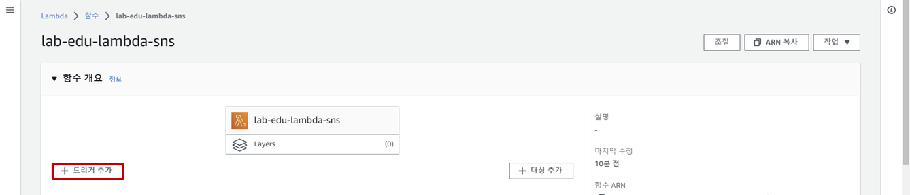

## Table of Contents
- [Table of Contents](#table-of-contents)
- [Notification 기능 구성](#notification-기능-구성)
  - [1. SNS 생성](#1-sns-생성)
  - [2. SNS Event Handler Function 생성](#2-sns-event-handler-function-생성)
  - [3. Lambda 함수 이벤트 트리거 설정](#3-lambda-함수-이벤트-트리거-설정)
- [Sample Code 수정 및 배포 테스트](#sample-code-수정-및-배포-테스트)
- [웹 호스팅 접속 테스트 (http://s3.{st01~30}.cj-cloud-wave.com/)](#웹-호스팅-접속-테스트-https3st0130cj-cloud-wavecom)

## Notification 기능 구성

### 1. SNS 생성

- **SNS 콘솔 메인 화면 → 주제 이름 입력: `lab-edu-sns-image-alarm` → `다음 단계` 버튼 클릭**

    

- `주제 생성` 버튼 클릭

- 생성 결과 화면 하단의 `구독 생성` 버튼 클릭 

    

- 구독 생성 정보 입력

    - 프로토콜: 이메일

    - 엔드포인트: 수신 Email 주소 입력 (개인 이메일 주소)

    - `구독 생성` 버튼 클릭

        

- 이메일 접속 → `Subscription Confirmation` 메일 확인 → `Confirm subscription` 클릭

    

### 2. SNS Event Handler Function 생성

- **Lambda 메인 콘솔 화면 → `함수 생성` 버튼 클릭**

- 함수 생성 정보 입력

    - 함수 이름: lab-edu-lambda-serverless-sns

    - 런타임: python 3.10

    - `기본 실행 역할 변경` 확장

    - 실행 역할 생성 정보 입력

        - `AWS 정책 템플릿에서 새 역할 생성` 라디오 버튼 클릭

        - 역할 이름: lab-edu-role-lambda-serverless-sns

        - 정책 템플릿: `Amazon SNS 게시 정책 (SNS)`

    - `함수 생성` 버튼 클릭

- **SNS 콘솔 메인 화면 → `주제` 탭 → `lab-edu-sns-image-alarm` 선택 → ARN 복사**

    

- VS Code IDE Terminal 화면으로 이동 → 폴더 구조 확인

    ```bash
    Workshop/
    ├── ...
    ├── images
    ├── scripts
    ├── serverless_code
    │   ├── css
    │   ├── images
    │   ├── index.html
    │   ├── lambda
    │   │   ├── lab-edu-lambda-event-handler.py
    │   │   ├── lab-edu-lambda-serverless_delete.py
    │   │   ├── lab-edu-lambda-serverless_put.py
    │   │   └── lab-edu-lambda-sns.py
    │   └── src
    ├── support_files
    └── ...
    ```

- `serverless_code/lambda` 폴더의 `lab-edu-lambda-sns.py` 파일 열기 → 코드 수정 → 코드 복사

    ```python
    import json
    import boto3

    sns = boto3.client('sns')

    def lambda_handler(event, context):
        response = sns.publish(
            TopicArn = '생성한 SNS Topic 의 ARN',       # ARN 정보 입력
            Message = event['Records'][0]['s3']['object']['key'] + ' has been ' + event['Records'][0]['eventName'],
            Subject = 'S3 Event',
            )
        # TODO implement
        return {
            'statusCode': 200,
            'body': json.dumps('Hello from Lambda!')
        }
    ```

- **Lambda 메인 콘솔 화면 → `lab-edu-lambda-serverless-sns` 선택 → 코드 소스 항목에 붙여넣기 → `Deploy` 버튼 클릭**

### 3. Lambda 함수 이벤트 트리거 설정

- **Lambda 메인 콘솔 화면 → `lab-edu-lambda-serverless-sns` 선택 → `트리거` 추가 버튼 클릭**

    

- 이벤트 트리거 생성 정보 입력

    - 소스 선택 이름: S3

    - 버킷: s3.*{st01~30}*.cj-cloud-wave.com

    - `입력과 출력 모두에 동일한 s3 버킷을 사용하는 것은...` 체크박스 활성화

    - `추가` 버튼 클릭

        

## Sample Code 수정 및 배포 테스트

- VS Code IDE Terminal 화면으로 이동 → `serverless_code/lambda` 폴더의 `index.html` 파일 열기 → 코드 수정

    ```html
    <html lang="en">
    <head>
    <meta charset="UTF-8">
    <meta name="viewport" content="width=device-width, initial-scale=1.0">
    <link rel="icon" href="./images/cj-olivenetworks.png" type="image/png"> <!-- cj-olivenetworks → google-logo 변경 -->
    <title>Serverless Application</title>
    <link rel="stylesheet" href="./css/style.css">
    </head>
    <body>
    <div class="container">
        <h1>Simple Todo List</h1>
        <div class="flex-container">
            <input type="text" id="todoInput" placeholder="Add a new todo list">
            <button id="addBtn">Add</button>
        </div>
        <script src="./src/script.js"></script>
        <ul id="todoList"></ul>
    </div>
    </body>
    </html>
    ```

- VS Code IDE Terminal 화면으로 이동 → Frontend 소스 코드 업로드

    ```bash
    cd /Workshop
    aws s3 sync ./ s3://s3.{st01~30}.cj-cloud-wave.com
    ```

## 웹 호스팅 접속 테스트 (http://s3.{st01~30}.cj-cloud-wave.com/)

- 웹사이트 로고 변경 확인

    

- 이메일 접속 → `S3 Event` 메일 확인
  
    