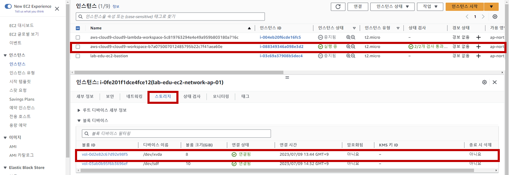
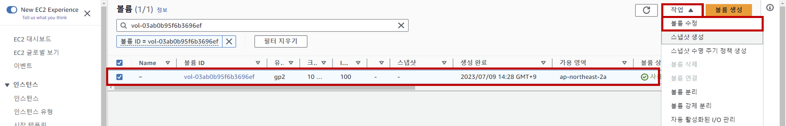
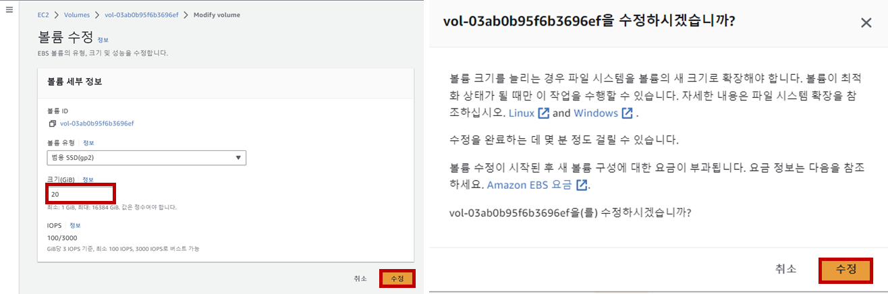

## Table of Contents
- [Table of Contents](#table-of-contents)
- [Web Server EBS Volume Size 확장](#web-server-ebs-volume-size-확장)
  - [1. EBS 볼륨 사이즈 수정](#1-ebs-볼륨-사이즈-수정)
  - [2. Web Server 접속](#2-web-server-접속)
  - [3. 볼륨 파티션 확장](#3-볼륨-파티션-확장)
  - [4. 파일 시스템 확장](#4-파일-시스템-확장)

## Web Server EBS Volume Size 확장

### 1. EBS 볼륨 사이즈 수정

- **EC2 메인 콘솔 화면 → `인스턴스` 리소스 탭 → `lab-edu-ec2-web` 서버 선택 → 상세 화면의 `스토리지` 탭 → `볼륨 ID` 클릭**

    

- `볼륨 ID` 선택 → `작업` 버튼 클릭 → `볼륨 수정` 버튼 클릭

    

- 크기 정보: `20GiB` 입력 → `수정` 버튼 클릭 → `수정` 버튼 클릭

    

### 2. Web Server 접속

- VS Code Terminal에서 ssh 명령을 통해 Web Server 접속

    ```bash
    ssh web-server
    ```

- 확장된 볼륨 확인

    - Xen Instance System 기준
  
        ```bash
        $ lsblk
        NAME      MAJ:MIN RM SIZE RO TYPE MOUNTPOINTS
        xvda      202:0    0  20G  0 disk 
        ├─xvda1   202:1    0  10G  0 part /
        ├─xvda127 259:0    0   1M  0 part 
        └─xvda128 259:1    0  10M  0 part /boot/efi
        ```

    - Nitro Instance System 기준
  
        ```bash
        $ sudo lsblk
        NAME          MAJ:MIN RM SIZE RO TYPE MOUNTPOINT
        nvme0n1       259:1    0  20G  0 disk
        └─nvme0n1p1   259:2    0   8G  0 part /
        └─nvme0n1p128 259:3    0   1M  0 part
        ```

### 3. 볼륨 파티션 확장

- Xen Instance System 기준

    ```bash
    $ sudo growpart /dev/xvda 1
    ```

    ```bash
    $ lsblk
    NAME      MAJ:MIN RM SIZE RO TYPE MOUNTPOINTS
    xvda      202:0    0  20G  0 disk 
    ├─xvda1   202:1    0  20G  0 part /
    ├─xvda127 259:0    0   1M  0 part 
    └─xvda128 259:1    0  10M  0 part /boot/efi
    ```

- Nitro Instance System 기준

    ```bash
    $ sudo growpart /dev/nvme0n1 1
    ```

    ```bash
    $ sudo lsblk
    NAME          MAJ:MIN RM SIZE RO TYPE MOUNTPOINT
    nvme0n1       259:1    0  20G  0 disk
    └─nvme0n1p1   259:2    0  20G  0 part /
    └─nvme0n1p128 259:3    0   1M  0 part
    ```

### 4. 파일 시스템 확장

- XFS 파일 시스템 기준

    ```bash
    $ df -Th
    Filesystem     Type      Size  Used Avail Use% Mounted on
    devtmpfs       devtmpfs  4.0M     0  4.0M   0% /dev
    tmpfs          tmpfs     475M     0  475M   0% /dev/shm
    tmpfs          tmpfs     190M  2.9M  188M   2% /run
    /dev/xvda1     xfs        10G  8.4G  1.7G  84% /
    tmpfs          tmpfs     475M  8.0K  475M   1% /tmp
    /dev/xvda128   vfat       10M  1.3M  8.7M  13% /boot/efi
    tmpfs          tmpfs      95M     0   95M   0% /run/user/1000
    ```

    ```bash
    sudo xfs_growfs -d /
    ```

    ```bash
    $ df -Th
    Filesystem     Type      Size  Used Avail Use% Mounted on
    devtmpfs       devtmpfs  4.0M     0  4.0M   0% /dev
    tmpfs          tmpfs     475M     0  475M   0% /dev/shm
    tmpfs          tmpfs     190M  2.9M  188M   2% /run
    /dev/xvda1     xfs        20G  8.4G   12G  43% /
    tmpfs          tmpfs     475M  8.0K  475M   1% /tmp
    /dev/xvda128   vfat       10M  1.3M  8.7M  13% /boot/efi
    tmpfs          tmpfs      95M     0   95M   0% /run/user/1000
    ```

- EXT 2~4 파일 시스템 기준

    ```bash
    sudo resize2fs /dev/xvda1
    ```

    ```bash
    sudo resize2fs /dev/nvme0n1p1
    ```
<br>