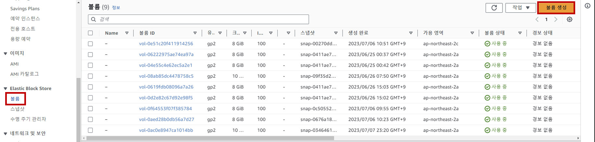
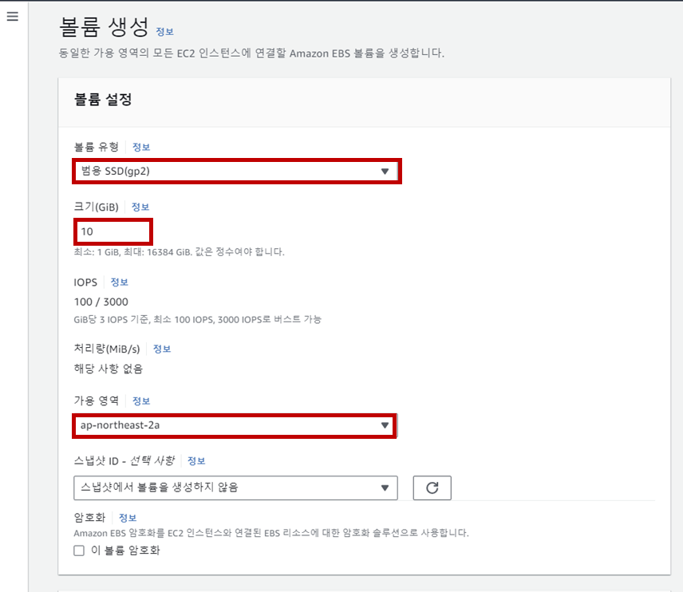
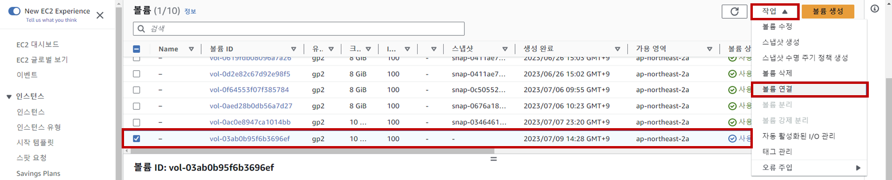

## Table of Contents
- [Table of Contents](#table-of-contents)
- [EBS Volume 생성 및 연결](#ebs-volume-생성-및-연결)
  - [1. EBS 볼륨 추가 생성](#1-ebs-볼륨-추가-생성)
  - [2. Web Server에 볼륨 연결](#2-web-server에-볼륨-연결)
  - [3. Web Server 접속](#3-web-server-접속)
  - [4. 파일 시스템 포맷](#4-파일-시스템-포맷)
  - [5. 파일 시스템 자동 마운트 설정](#5-파일-시스템-자동-마운트-설정)

## EBS Volume 생성 및 연결

### 1. EBS 볼륨 추가 생성

- **EC2 메인 콘솔 화면 → `볼륨` 리소스 탭 → `볼륨 생성` 버튼 클릭**

    

- EBS 볼륨 생성 정보 입력

    - 볼륨 유형: 범용 SSD(gp3)

    - 크기: 10GiB

    - 가용 영역: ap-northeast-2a

    - `볼륨 생성` 버튼 클릭

        

### 2. Web Server에 볼륨 연결

- 신규 생성 볼륨 선택 → `작업` → `볼륨 연결` 버튼 클릭

    

- EBS 연결 정보 입력

    - 인스턴스 항목: lab-edu-ec2-web

    - 디바이스 이름: /dev/sdf

    - `볼륨 연결` 버튼 클릭

### 3. Web Server 접속

- VS Code Terminal에서 ssh 명령을 통해 Web Server 접속

    ```bash
    ssh web-server
    ```

- 연결된 볼륨 정보 확인

    ```bash
    $ lsblk
    NAME          MAJ:MIN RM SIZE RO TYPE MOUNTPOINTS
    nvme0n1       259:0    0   8G  0 disk 
    ├─nvme0n1p1   259:1    0   8G  0 part /
    ├─nvme0n1p127 259:2    0   1M  0 part 
    └─nvme0n1p128 259:3    0  10M  0 part /boot/efi
    nvme1n1       259:4    0  10G  0 disk 
    ```

### 4. 파일 시스템 포맷

- 볼륨을 연결할 `/data` 폴더 생성

    ```bash
    sudo mkdir /data
    ```

- xfs 타입으로 파일 시스템 포맷 

    ```bash
    sudo mkfs.xfs /dev/nvme1n1
    ```

- `/data` 폴더에 마운트

    ```bash
    sudo mount /dev/nvme1n1 /data
    ```

- 마운트 결과 확인

    ```bash
    $ lsblk
    NAME          MAJ:MIN RM SIZE RO TYPE MOUNTPOINTS
    nvme0n1       259:0    0   8G  0 disk 
    ├─nvme0n1p1   259:1    0   8G  0 part /
    ├─nvme0n1p127 259:2    0   1M  0 part 
    └─nvme0n1p128 259:3    0  10M  0 part /boot/efi
    nvme1n1       259:4    0  10G  0 disk /data
    ```

### 5. 파일 시스템 자동 마운트 설정

> Command Line으로 설정 마운트 정보는 시스템 재부팅 시 초기화 되기 때문에 fstab 파일에 등록해서 마운트를 자동으로 처리하도록 설정

- blkid 명령어로 `/dev/nvme1n1` 장치의 UUID 값 확인 후 복사

    ```bash
    $ sudo blkid
    /dev/nvme0n1p1: LABEL="/" UUID="f2b2ef41-737e-43c2-8746-a8a3b0a9feb8" BLOCK_SIZE="4096" TYPE="xfs" PARTLABEL="Linux" PARTUUID="78211cfb-c3f9-4d33-8fa9-b74de39853b2"
    /dev/nvme0n1p128: SEC_TYPE="msdos" UUID="D6C4-DA90" BLOCK_SIZE="512" TYPE="vfat" PARTLABEL="EFI System Partition" PARTUUID="11e41d8e-dee8-4c97-a1e4-9dab7d22bf71"
    /dev/nvme0n1p127: PARTLABEL="BIOS Boot Partition" PARTUUID="9c4a6d1a-eaff-4f1c-81e9-c078d27058e9"
    /dev/nvme1n1: UUID="d7f03908-1e26-43d9-bb4d-44eb2fdd09f5" BLOCK_SIZE="512" TYPE="xfs"
    ```
- `/etc/fstab` 설정

    ```bash
    $ sudo vim /etc/fstab
    ```

    ```bash
    UUID=f2b2ef41-737e-43c2-8746-a8a3b0a9feb8  /          xfs   defaults,noatime  1  1
    UUID=D6C4-DA90                             /boot/efi  vfat  defaults,noatime,uid=0,gid=0,umask=0077,shortname=winnt,x-systemd.automount 0  2
    UUID=d7f03908-1e26-43d9-bb4d-44eb2fdd09f5  /data      xfs   defaults,noatime  1  1 #내용추가
    ```

- 마운트 해제 후 설정 확인

    ```bash
    sudo umount /data
    ```

    ```bash
    sudo mount -a
    ```
<br>