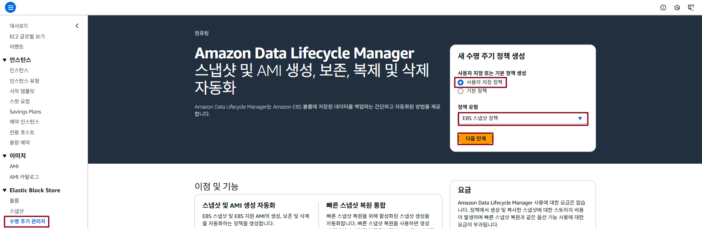

## Table of Contents
- [Table of Contents](#table-of-contents)
- [Snapshop 생성](#snapshop-생성)
  - [1. 스냅샷 생성](#1-스냅샷-생성)
  - [2. 스냅샷으로 볼륨 복제 생성](#2-스냅샷으로-볼륨-복제-생성)
  - [3. 복제 볼륨 VS Code 서버에 연결](#3-복제-볼륨-vs-code-서버에-연결)
  - [3. VS Code Server 접속](#3-vs-code-server-접속)
  - [4. 파일 시스템 마운트](#4-파일-시스템-마운트)
  - [5. Web Server Source Code 확인](#5-web-server-source-code-확인)
- [EBS Snapshot 해외 리전으로 복제](#ebs-snapshot-해외-리전으로-복제)
- [EBS 수명 주기 정책 설정](#ebs-수명-주기-정책-설정)
  - [1. 수명 주기 정책 생성](#1-수명-주기-정책-생성)

## Snapshop 생성

### 1. 스냅샷 생성

- **EC2 메인 콘솔 화면 → `인스턴스` 리소스 탭 → `lab-edu-ec2-web` 서버 선택 → 상세 화면의 `스토리지` 탭 → `/dev/xvda` 장치 `볼륨 ID` 클릭**

    

- `볼륨 ID` 선택 → `작업` 버튼 클릭 → `스냅샷 생성` 버튼 클릭

- 스냅샷 생성 정보 입력

    - 설명: lab-edu-snapshot-web

    - `태그 추가` 버튼 클릭

    - 키/값: Name / lab-edu-snapshot-web

    - `스냅샷 생성` 버튼 클릭

        

### 2. 스냅샷으로 볼륨 복제 생성

- **EC2 메인 콘솔 화면 → `스냅샷` 리소스 탭 → `lab-edu-snapshot-web` 스냅샷 선택 → `작업` → `스냅샷에서 볼륨 생성`**

- 볼륨 생성 정보 입력

    - 가용 영역: ap-northeast-2c

    - `암호화` 체크박스 활성화

    - `태그 추가` 버튼 클릭

    - 키/값: Name / lab-edu-ebs-web

    - `볼륨 생성` 버튼 클릭

- **EC2 메인 콘솔 화면 → `볼륨` 리소스 탭 → `lab-edu-ebs-web` 볼륨 선택 → 생성된 볼륨 상태 확인** 

    > <span style="color:green">**※ NOTE:**</span> 암호화 항목에 설정이 반영되었는지 체크

    

### 3. 복제 볼륨 VS Code 서버에 연결

- 복제 볼륨 `lab-edu-ebs-web` 선택 → `작업` → `볼륨 연결` 버튼 클릭

- EBS 연결 정보 입력

    - 인스턴스 항목: lab-edu-ec2-vscode

    - 디바이스 이름: /dev/sdf

    - `볼륨 연결` 버튼 클릭

### 3. VS Code Server 접속

- VS Code Terminal 접속 후 볼륨 연결 상태 확인

    ```bash
    $ lsblk
    NAME          MAJ:MIN RM  SIZE RO TYPE MOUNTPOINTS
    loop0           7:0    0 26.3M  1 loop /snap/amazon-ssm-agent/9881
    loop1           7:1    0 73.9M  1 loop /snap/core22/1663
    loop2           7:2    0 38.8M  1 loop /snap/snapd/21759
    loop3           7:3    0 44.3M  1 loop /snap/snapd/23258
    loop4           7:4    0 73.9M  1 loop /snap/core22/1722
    nvme0n1       259:0    0  100G  0 disk 
    ├─nvme0n1p1   259:1    0   99G  0 part /
    ├─nvme0n1p14  259:2    0    4M  0 part 
    ├─nvme0n1p15  259:3    0  106M  0 part /boot/efi
    └─nvme0n1p16  259:4    0  913M  0 part /boot
    nvme1n1       259:5    0   20G  0 disk 
    ├─nvme1n1p1   259:6    0   20G  0 part 
    ├─nvme1n1p127 259:7    0    1M  0 part 
    └─nvme1n1p128 259:8    0   10M  0 part 
    ```
### 4. 파일 시스템 마운트

- 볼륨을 연결할 `/web_directory` 폴더 생성

    ```bash
    sudo mkdir /web_directory
    ```

- `/web_directory` 폴더에 마운트

    ```bash
    sudo mount /dev/nvme1n1p1 /web_directory
    ```

- 마운트 결과 확인

    ```bash
    $ lsblk
    NAME          MAJ:MIN RM  SIZE RO TYPE MOUNTPOINTS
    loop0           7:0    0 26.3M  1 loop /snap/amazon-ssm-agent/9881
    loop1           7:1    0 73.9M  1 loop /snap/core22/1663
    loop2           7:2    0 38.8M  1 loop /snap/snapd/21759
    loop3           7:3    0 44.3M  1 loop /snap/snapd/23258
    loop4           7:4    0 73.9M  1 loop /snap/core22/1722
    nvme0n1       259:0    0  100G  0 disk 
    ├─nvme0n1p1   259:1    0   99G  0 part /
    ├─nvme0n1p14  259:2    0    4M  0 part 
    ├─nvme0n1p15  259:3    0  106M  0 part /boot/efi
    └─nvme0n1p16  259:4    0  913M  0 part /boot
    nvme1n1       259:5    0   20G  0 disk 
    ├─nvme1n1p1   259:6    0   20G  0 part /web_directory
    ├─nvme1n1p127 259:7    0    1M  0 part 
    └─nvme1n1p128 259:8    0   10M  0 part
    ```

- 디스크 데이터 확인

    ```bash
    $ ll /web_directory/
    total 36
    dr-xr-xr-x. 19 root root   249 Dec 15 06:32 ./
    drwxr-xr-x  25 root root  4096 Dec 15 07:23 ../
    lrwxrwxrwx.  1 root root     7 Jan 30  2023 bin -> usr/bin/
    dr-xr-xr-x.  5 root root 16384 Nov 22 05:03 boot/
    drwxr-xr-x.  2 root root     6 Dec 15 06:32 data/
    drwxr-xr-x.  3 root root   136 Nov 22 05:04 dev/
    drwxr-xr-x. 76 root root 16384 Dec 15 07:06 etc/
    drwxr-xr-x.  3 root root    22 Dec 14 14:18 home/
    lrwxrwxrwx.  1 root root     7 Jan 30  2023 lib -> usr/lib/
    lrwxrwxrwx.  1 root root     9 Jan 30  2023 lib64 -> usr/lib64/
    drwxr-xr-x.  2 root root     6 Nov 22 05:01 local/
    drwxr-xr-x.  2 root root     6 Jan 30  2023 media/
    drwxr-xr-x.  2 root root     6 Jan 30  2023 mnt/
    drwxr-xr-x.  3 root root    17 Nov 22 05:03 opt/
    drwxr-xr-x   2 root root     6 Nov 22 05:01 proc/
    dr-xr-x---.  5 root root   179 Dec 15 07:06 root/
    drwxr-xr-x.  2 root root     6 Nov 22 05:04 run/
    lrwxrwxrwx.  1 root root     8 Jan 30  2023 sbin -> usr/sbin/
    drwxr-xr-x.  2 root root     6 Jan 30  2023 srv/
    drwxr-xr-x   2 root root     6 Nov 22 05:01 sys/
    drwxrwxrwt   2 root root     6 Nov 22 05:01 tmp/
    drwxr-xr-x. 12 root root   144 Nov 22 05:02 usr/
    drwxr-xr-x. 19 root root   266 Dec 14 14:18 var/
    ```

### 5. Web Server Source Code 확인

- root 계정으로 전환

    ```bash
    sudo su -
    ```

- `/web_directory/root/streamlit-project` 폴더로 이동

    ```bash
    cd /web_directory/root/streamlit-project
    ```

- Source Code 확인
  
    ```bash
    $ ll
    total 66020
    drwxr-xr-x. 11 root root    16384 Dec 14 14:19 ./
    dr-xr-x---.  5 root root      179 Dec 15 07:06 ../
    -rw-r--r--.  1 root root      263 Dec 14 14:19 appspec.yml
    drwxr-xr-x.  3 root root       78 Dec 13 19:24 aws/
    -rw-r--r--.  1 root root 67517785 Dec 14 14:19 awscliv2.zip
    drwxr-xr-x.  2 root root    16384 Dec 14 14:19 backend/
    drwxr-xr-x.  8 root root      163 Dec 14 14:19 .git/
    -rw-r--r--.  1 root root       24 Dec 14 14:19 .gitignore
    drwxr-xr-x.  3 root root       56 Dec 14 14:19 images/
    -rw-r--r--.  1 root root     2290 Dec 14 14:19 main.py
    drwxr-xr-x.  3 root root      121 Dec 14 14:31 menu/
    -rw-r--r--.  1 root root       37 Dec 14 14:19 README.md
    -rw-r--r--.  1 root root      275 Dec 14 14:19 requirements.txt
    drwxr-xr-x.  2 root root    16384 Dec 14 14:19 scripts/
    drwxr-xr-x.  6 root root       74 Dec 14 14:19 serverless_code/
    drwxr-xr-x.  6 root root    16384 Dec 14 14:19 support_files/
    drwxr-xr-x.  3 root root       60 Dec 14 14:31 widget/
    ```
<br>


## EBS Snapshot 해외 리전으로 복제

- **EC2 메인 콘솔 화면 → `스냅샷` 리소스 탭 → `lab-edu-snapshot-web` 스냅샷 선택 → `작업` → `스냅샷 복사`**

- 스냅샷 복제 정보 입력

    - **대상 리전:** us-east-1

    - `이 스냅샷 암호화` 체크박스 활성화

    - `볼륨 복제` 버튼 클릭

- **버지니아 리전으로 이동 → EC2 메인 콘솔 화면 → `스냅샷` 리소스 탭 → 복제된 스냅샷 정보 확인**

    

<br> 


## EBS 수명 주기 정책 설정

### 1. 수명 주기 정책 생성

- **EC2 메인 콘솔 화면 → `수명 주기 관리자` 리소스 탭 → `사용자 지정 정책` 선택 → `EBS Snapshot 정책` 선택 → `다음 단계` 클릭**

    > <span style="color:green">**※ NOTE:**</span> EBS Snapshot 정책
    >
    > - EBS 스냅샷 정책 : 스토리지 볼륨 백업
    >
    > - EBS 지원 AMI 정책 : AMI 이미지로 백업
    >
    > - 교차 계정 복사 이벤트 정책 : 백업 AMI 이미지를 다른 AWS 계정과 공유

    

- 수명 주기 정책 생성 정보 입력

    - **대상 리소스 유형:** *볼륨*

    - **대상 리소스 태그:** 

        - **Key:** *Name*

        - **Value:** *lab-edu-ebs-web*

        - `추가` 버튼 클릭

    - **정책 설명:** *lifecycle for web server ebs*

    - `다음` 버튼 클릭

        

    - **일정 세부 정보**

        - **일정 이름:** *lab-edu-ebslc-web*

        - **빈도:** *일별*

        - **매:** *24시간*

        - **시작 시간:** *09:00*

        - **보존 유형:** *개수*

        - **유지:** *5*

        

    - `정책 검토` 버튼 클릭 → `정책 생성` 버튼 클릭
