## Table of Contents
- [Table of Contents](#table-of-contents)
- [콘솔에서 Amazon S3 생성 및 ACL 접근제어 설정](#콘솔에서-amazon-s3-생성-및-acl-접근제어-설정)
  - [1. 테스트용 S3 버킷 생성](#1-테스트용-s3-버킷-생성)
  - [2. 테스트 파일 업로드](#2-테스트-파일-업로드)
  - [3. 테스트 객체 접근 테스트](#3-테스트-객체-접근-테스트)
  - [4. Access Control List 이용 Public Access 설정](#4-access-control-list-이용-public-access-설정)
    - [4.1 Access Control List 기능 활성화](#41-access-control-list-기능-활성화)
    - [4.2 Public Access Block 비활성화](#42-public-access-block-비활성화)
    - [4.3 업로드 한 테스트용 객체 파일 Public 설정](#43-업로드-한-테스트용-객체-파일-public-설정)
    - [4.4 테스트용 객체 접근 테스트](#44-테스트용-객체-접근-테스트)
  - [5. 테스트 파일 추가 업로드](#5-테스트-파일-추가-업로드)
    - [5.1 두 번재 테스트 파일 업로드](#51-두-번재-테스트-파일-업로드)
    - [5.2 테스트용 객체 접근 테스트](#52-테스트용-객체-접근-테스트)
  - [6. 테스트용 버킷 삭제](#6-테스트용-버킷-삭제)
    - [6.1 테스트용 객체 삭제](#61-테스트용-객체-삭제)
    - [6.2 버킷 삭제](#62-버킷-삭제)

## 콘솔에서 Amazon S3 생성 및 ACL 접근제어 설정

### 1. 테스트용 S3 버킷 생성

- **S3 콘솔 메인 화면 → `버킷 만들기` 버튼 클릭**

    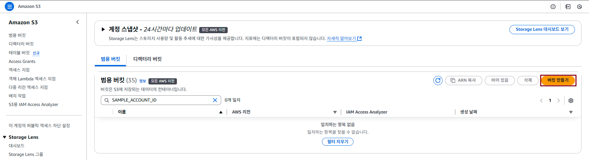

- S3 버킷 생성 정보 입력

    - 버킷 이름: lab-edu-bucket-sample-{ACCOUNT_ID}

    - `버킷 생성` 버튼 클릭

    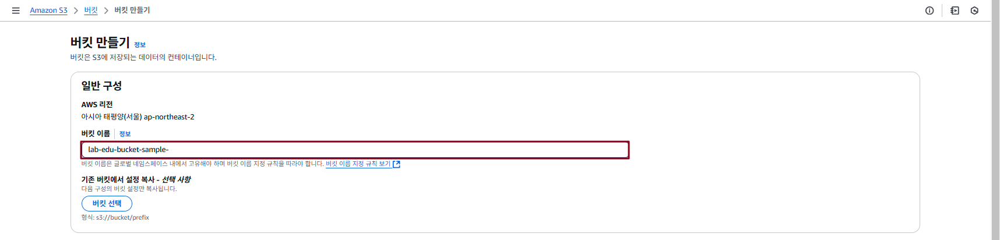

### 2. 테스트 파일 업로드

- S3 콘솔 메인 화면 → `lab-edu-bucket-sample-{ACCOUNT_ID}` 버킷 클릭

    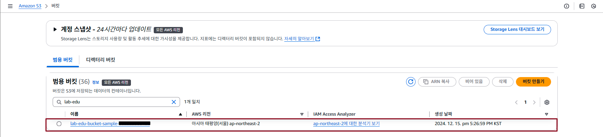

- `업로드` 버튼 클릭

    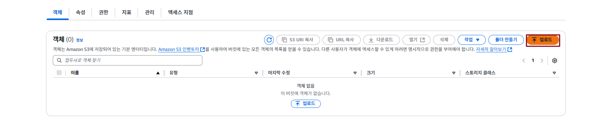

- `파일 추가` 버튼 클릭 → 테스트용 파일 선택 → `열기` 버튼 클릭 → `업로드` 버튼 클릭

    > **※ NOTE:** 테스트용 파일은 임의의 이미지 파일 활용

    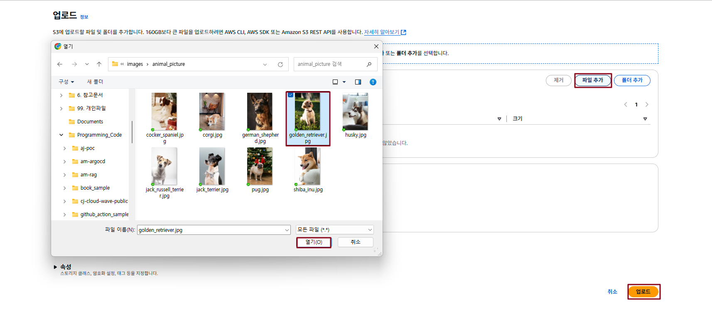

### 3. 테스트 객체 접근 테스트

- 테스트 객체명 클릭

    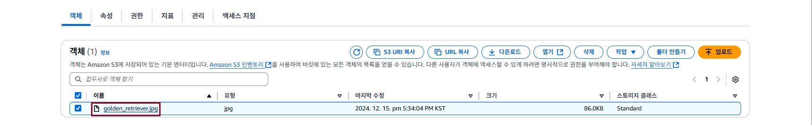

- `객체 URL` 복사

    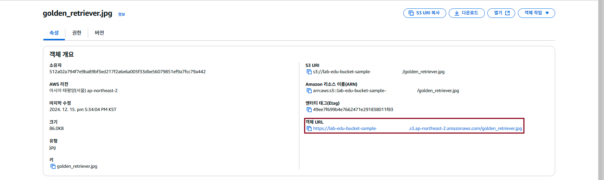

- 웹 브라우저에서 접속 테스트

    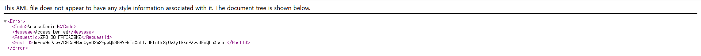

### 4. Access Control List 이용 Public Access 설정

#### 4.1 Access Control List 기능 활성화

- S3 콘솔 메인 화면 → `lab-edu-bucket-sample-{ACCOUNT_ID}` 버킷 클릭 → `권한` 탭

    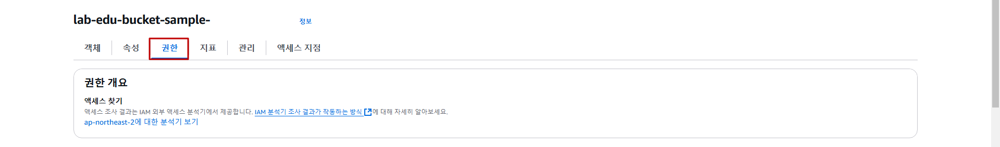

- `객체 소유권` 필드의 `편집` 버튼 클릭

    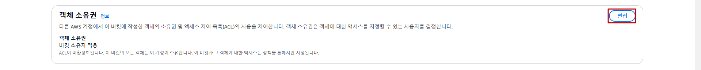

- `ACL 활성화됨` 활성화 → `ACL이 복원된다는 것을 확인합니다.` 체크 → `변경 사항 저장` 버튼 클릭

    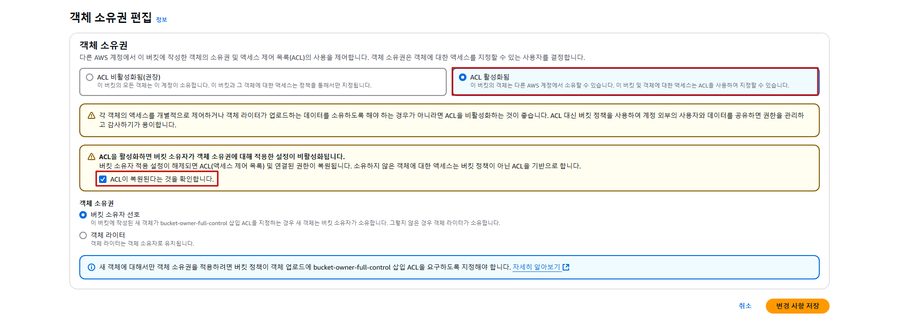

#### 4.2 Public Access Block 비활성화

- `퍼블릭 액세스 차단` 필드의 `편집` 버튼 클릭

    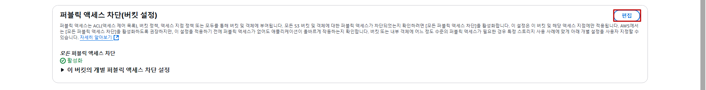

- `모든 퍼블릭 액세스 차단` 체크 박스 해제 → `변경 사항 저장` 버튼 클릭

    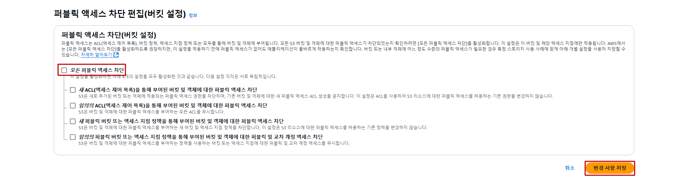

- 팝업된 경고 문구 화면의 입력 창에 `확인` 텍스트 입력 → `확인` 버튼 클릭

    

#### 4.3 업로드 한 테스트용 객체 파일 Public 설정

- 버킷의 `객체` 탭으로 이동 → 테스트 파일 체크 → `작업` 클릭 →  `ACL을 사용하여 퍼블릭으로 설정` 클릭

    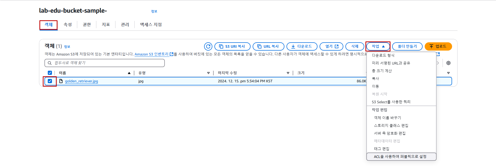

- `퍼블릭으로 설정` 버튼 클릭

    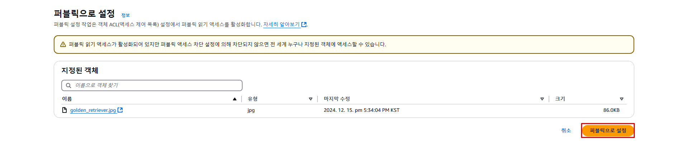

#### 4.4 테스트용 객체 접근 테스트

- 테스트 객체명 클릭

    

- `객체 URL` 복사

    

- 웹 브라우저에서 접속 테스트

    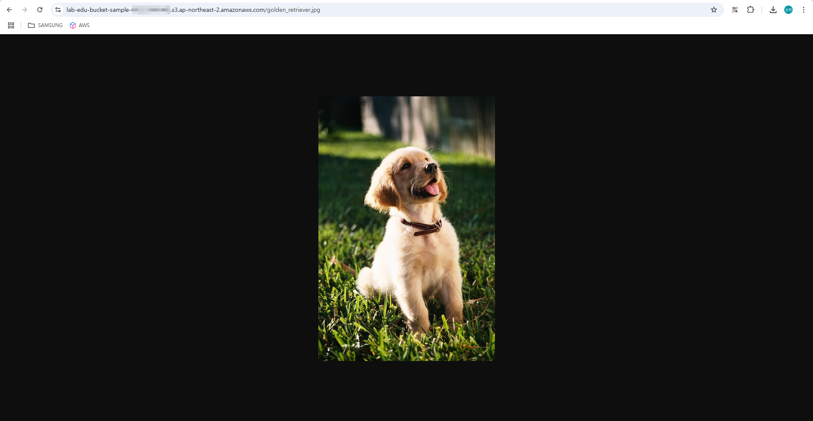

### 5. 테스트 파일 추가 업로드

#### 5.1 두 번재 테스트 파일 업로드

> **※ NOTE:** 기존 파일과 다른 새로운 파일 업로드

- S3 콘솔 메인 화면 → `lab-edu-bucket-sample-{ACCOUNT_ID}` 버킷 클릭 → `업로드` 버튼 클릭

- `파일 추가` 버튼 클릭 → 테스트용 파일 선택 → `열기` 버튼 클릭 

- 화면 하단의 `권한` 탭 확장 → `퍼블릭 읽기 액세스 권한 부여` 체크 → `지정된 객체에 퍼블릭 읽기 액세스 권한을 부여할 위험이 있음을 알고 있습니다.` 체크 → `업로드` 버튼 클릭

    > **※ NOTE:** ACL에서 모든 사용자를 대상으로 Public Access 허용하지 않는 경우 각 객체 마다 Public Access 설정 필요

    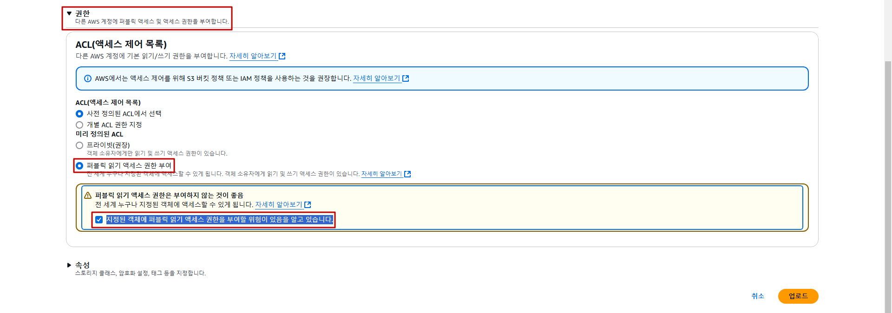

#### 5.2 테스트용 객체 접근 테스트

- 테스트 객체명 클릭 → `객체 URL` 복사 → 웹 브라우저에서 접속 테스트

    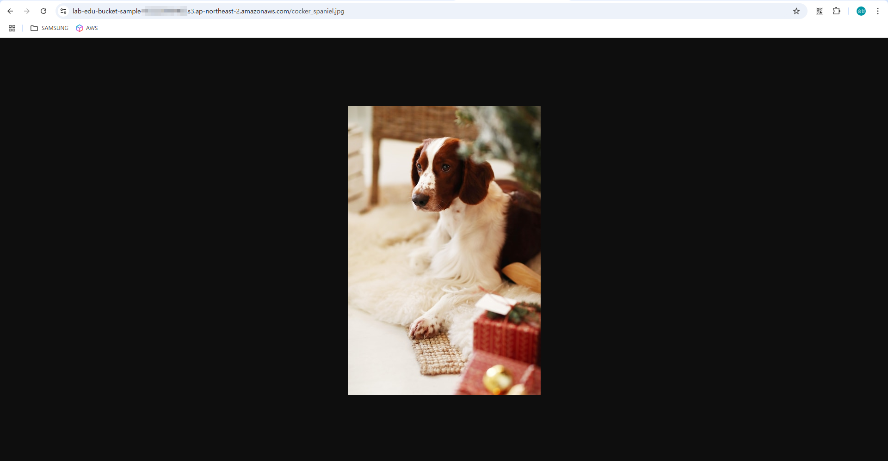

### 6. 테스트용 버킷 삭제

#### 6.1 테스트용 객체 삭제

- S3 콘솔 메인 화면 → `lab-edu-bucket-sample-{ACCOUNT_ID}` 버킷 클릭 → 객체 전체 선택 버튼 클릭 → `삭제` 버튼 클릭

    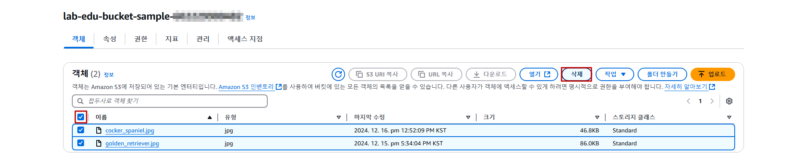

- `영구 삭제` 텍스트 입력 → `객체 삭제` 버튼 클릭

    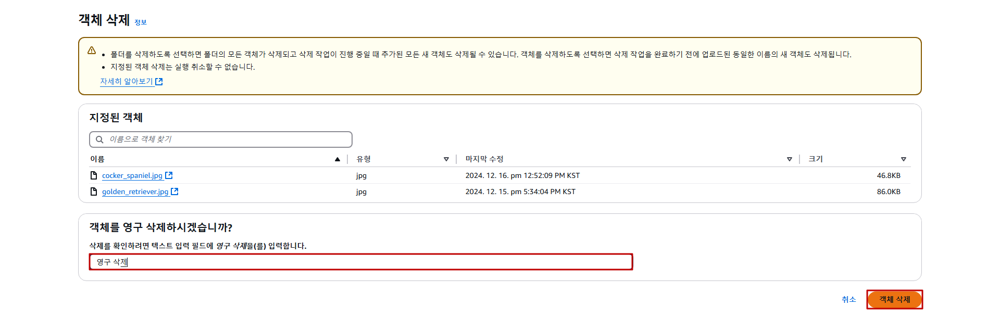

#### 6.2 버킷 삭제

- S3 콘솔 메인 화면 → `lab-edu-bucket-sample-{ACCOUNT_ID}` 활성화 버튼 클릭 → `삭제` 버튼 클릭

    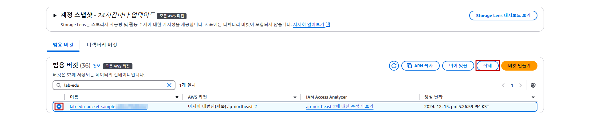

- 화면의 입력 창에 `lab-edu-bucket-sample-{ACCOUNT_ID}` 버킷명 입력 → `버킷 삭제` 버튼 클릭

    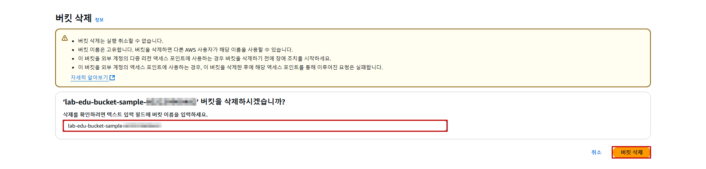