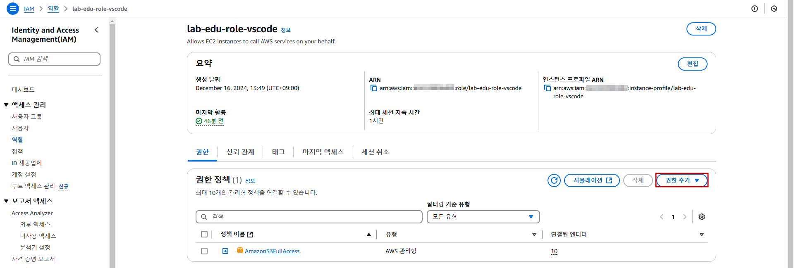

## Table of Contents
- [Table of Contents](#table-of-contents)
- [S3 Bucket Policy 설정 (IAM Role 접근 허용 정책)](#s3-bucket-policy-설정-iam-role-접근-허용-정책)
  - [1. Web Server 접속 및 S3 접근 테스트](#1-web-server-접속-및-s3-접근-테스트)
  - [2. VS Code 서버 Instance Profile에 IAM 권한 추가](#2-vs-code-서버-instance-profile에-iam-권한-추가)
  - [3. Bucket JSON 정책 수정](#3-bucket-json-정책-수정)
  - [4. Bucket Policy 설정](#4-bucket-policy-설정)
  - [5. Web Server 접속 및 S3 접근 테스트](#5-web-server-접속-및-s3-접근-테스트)
- [S3 Bucket Policy 설정 (Source IP 기반 접근 허용 정책)](#s3-bucket-policy-설정-source-ip-기반-접근-허용-정책)
  - [1. 기존 버킷 정책 삭제 및 접근 테스트](#1-기존-버킷-정책-삭제-및-접근-테스트)
  - [2. Bucket JSON 정책 수정 및 반영 스크립트 실행](#2-bucket-json-정책-수정-및-반영-스크립트-실행)
  - [3. Web Server 접속 및 S3 접근 테스트](#3-web-server-접속-및-s3-접근-테스트)

## S3 Bucket Policy 설정 (IAM Role 접근 허용 정책)

### 1. Web Server 접속 및 S3 접근 테스트

- VS Code Terminal에서 ssh 명령을 통해 Web Server 접속

    ```bash
    $ ssh web-server
    ```

- S3 버킷의 특정 객체 조회 명령어 테스트

    > <span style="color:green">**※ [NOTE]:**</span> 현재는 IAM Policy에 `EC2FullAccess` 권한만 할당되어 있기 때문에 접근 제한

    ```bash
    ACCOUNT_ID=$(aws sts get-caller-identity --query Account --output text)
    BUCKET_NAME="lab-edu-bucket-image-$ACCOUNT_ID"
    ```

    ```bash
    $ aws s3 ls s3://$BUCKET_NAME
    An error occurred (AccessDenied) when calling the ListBuckets operation: User: arn:aws:sts::602229900482:assumed-role/lab-edu-role-ec2/i-009a44f7f7119202e is not authorized to perform: s3:ListAllMyBuckets because no identity-based policy allows the s3:ListAllMyBuckets action
    ```

### 2. VS Code 서버 Instance Profile에 IAM 권한 추가

- **IAM 메인 콘솔 화면 → `역할` 리소스 탭 → 검색 창에 "`lab-edu-role-vscode`" 입력 → `lab-edu-role-vscode` 이름 클릭**

- `권한 추가` 버튼 클릭 → `정책 연결` 버튼 클릭

  

- 검색 창에 "`IAMFullAccess`" 입력 → "`IAMFullAccess`"체크박스 활성 → `권한 추가` 버튼 클릭

### 3. Bucket JSON 정책 수정

- VS Code Terminal 접속 → Shell Script 실행

  ```bash
  $ cd /Workshop/support_files/policy
  $ sudo sh ./s3_bucket_policy_ec2_web_role.sh
  ```

- 화면에 출력된 결과 값 복사 (또는, `/Workshop/support_files/policy/s3_bucket_policy_ec2_web_role_output.json` 파일 내용 전체 복사)

  

### 4. Bucket Policy 설정

- S3 콘솔 메인 화면 → `lab-edu-bucket-image-{ACCOUNT_ID}` 버킷 클릭 → `권한` 탭

- `버킷 정책` 필드의 `편집` 버튼 클릭

  

- 복사한 S3 Bucket Policy (JSON) 붙여넣기 → `변경 사항 저장` 버튼 클릭

  

### 5. Web Server 접속 및 S3 접근 테스트

- VS Code Terminal에서 ssh 명령을 통해 Web Server 접속

    ```bash
    $ ssh web-server
    ```

- S3 버킷의 객체 조회 테스트

    ```bash
    ACCOUNT_ID=$(aws sts get-caller-identity --query Account --output text)
    BUCKET_NAME="lab-edu-bucket-image-$ACCOUNT_ID"
    ```

    ```bash
    $ aws s3 ls s3://$BUCKET_NAME
    2024-12-16 05:26:33      47921 cocker_spaniel.jpg
    2024-12-16 05:26:33      64638 corgi.jpg
    2024-12-16 05:26:33      74181 german_shepherd.jpg
    2024-12-16 05:26:33      88081 golden_retriever.jpg
    2024-12-16 05:26:33      41784 husky.jpg
    2024-12-16 05:26:33      33828 jack_russell_terrier.jpg
    2024-12-16 05:26:33      44155 jack_terrier.jpg
    2024-12-16 05:26:33      65919 pug.jpg
    2024-12-16 05:26:33      52571 shiba_inu.jpg
    ```

## S3 Bucket Policy 설정 (Source IP 기반 접근 허용 정책)

### 1. 기존 버킷 정책 삭제 및 접근 테스트

- S3 콘솔 메인 화면 → `lab-edu-bucket-image-{ACCOUNT_ID}` 버킷 클릭 → `권한` 탭

- `버킷 정책` 필드의 `삭제` 버튼 클릭 → 텍스트 입력 창에 "`삭제`" 입력

- VS Code Terminal에서 ssh 명령을 통해 Web Server 접속

    ```bash
    $ ssh web-server
    ```

- S3 버킷의 특정 객체 조회 명령어 테스트

    ```bash
    ACCOUNT_ID=$(aws sts get-caller-identity --query Account --output text)
    BUCKET_NAME="lab-edu-bucket-image-$ACCOUNT_ID"
    ```

    ```bash
    $ aws s3 ls s3://$BUCKET_NAME
    An error occurred (AccessDenied) when calling the ListBuckets operation: User: arn:aws:sts::602229900482:assumed-role/lab-edu-role-ec2/i-009a44f7f7119202e is not authorized to perform: s3:ListAllMyBuckets because no identity-based policy allows the s3:ListAllMyBuckets action
    ```

### 2. Bucket JSON 정책 수정 및 반영 스크립트 실행

- VS Code Terminal 접속 → Shell Script 실행

    ```bash
    $ cd /Workshop/support_files/policy
    $ sudo sh ./s3_bucket_policy_ec2_web_ip.sh
    ```

- 정책 반영 명령어 실행

    ```bash
    ACCOUNT_ID=$(aws sts get-caller-identity --query Account --output text)
    BUCKET_NAME="lab-edu-bucket-image-$ACCOUNT_ID"
    aws s3api put-bucket-policy --bucket $BUCKET_NAME --policy file://s3_bucket_policy_ec2_web_ip_output.json
    ```

- 정책 반영 결과 확인

    ```bash
    $ aws s3api get-bucket-policy --bucket $BUCKET_NAME
    ```

### 3. Web Server 접속 및 S3 접근 테스트
- VS Code Terminal에서 ssh 명령을 통해 Web Server 접속

    ```bash
    $ ssh web-server
    ```

- EC2 인스턴스가 인터넷 방향으로 트래픽을 보낼 때 반영되는 NAT IP 확인하는 명령어

  ```bash
  curl http://checkip.amazonaws.com
  ```

- S3 버킷의 객체 조회 테스트

    ```bash
    $ aws s3 ls s3://$BUCKET_NAME
    2024-12-16 05:26:33      47921 cocker_spaniel.jpg
    2024-12-16 05:26:33      64638 corgi.jpg
    2024-12-16 05:26:33      74181 german_shepherd.jpg
    2024-12-16 05:26:33      88081 golden_retriever.jpg
    2024-12-16 05:26:33      41784 husky.jpg
    2024-12-16 05:26:33      33828 jack_russell_terrier.jpg
    2024-12-16 05:26:33      44155 jack_terrier.jpg
    2024-12-16 05:26:33      65919 pug.jpg
    2024-12-16 05:26:33      52571 shiba_inu.jpg
    ```


