## Table of Contents
- [Table of Contents](#table-of-contents)
- [Custom Parameter Group 생성](#custom-parameter-group-생성)
  - [1. RDS, Aurora 생성 후 자주 설정하게 되는 Parameter Group 설정 (PostgreSQL 기준)](#1-rds-aurora-생성-후-자주-설정하게-되는-parameter-group-설정-postgresql-기준)
  - [2. Custom Parameter Group 이용 timezone 설정](#2-custom-parameter-group-이용-timezone-설정)
    - [2.1 Parameter Group 생성](#21-parameter-group-생성)
    - [2.2 Parameter 값 수정](#22-parameter-값-수정)
    - [2.3 Parameter Group 적용](#23-parameter-group-적용)
- [Read Replica 테스트](#read-replica-테스트)
  - [1. Read Replica 생성](#1-read-replica-생성)
  - [2. Writer Instance 접속](#2-writer-instance-접속)
    - [2.1 Aurora 접속 정보 확인](#21-aurora-접속-정보-확인)
    - [2.2 Aurora 접속](#22-aurora-접속)
  - [3. Parameter Group 설정 적용 상태 확인](#3-parameter-group-설정-적용-상태-확인)
  - [4. TEST를 위한 Sample TABLE 생성](#4-test를-위한-sample-table-생성)
  - [3. Reader Instance 접속](#3-reader-instance-접속)
    - [3.1 Aurora 접속 정보 확인](#31-aurora-접속-정보-확인)
    - [3.2 Aurora 접속](#32-aurora-접속)
  - [4. Writer Instance에서 Sample 데이터 입력](#4-writer-instance에서-sample-데이터-입력)

## Custom Parameter Group 생성

RDS DB 엔진의 설정 값(Parameter)를 관리하는 기능

> 💡 **Default Parameter Group vs Custom Parameter Group**
> - **Default Parameter Group**: RDS에서 기본 제공하며 수정 불가  
> - **Custom Parameter Group**: 사용자가 생성하고 커스터마이징 가능  

> 💡 **Parameter Classification**
> - **Dynamic Parameters**: 변경 사항 즉시 적용  
> - **Static Parameters**: 변경 사항은 RDS 인스턴스 재부팅 필요 (Custom Parameter Group의 대부분은 Static 

> 💡 **Parameter Type** 
> - **DB Parameters Group**: 단일 Aurora 인스턴스에 대한 설정 관리  
> - **Cluster Parameters Group**: Aurora 클러스에서 속한 모든 인스턴스에 전역으로 적용되는 설정 관리

### 1. RDS, Aurora 생성 후 자주 설정하게 되는 Parameter Group 설정 (PostgreSQL 기준)

| Parameter Name                     | Default  |           Recommended            | Description                                                            |
| :--------------------------------- | :------: | :------------------------------: | :--------------------------------------------------------------------- |
| timezone                           |   UTC    |            Asia/Seoul            | 서버의 시간대를 서울 시간(Asia/Seoul)으로 설정                         |
| log_connections                    |    0     |                1                 | Connection 연결 기록을 저장하기 위한 설정                              |
| log_temp_files                     |    0     |               1024               | 설정 값(KB) 이상의 임시 파일을 사용하는 SQL 쿼리 기록                  |
| log_min_messages                   | warning  |              error               | 로그에 기록되는 메시지 종류를 error 로그 레벨 이상으로 설정            |
| log_lock_waits                     |    0     |                1                 | 지정 시간 동안 잠긴 교착 상태의 트랜잭션 감지                          |
| log_statement                      |   none   |               ddl                | 로그에 남길 SQL 명령의 유형을 설정 (DDL, MOD, ALL, NONE)               |
| log_min_duration_statement         |    -1    |             100 or 1             | 지정 시간(ms) 이상 소요된 쿼리 로깅하여 느린 쿼리 추적                 |
| log_autovacuum_min_duration        |    -1    |               1000               | 지정 시간(ms) 이상 소요된 autovacuum 작업 로깅                         |
| rds.force_autovacuum_logging_level | disabled |               log                | autovacuum 로그의 로깅 레벨 설정                                       |
| auto_explain.log_min_duration      |    -1    |               1000               | 지정 시간(ms) 이상의 쿼리 실행 계획을 로깅                             |
| shared_preload_libraries           |   none   | auto_explain, pg_stat_statements | 실행 계획 및 성능 통계를 로깅하는 기능 설정                            |
| log_error_verbosity                | default  |             verbose              | 오류 로그의 상세 수준을 설정 (terse, default, verbose)                 |
| rds.force_admin_logging_level      | disabled |               log                | 마스터 사용자의 활동 로그 레벨 설정 (마스터 관리자가 실행한 모든 쿼리) |

### 2. Custom Parameter Group 이용 timezone 설정

#### 2.1 Parameter Group 생성

- **RDS 메인 콘솔 화면 → `파라미터 그룹` 탭 → `파라미터 그룹 생성` 버튼 클릭**

  

- 아래 명세서를 참고하여 생성 정보 입력

  - 파라미터 그룹 이름: lab-edu-pg-postgresql

  - 엔진 유형: Aurora PostgreSQL

  - 파라미터 그룹 패밀리: aurora-postgresql15

  - 유형: DB Cluster Parameter Group

  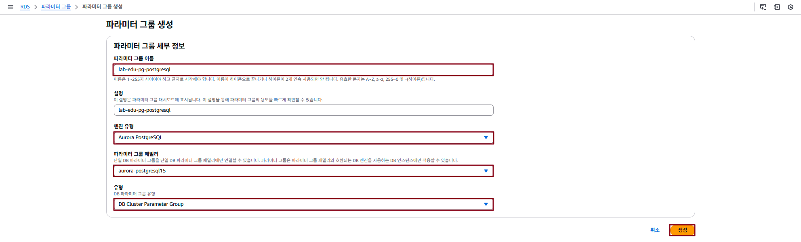

#### 2.2 Parameter 값 수정

- `파라미터 그룹` 탭에서 생성한 파라미터 그룹의 이름 `lab-edu-pg-postgresql` 클릭

- `편집` 버튼 클릭

  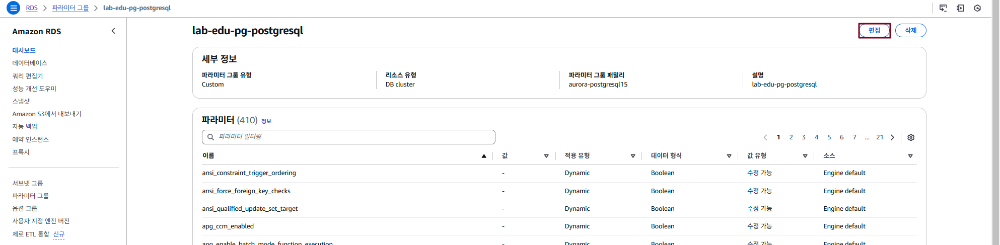

- 검색 창에 `timezone` 입력 → 값 입력 창에 `Asia/Seoul` 입력 → `변경 사항 저장` 버튼 클릭

  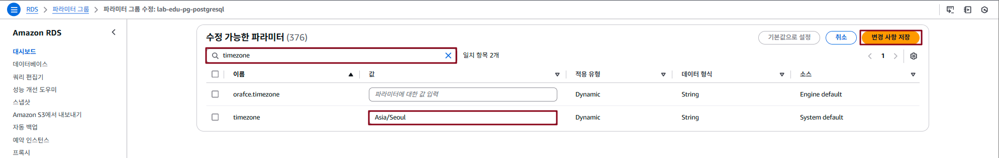

#### 2.3 Parameter Group 적용

- **RDS 메인 콘솔 화면 → `데이터 베이스` 탭 → `lab-edu-rds-aurora` 선택 → `수정` 클릭**

  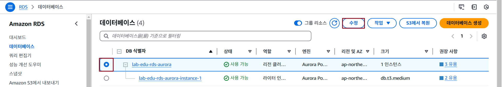

- `설정` 필드 → `마스터 암호`, `마스터 암호 확인` 항목에 `PASSWORD` 입력

  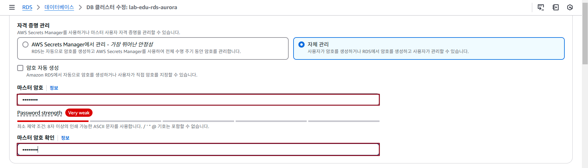

- `추가 구성` 필드 → `DB 클러스터 파라미터 그룹`에서 `lab-edu-pg-postgresql` 선택

  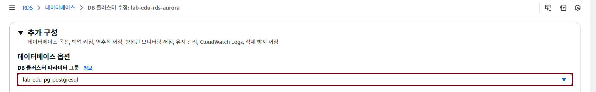

- `계속` 버튼 클릭 → `수정 예약` 필드에서 `즉시 적용` 적용 확인 → `클러스터 수정` 버튼 클릭

  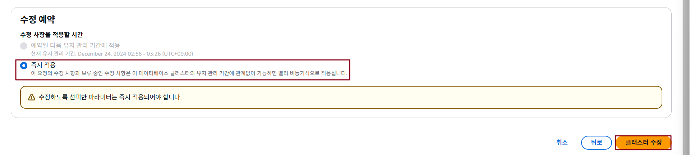

<br>


## Read Replica 테스트

### 1. Read Replica 생성

- **RDS 메인 콘솔 화면 → `데이터 베이스` 탭 → `lab-edu-rds-aurora` 선택 → `작업` → `읽기 추가` 클릭**

  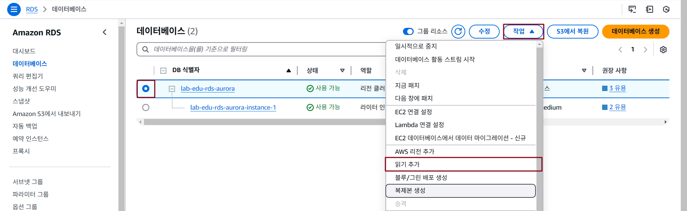
  
- `설정` 필드 → `DB 인스턴스 식별자` 항목에 `lab-edu-rds-aurora` 입력

  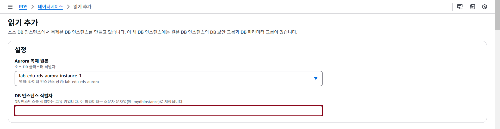

- `읽기 추가` 버튼 클릭

### 2. Writer Instance 접속

#### 2.1 Aurora 접속 정보 확인

- **RDS 메인 콘솔 화면 → `데이터베이스` 탭 → `lab-edu-rds-aurora` 데이터 베이스 클릭**

- 엔드포인트 탭의 `라이터` 유형의 엔드포인트 이름 복사 

  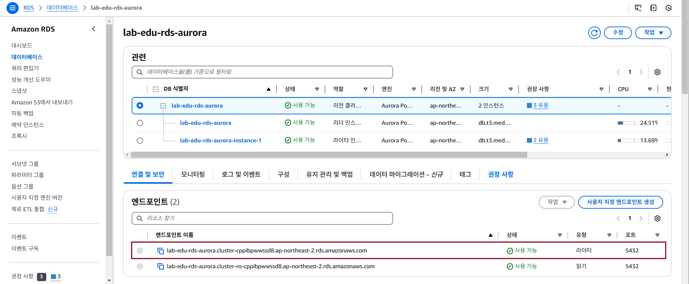  

#### 2.2 Aurora 접속

- VS Code IDE Terminal 접속 → PostgreSQL 접속

  ```bash
  psql -U user -d trip_advisor -h {RDS_AURORA_WRITER_ENDPOINT}
  Password for user user: {RDS_AURORA_PASSWORD}
  ```

### 3. Parameter Group 설정 적용 상태 확인

- PostgreSQL CLI 화면에서 Command 실행

    ```sql
    postgres=> SHOW timezone;
      TimeZone  
    ------------
     Asia/Seoul
    ```

### 4. TEST를 위한 Sample TABLE 생성

- VS Code IDE → 좌측 폴더 패널에서 `support_files/sql_query/create_destination_teable.sql` 파일 열기

- `테이블 생성` SQL Query 명령문 복사

  ```sql
  CREATE TABLE attractions (
      id SERIAL PRIMARY KEY,
      name VARCHAR(255) NOT NULL,
      location VARCHAR(255) NOT NULL,
      average_rating VARCHAR(10),
      photo_url VARCHAR(255)
  );
  ```

- PostgreSQL CLI 화면에서 Command 실행

  ```sql
  trip_advisor=> CREATE TABLE attractions (
      id SERIAL PRIMARY KEY,
      name VARCHAR(255) NOT NULL,
      location VARCHAR(255) NOT NULL,
      average_rating VARCHAR(10),
      photo_url VARCHAR(255)
  );
  CREATE TABLE
  ```

- 생성된 테이블 목록 조회 명령어 

  ```sql
  trip_advisor=> \dt
  \          List of relations
  Schema |    Name     | Type  | Owner 
  --------+-------------+-------+-------
  public | attractions | table | user
  (1 row)
  ```

### 3. Reader Instance 접속

#### 3.1 Aurora 접속 정보 확인

- **RDS 메인 콘솔 화면 → `데이터베이스` 탭 → `lab-edu-rds-aurora` 데이터 베이스 클릭**

- 엔드포인트 탭의 `리더` 유형의 엔드포인트 이름 복사

  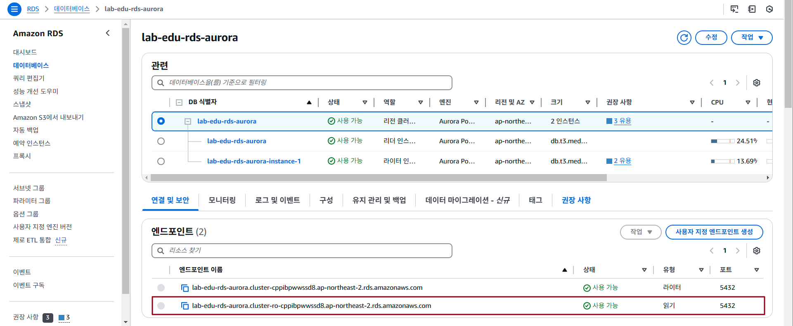

#### 3.2 Aurora 접속

- VS Code IDE Terminal 접속 → Terminal 화면 분할 

  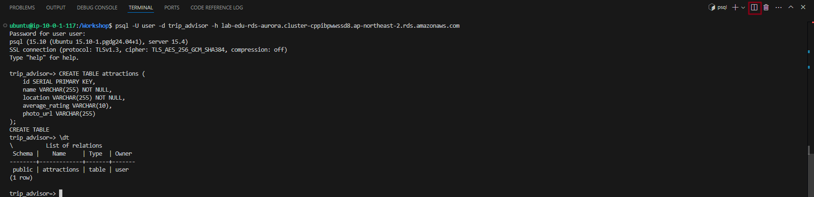

- 두 번째 Terminal 화면에서 READER 인스턴스의 DB TABLE 모니터링 Shell Script 실행

  ```bash
  while true; do
    PGPASSWORD="qwer1234" psql -h {RDS_AURORA_READER_ENDPOINT} \
        -U user \
        -d trip_advisor \
        -c "select * from attractions;";
    sleep 10;
  done
  ```

  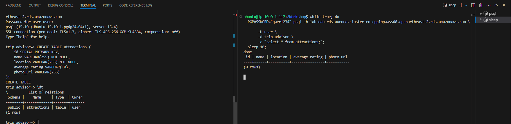

### 4. Writer Instance에서 Sample 데이터 입력

- VS Code IDE → 좌측 폴더 패널에서 `support_files/sql_query/create_destination_teable.sql` 파일 열기

- `테스트 데이터 입력` SQL Query 명령문 복사

  ```sql
  INSERT INTO attractions (name, location, average_rating, photo_url) VALUES 
  ('Eiffel Tower', 'Paris, France', 4.7, 'https://lh5.googleusercontent.com/p/AF1QipOnJHzIOu1VUvkTX0GKjmqK-NdgXWJEUa8m2YPd=w540-h312-n-k-no'),
  ('Great Wall of China', 'Beijing, China', 4.8, 'https://encrypted-tbn1.gstatic.com/licensed-image?q=tbn:ANd9GcSNsVSfi_LRcKaaxzjCs-Aq1_9YS7WAN7d4rrC_Oecn5n0D3Jkm8klHCLU6Eo9cZNRctYeEuTL_3jL_xUATWJOuSJm62z54'),
  ('Statue of Liberty', 'New York, USA', 4.6, 'https://encrypted-tbn2.gstatic.com/licensed-image?q=tbn:ANd9GcQeve9KWo7zk7gXpRgaBDhfeCklifCZqaLWPXXJgKJJCFpYSp7kauVOlyt1nmNLi9UqT9P4SiUFBLihf5omTv-bdR8LLTWv'),
  ('Taj Mahal', 'Agra, India', 4.9, 'https://lh3.googleusercontent.com/p/AF1QipOIwFX7pMJXtOZ5zEkes4rLws69dgeTYas5C1p4=s680-w680-h510'),
  ('Colosseum', 'Rome, Italy', 4.8, 'https://lh3.googleusercontent.com/p/AF1QipNtY2FidGEO7yj8kqm-h-ixL3H27DmKOD8dAwvK=s1360-w1360-h1020'),
  ('Machu Picchu', 'Cusco Region, Peru', 4.9, 'https://lh3.googleusercontent.com/p/AF1QipOHVkYSLcE9rOozPl9UPtEz4ga0IkMVD5_4J-NM=s1360-w1360-h1020'),
  ('Gyeongbokgung Palace', 'Seoul, South Korea', 4.7, 'https://lh3.googleusercontent.com/p/AF1QipPe2q2PPeip1zVjV6UI4FHCkdFxIglodID7c0a3=s1360-w1360-h1020'),
  ('Sydney Opera House', 'Sydney, Australia', 4.7, 'https://lh3.googleusercontent.com/p/AF1QipMHftgSCBlvyjxYphi4gLqDC_62WWvZvyy1EBuh=s1360-w1360-h1020'),
  ('Waikiki Beach', 'Honolulu, Hawaii', 4.5, 'https://www.vmcdn.ca/f/files/glaciermedia/import/lmp-all/1621129-hawaiian-islands-jpg-w-960.jpg');
  ```

- VS Code Terminal 좌측 화면의 Writer Instance에서 복사한 명령어 실행 

  > 1 ~ 10초 정도의 시간이 지나면, 데이터가 복제되어 우측 Terminal 화면에서 조회되는 데이터 확인

  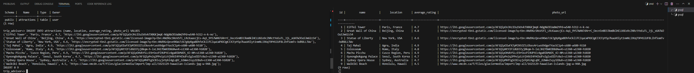


<!-- ### 6. PostgreSQL Database, User 생성 및 권한 할당

- Cloud9 IDE 접속 → SQL Query Sample 파일 열기 (support_files/sql_query/initial_settings_db.sql) → 내용 복사 → 붙여넣기

    ```sql
    create database trip_advisor;
    create user "user" with password 'qwer1234';
    grant all privileges on database trip_advisor to "user";
    alter database trip_advisor owner to "user";
    ```

- 'user' 계정 활용 'trip_advisor' 접속 테스트

    ```bash
    psql –U user –d trip_advisor –h {RDS_AURORA_ENDPOINT}   # 앞에서 메모장에 저장한 RDS Aurora 엔드포인 정보 입력
    Password for user user: {RDS_AURORA_PASSWORD}       # 생성과정에 입력했던 패스워드 입력
    ``` -->