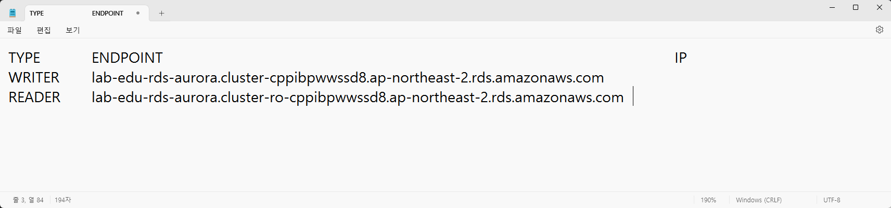
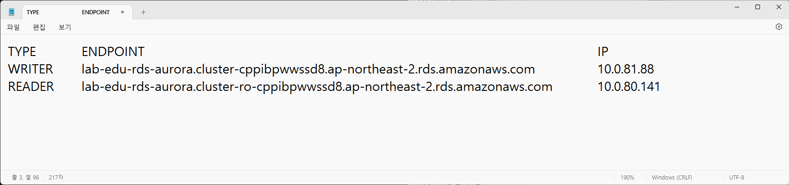
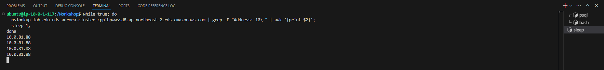
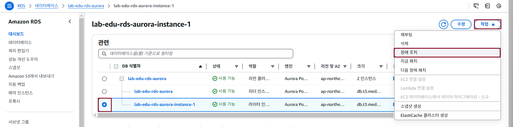
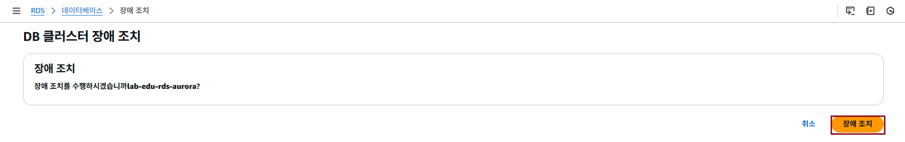
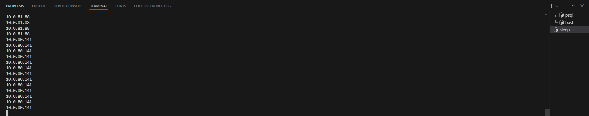

## Table of Contents
- [Table of Contents](#table-of-contents)
- [Aurora Cluster Failover 테스트](#aurora-cluster-failover-테스트)
  - [1. Writer / Reader Instance IP 정보 확인](#1-writer--reader-instance-ip-정보-확인)
  - [2. Writer Instance IP 반복 조회 명령어 실행](#2-writer-instance-ip-반복-조회-명령어-실행)
  - [3. Writer Instance 장애 조치 테스트](#3-writer-instance-장애-조치-테스트)

## Aurora Cluster Failover 테스트

### 1. Writer / Reader Instance IP 정보 확인

- **RDS 메인 콘솔 화면 → `데이터베이스` 탭 → `lab-edu-rds-aurora` 데이터 베이스 클릭**

- 엔드포인트 탭의 `라이터` 유형의 엔드포인트 이름 복사 → 메모장에 입력

- 엔드포인트 탭의 `리더` 유형의 엔드포인트 이름 복사 → 메모장에 입력

  

- VS Code IDE Terminal 접속 → `라이터` 인스턴스 IP 주소 조회 → 메모장에 입력

  ```bash
  nslookup {RDS_AURORA_WRITER_ENDPOINT} | grep -E "Address: 10\." | awk '{print $2}'
  ```

- `리더` 인스턴스 IP 주소 조회 → 메모장에 입력

  ```bash
  nslookup {RDS_AURORA_READER_ENDPOINT} | grep -E "Address: 10\." | awk '{print $2}'
  ```

  

### 2. Writer Instance IP 반복 조회 명령어 실행

- VS Code IDE Terminal 접속 → Writer Instance IP 반복 조회 Shell Script 실행

  ```bash
  while true; do 
    nslookup {RDS_AURORA_WRITER_ENDPOINT} | grep -E "Address: 10\." | awk '{print $2}';
    sleep 1; 
  done
  ```

  

### 3. Writer Instance 장애 조치 테스트

- **RDS 메인 콘솔 화면 → `데이터 베이스` 탭 → `lab-edu-rds-aurora` 선택 → `lab-edu-rds-aurora-instance-1` 선택 → `작업` → `장애 조치` 버튼 클릭**

  

- `장애 조치` 버튼 클릭

  

- VS Code IDE Terminal 접속 → 조회되는 IP 값 모니터링 (WRITER_IP → READER_IP 변경되는지 확인)

  

- 변경된 IP 정보와 사전에 READER INSTANCE IP 정보를 메모해둔 정보와 비교 확인

  