## Table of Contents
- [Table of Contents](#table-of-contents)
- [ap-northeast-2 Region에 Network Baseline 추가](#ap-northeast-2-region에-network-baseline-추가)
  - [1. CloudFormation YAML 파일 S3 업로드](#1-cloudformation-yaml-파일-s3-업로드)
  - [2. Resource Section 이용 VPC 생성](#2-resource-section-이용-vpc-생성)
  - [3. Parameter Section 활용 Public Subnet 생성](#3-parameter-section-활용-public-subnet-생성)
  - [4. Output Section 활용](#4-output-section-활용)
  - [5. Metadatea Section의 ParameterGroups 활용](#5-metadatea-section의-parametergroups-활용)

## ap-northeast-2 Region에 Network Baseline 추가

### 1. CloudFormation YAML 파일 S3 업로드

- VS Code IDE Terminal 접속 → CloudFormation YAML 코드 디렉토리 이동

  ```bash
  cd /Workshop/support_files/infra_as_a_code/ap-northeast-2/
  ```

- CloudFormation YAML 코드 S3 Bucket 업로드 스크립트 실행

  > 스크립트 실행 결과 하단에 표시되는 `OBJECT_URL` 정보 복사 → 다음 작업에서 사용

  ```bash
  $ sudo sh ./"01. vpc_resource.sh"
  Creating S3 bucket: lab-edu-bucket-cf-repository-************...
  make_bucket: lab-edu-bucket-cf-repository-************
  Bucket created successfully.
  Uploading './01. vpc_resource.yaml' to s3://lab-edu-bucket-cf-repository-************/network-baseline.yaml...
  upload: ./01. vpc_resource.yaml to s3://lab-edu-bucket-cf-repository-************/network-baseline.yaml
  File uploaded successfully.
  OBJECT_URL: https://lab-edu-bucket-cf-repository-************.s3.amazonaws.com/network-baseline.yaml
  ```

### 2. Resource Section 이용 VPC 생성

- YAML Template 파일 구성 확인

  > 💡 **Resource Section**
  > - CloudFormation이 생성하거나 관리할 AWS 리소스를 선언하는 영역

  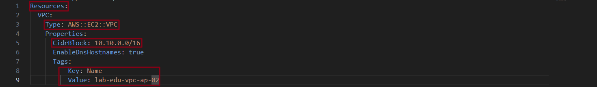

- **CloudFormation 메인 콘솔 화면 → `스택` 리소스 탭 → `스택 생성` 버튼 클릭**

    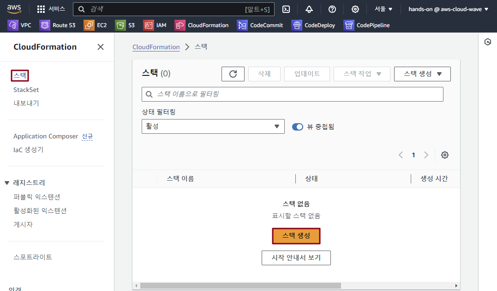

- 앞에서 복사한 `OBJECT_URL` 정보 입력 → `다음` 버튼 클릭

    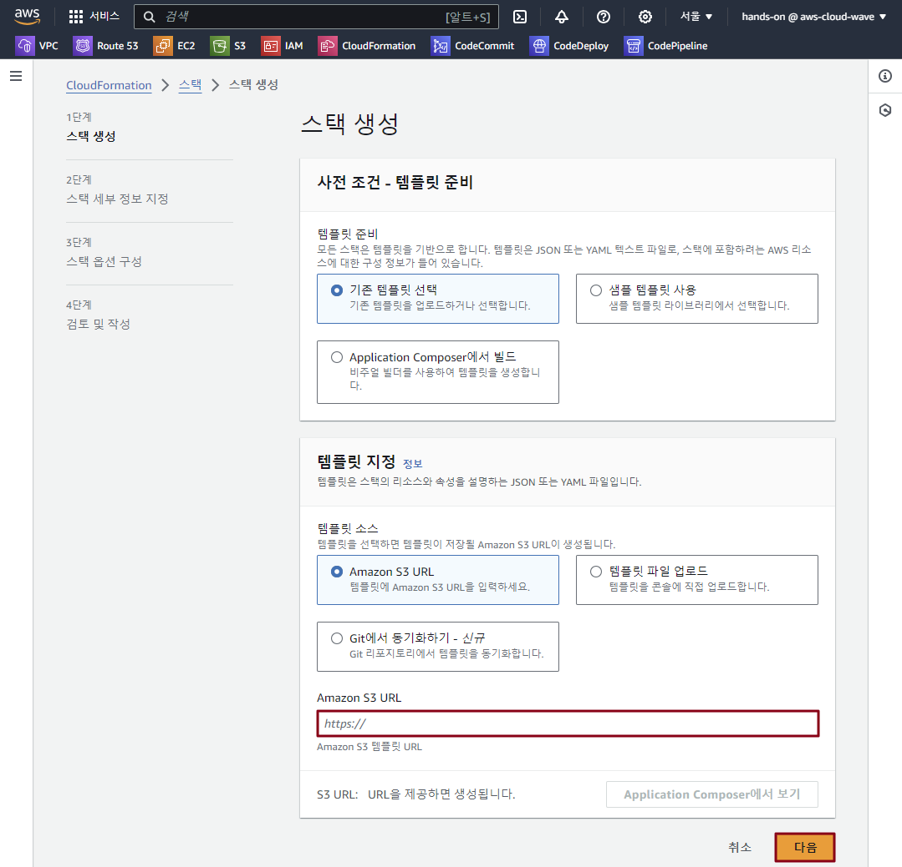

- 스택 이름: `lab-edu-cf-network-baseline-ap`

- `다음` 버튼 클릭 → `다음` 버튼 클릭 → `전송` 버튼 클릭

    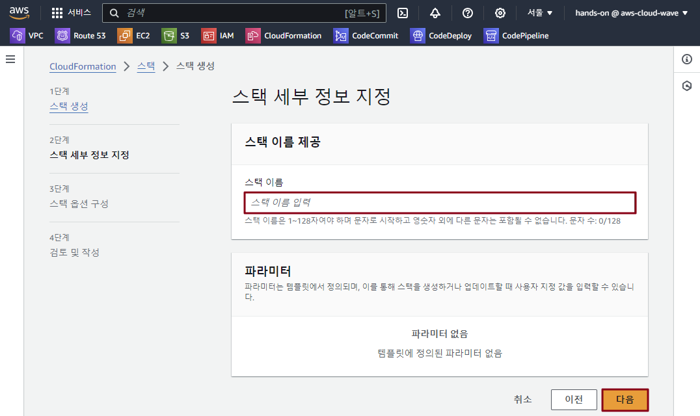


### 3. Parameter Section 활용 Public Subnet 생성

- YAML Template 파일 구성 확인

  > 💡 **Parameters Section**
  > - CloudFormation 스택 생성 시 사용자로부터 입력값을 받아 템플릿의 동적 구성을 가능하게 하는 섹션
  > - Hard-Coding을 방지하고 재사용성을 높이기 위해, 리소스 속성이나 설정값을 외부에서 주입할 수 있도록 지원하는 기능

    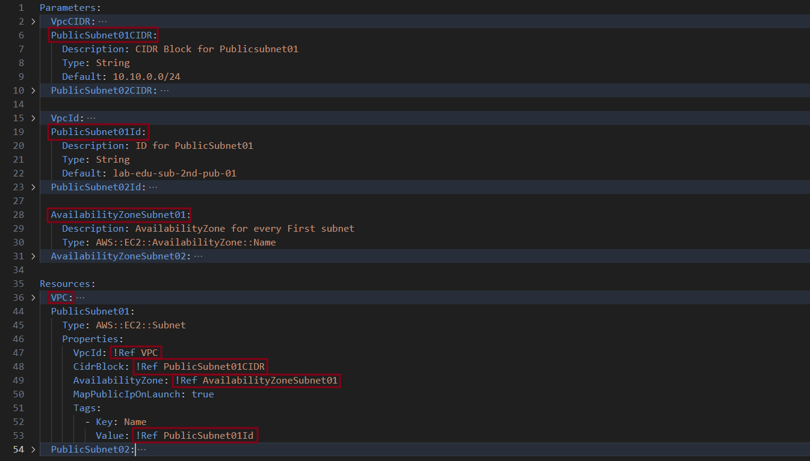

- VS Code IDE Terminal 접속 → CloudFormation YAML 코드 디렉토리 이동

  ```bash
  cd /Workshop/support_files/infra_as_a_code/ap-northeast-2/
  ```

- CloudFormation YAML 코드 S3 Bucket 업로드 스크립트 실행

  > 스크립트 실행 결과 하단에 표시되는 `OBJECT_URL` 정보 복사 → 다음 작업에서 사용

  ```bash
  $ sudo sh ./"02. subnet_resource.sh"
  Uploading './02. subnet_resource.yaml' to s3://lab-edu-bucket-cf-repository-************/network-baseline.yaml...
  upload: ./02. subnet_resource.yaml to s3://lab-edu-bucket-cf-repository-************/network-baseline.yaml
  File uploaded successfully.
  OBJECT_URL: https://lab-edu-bucket-cf-repository-************.s3.amazonaws.com/network-baseline.yaml
  ```

- **CloudFormation 메인 콘솔 화면 → `스택` 리소스 탭 → `lab-edu-cf-network-baseline-ap` 스택 클릭**

    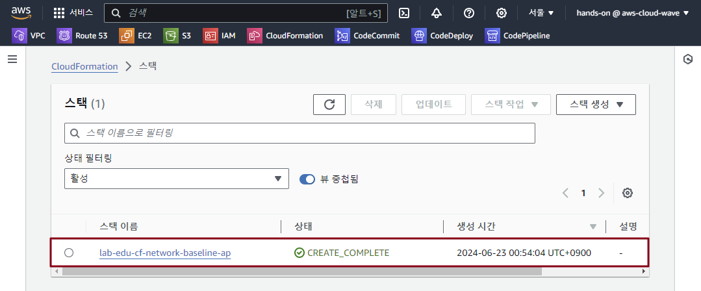

- **`업데이트` 버튼 클릭**

    

- **`기존 템플릿 교체` 라디오 버튼 클릭 → `OBJECT_URL` 정보 입력 → `다음` 버튼 클릭**

    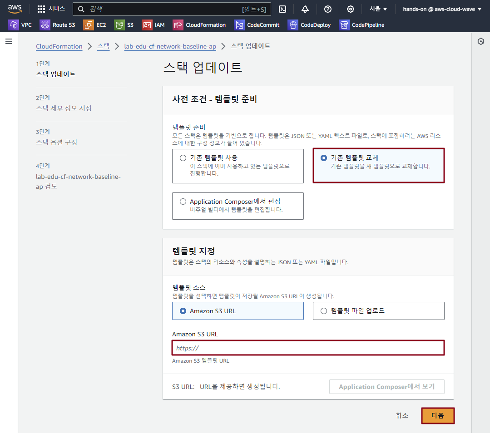

- **AvailabilityZoneSubnet01:** *`ap-northeast-2a`* / **AvailabilityZoneSubnet02:** *`ap-northeast-2c`* 선택 → `다음` 버튼 클릭

    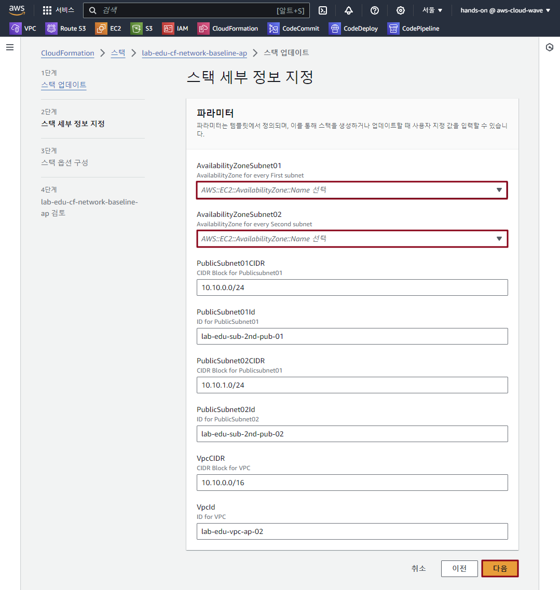

- `다음` 버튼 클릭 → `전송` 버튼 클릭


### 4. Output Section 활용 

- YAML Template 파일 구성 확인

  > 💡 **Outputs Section**
  > - CloudFormation 스택 생성 또는 업데이트 완료 후, 중요한 정보를 반환하는 섹션
  > - 생성된 리소스의 속성값(예: ARN, URL, ID 등)이나 사용자 정의 값을 출력해, 다른 스택이나 외부 시스템에서 참조할 수 있도록 지원하는 기능

  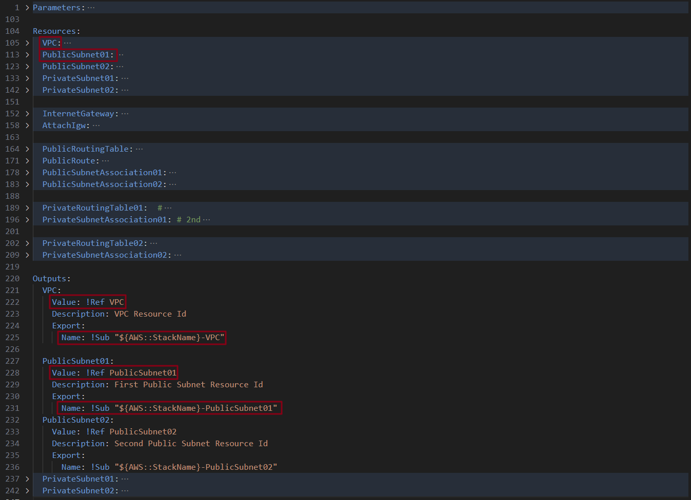

- CloudFormation YAML 코드 S3 Bucket 업로드 스크립트 실행

  ```bash
  $ sudo sh ./"03. resource_output.sh"
  Uploading './03. resource_output.yaml' to s3://lab-edu-bucket-cf-repository-************/network-baseline.yaml...
  upload: ./02. subnet_resource.yaml to s3://lab-edu-bucket-cf-repository-************/network-baseline.yaml
  File uploaded successfully.
  OBJECT_URL: https://lab-edu-bucket-cf-repository-************.s3.amazonaws.com/network-baseline.yaml
  ```

- **CloudFormation 메인 콘솔 화면 → `스택` 리소스 탭 → `lab-edu-cf-network-baseline-ap` 스택 클릭**

- **`업데이트` 버튼 클릭 → `기존 템플릿 교체` 라디오 버튼 클릭 → `OBJECT_URL` 정보 입력 → `다음` 버튼 클릭**

- `다음` 버튼 클릭 → `다음` 버튼 클릭 → `전송` 버튼 클릭

### 5. Metadatea Section의 ParameterGroups 활용 

- YAML Template 파일 구성 확인

    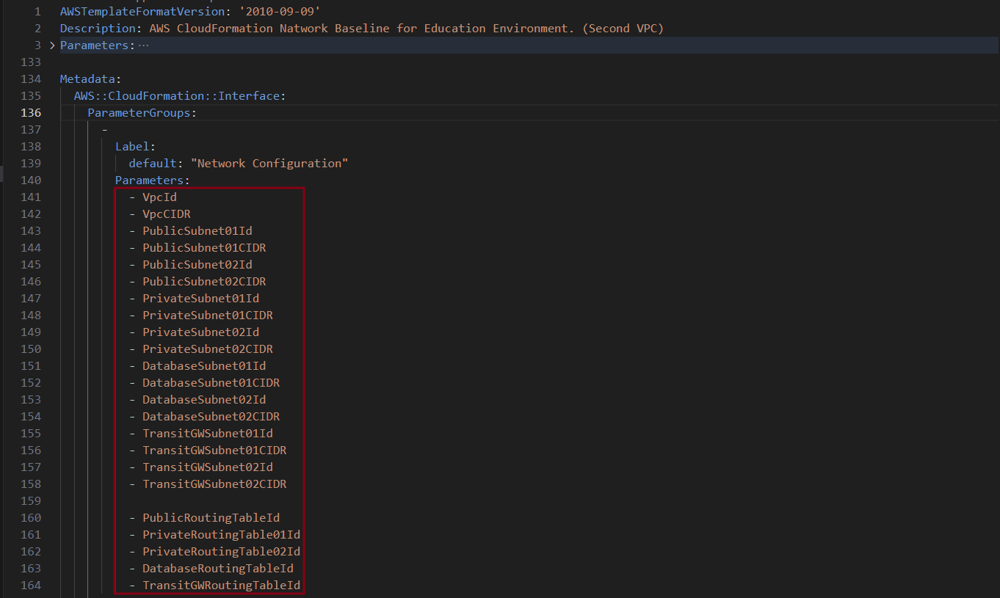

- CloudFormation YAML 코드 S3 Bucket 업로드 스크립트 실행

    ```bash
  $ sudo sh ./"04. metadata_parameter_groups.sh"
  Uploading './04. metadata_parameter_groups.yaml' to s3://lab-edu-bucket-cf-repository-************/network-baseline.yaml...
  upload: ./02. subnet_resource.yaml to s3://lab-edu-bucket-cf-repository-************/network-baseline.yaml
  File uploaded successfully.
  OBJECT_URL: https://lab-edu-bucket-cf-repository-************.s3.amazonaws.com/network-baseline.yaml
  ```

- **CloudFormation 메인 콘솔 화면 → `스택` 리소스 탭 → `lab-edu-cf-network-baseline-ap` 스택 클릭**

- **`업데이트` 버튼 클릭 → `기존 템플릿 교체` 라디오 버튼 클릭 → `OBJECT_URL` 정보 입력 → `다음` 버튼 클릭**

- `다음` 버튼 클릭 → `다음` 버튼 클릭

- `AWS CloudFormation에서 사용자 지정 이름으로 IAM 리소스를 생성할 수 있음을 승인합니다.` 체크 → `전송` 버튼 클릭

    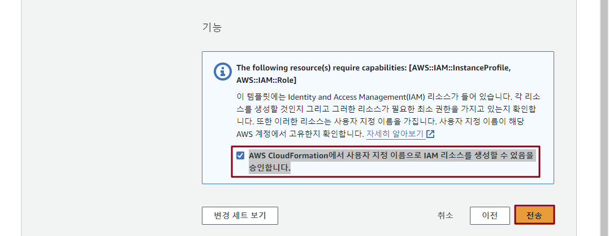


### 6. 불필요 과금을 제외하기 위해 Nat Gateway 제거 버전 배포 

- YAML Template 파일 구성 확인

    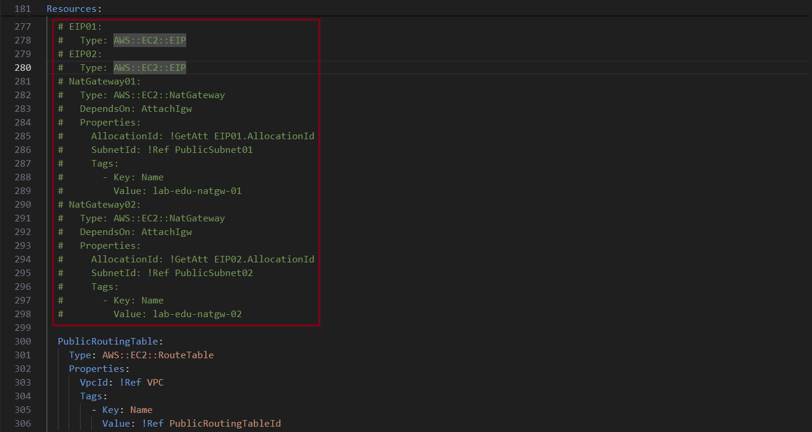

- CloudFormation YAML 코드 S3 Bucket 업로드 스크립트 실행

    ```bash
  $ sudo sh ./"network_baseline.sh"
  Uploading './network_baseline.yaml' to s3://lab-edu-bucket-cf-repository-************/network-baseline.yaml...
  upload: ./02. subnet_resource.yaml to s3://lab-edu-bucket-cf-repository-************/network-baseline.yaml
  File uploaded successfully.
  OBJECT_URL: https://lab-edu-bucket-cf-repository-************.s3.amazonaws.com/network-baseline.yaml
  ```

- **CloudFormation 메인 콘솔 화면 → `스택` 리소스 탭 → `lab-edu-cf-network-baseline-ap` 스택 클릭**

- **`업데이트` 버튼 클릭 → `기존 템플릿 교체` 라디오 버튼 클릭 → `OBJECT_URL` 정보 입력 → `다음` 버튼 클릭**

- `다음` 버튼 클릭 → `다음` 버튼 클릭

- `AWS CloudFormation에서 사용자 지정 이름으로 IAM 리소스를 생성할 수 있음을 승인합니다.` 체크 → `전송` 버튼 클릭


