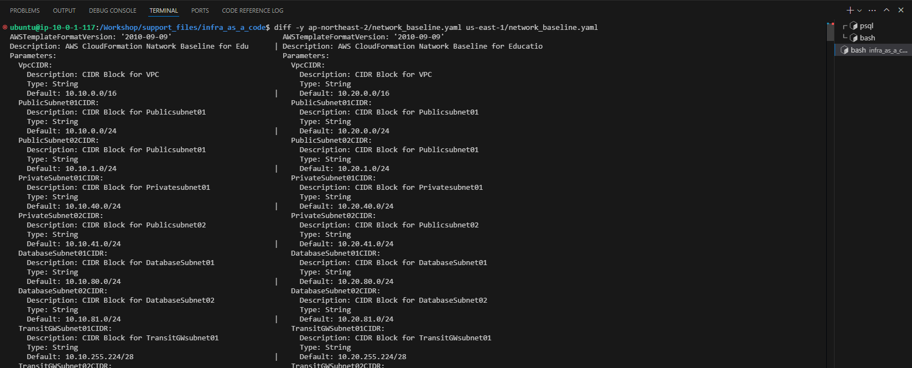

## Table of Contents
- [Table of Contents](#table-of-contents)
- [us-east-1 Region에 Network Baseline 추가](#us-east-1-region에-network-baseline-추가)
  - [1. VS Code 서버에 CloudFormation 실행 권한 할당](#1-vs-code-서버에-cloudformation-실행-권한-할당)
  - [2. 서울 리전에 생성하는 CloudFormation과 차이점 확인](#2-서울-리전에-생성하는-cloudformation과-차이점-확인)
  - [3. 버지니아 리전 network\_baseline.yaml 배포](#3-버지니아-리전-network_baselineyaml-배포)

## us-east-1 Region에 Network Baseline 추가

### 1. VS Code 서버에 CloudFormation 실행 권한 할당

- VS Code IDE Terminal 접속 → CloudFormation YAML 코드 디렉토리 이동

  ```bash
  cd /Workshop/support_files/infra_as_a_code/us-east-1/
  ```

- 필요한 권한 할당을 위한 스크립트 실행

  ```bash
  sh ./attach_iam_policy.sh
  ```

### 2. 서울 리전에 생성하는 CloudFormation과 차이점 확인

- 서울리전, 버지니아 리전 Yaml 파일 비교 명령어 실행

  ```bash
  cd /Workshop/support_files/infra_as_a_code/
  ```

  ```bash
  diff -y ap-northeast-2/network_baseline.yaml us-east-1/network_baseline.yaml
  ```

  > 💡 **`diff -y` 명령어**: 두 파일을 비교하여 차이점을 기호로 표시해주는 명령어
  > - `|` 두 파일에 동일한 행이 존재하지만 내용에 차이가 있는 경우
  > - `<` 좌측 파일에는 존재하지만 우측 파일에는 해당 행이 없는 경우
  > - `>` 우측 파일에는 존재하지만 좌측 파일에는 해당 행이 없는 경우
  > - 차이점만 표시하고 싶은 경우 `--suppress-common-lines` 옵션 추가

  

### 3. 버지니아 리전 network_baseline.yaml 배포

- VS Code IDE Terminal 접속 → CloudFormation YAML 코드 디렉토리 이동

  ```bash
  cd /Workshop/support_files/infra_as_a_code/us-east-1/
  ```

- 버지니아 리전의 CloudFormation에 Stack 생성 스크립트 실행

  ```bash
  sh create_cloudformation_stack.sh
  ```


