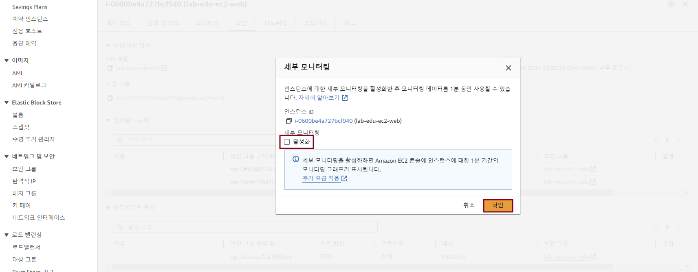

## Table of Contents
- [Table of Contents](#table-of-contents)
- [Amazon CloudWatch → Amazon SNS 연동](#amazon-cloudwatch--amazon-sns-연동)
  - [1. Amazon SNS 생성](#1-amazon-sns-생성)
  - [2. CloudWatch Alarm 생성](#2-cloudwatch-alarm-생성)
  - [3. 경보 생성 테스트](#3-경보-생성-테스트)
    - [3.1 Application Load Balancer 접속 정보 확인](#31-application-load-balancer-접속-정보-확인)
    - [3.2 Web Application 접속](#32-web-application-접속)
  - [4. CloudWatch Metric 수집 결과 확인](#4-cloudwatch-metric-수집-결과-확인)

## Amazon CloudWatch → Amazon SNS 연동

### 1. Amazon SNS 생성

- **SNS 콘솔 메인 화면 → 주제 이름 입력: `lab-edu-sns-cloudwatch` → `다음 단계` 버튼 클릭**

  

- `주제 생성` 버튼 클릭

- 생성 결과 화면 하단의 `구독 생성` 버튼 클릭 

    

- 구독 생성 정보 입력

    - 프로토콜: 이메일

    - 엔드포인트: 수신 Email 주소 입력 (개인 이메일 주소)

    - `구독 생성` 버튼 클릭
    
      

- 이메일 접속 → `Subscription Confirmation` 메일 확인 → Confirm subscription' 클릭

  

### 2. CloudWatch Alarm 생성

- **EC2 콘솔 메인 화면 → `인스턴스` 탭 → `lab-edu-ec2-web` 선택 → `작업` → `모니터링 및 문제해결` → `세부 모니터링 관리` 버튼 클릭**

    

- `세부 모니터링` 설정 체크박스의 `활성화` 체크 박스 활성화 → `확인` 버튼 클릭

    

- EC2 콘솔 메인 화면 → `인스턴스` 탭 → `lab-edu-ec2-web` 선택 → `작업` → `모니터링 및 문제해결` → `CloudWatch 경보 관리` 버튼 클릭

    

- 경보 생성 정보 입력

    - 경보알림: lab-edu-sns-cloudwatch
    
    - 경보 임계값
    
        - 샘플 그룹화 기준: 평균
    
        - 샘플링 할 데이터 유형: CPU 사용률
    
        - 경보 시기: >=
    
        - %: 60

          

        - 연속 기간: 1
    
        - 기간 : 5분
    
        - 경보 이름: lab-edu-alarm-CPUUtilization

      - `생성` 버튼 클릭

          

### 3. 경보 생성 테스트

#### 3.1 Application Load Balancer 접속 정보 확인

- 인스턴스 메인 콘솔 화면 이동 → `로드밸런서` 탭 → `lab-edu-alb-web` DNS 이름 주소 복사 버튼 클릭

#### 3.2 Web Application 접속

> **※ NOTE:** 로드밸런서 DNS 정보로 브라우저에서 접속

- 서비스 접속 후 서버 부하 발생을 위해 `Stress Tool` 클릭

- 알람 수신을 위해 입력한 이메일로 접속해 알람 발생 여부 확인

### 4. CloudWatch Metric 수집 결과 확인

- **EC2 콘솔 메인 화면 → `인스턴스` 탭 → `lab-edu-ec2-web` 선택 → `인스턴스 ID 복사`**

    

- **CloudWatch 콘솔 메인 화면 → `모든 지표` 탭 → `lab-edu-ec2-web` ID 검색창에 입력 → `CPUUtilization` 검색창에 입력**

- `EC2 > 인스턴스 별 지표` 선택 → `lab-edu-ec2-web` 선택 → `그래프` 확인

  
 
