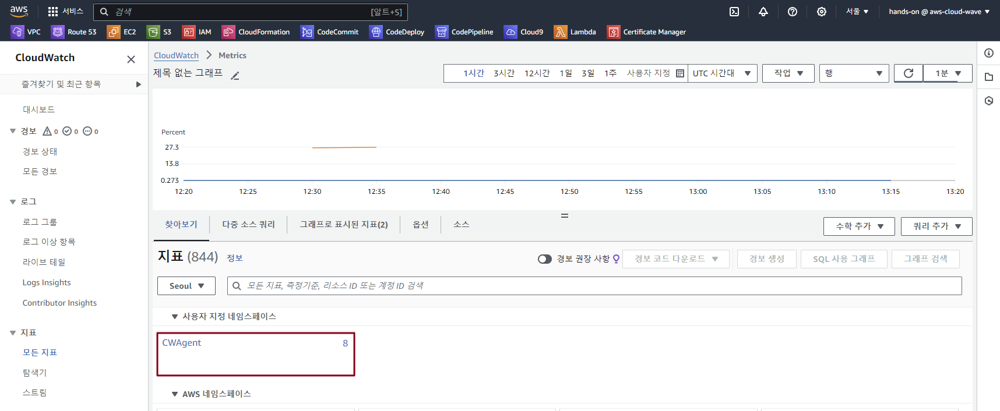
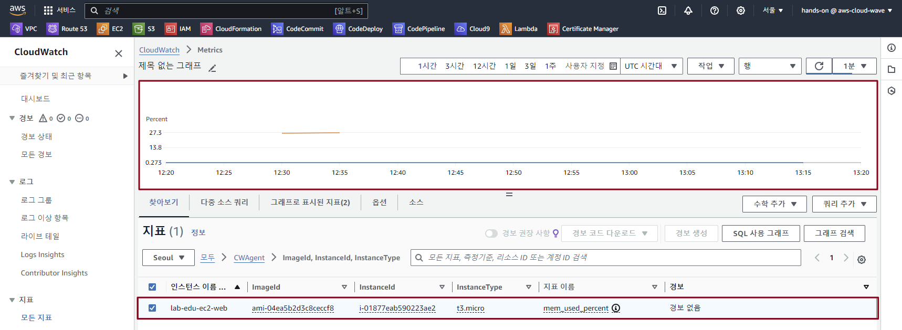

## Table of Contents
- [Table of Contents](#table-of-contents)
- [CloudWatch Agent 설치 및 Memory, Disk 사용량 수집](#cloudwatch-agent-설치-및-memory-disk-사용량-수집)
  - [1. Web 서버 접속 및 Agent 설치](#1-web-서버-접속-및-agent-설치)
  - [2. CloudWatch Agent로 수집된 데이터 확인](#2-cloudwatch-agent로-수집된-데이터-확인)

## CloudWatch Agent 설치 및 Memory, Disk 사용량 수집

### 1. Web 서버 접속 및 Agent 설치

- VS Code IDE Terminal 접속 → SSH 명령어 실행

    ```bash
    ssh web-server
    ```

- CloudWatch Agent 설치 명령어 실행

    ```bash
    sudo yum install amazon-cloudwatch-agent -y
    ```

- CloudWatch Agent 설정 파일 실행

    ```bash
    cd /opt/aws/amazon-cloudwatch-agent/bin/
    sudo ./amazon-cloudwatch-agent-config-wizard
    ```

- CloudWatch Agent Config 파일 설정

    ```bash
    # 에이전트를 설치할 운영 체제를 선택합니다. [1]번을 선택합니다.
    On which OS are you planning to use the agent?
    1. linux
    2. windows
    3. darwin
    default choice: [1]:

    # 에이전트를 설치할 호스트 환경을 선택합니다. [1]번을 선택합니다.
    Trying to fetch the default region based on ec2 metadata...
    I! imds retry client will retry 1 timesAre you using EC2 or On-Premises hosts?
    1. EC2
    2. On-Premises
    default choice: [1]:

    # 에이전트를 실행할 사용자 계정을 선택합니다. [1]번을 선택합니다.
    Which user are you planning to run the agent?
    1. cwagent
    2. root
    3. others
    default choice: [1]:
    
    # StatsD 데몬을 활성화할지 선택합니다. [1]번을 선택합니다.
    # StatsD를 활성화하면, 사용자 정의 메트릭을 쉽게 CloudWatch로 전송할 수 있습니다. 
    # 애플리케이션 성능 모니터링을 위해 주로 사용합니다.
    Do you want to turn on StatsD daemon?
    1. yes
    2. no
    default choice: [1]:

    # Default 값을 유지하고 다음으로 넘어갑니다.
    Which port do you want StatsD daemon to listen to?
    default choice: [8125]
    
    # StatsD 데몬이 메트릭을 얼마나 자주 수집할지 결정합니다. [3]번을 선택합니다.
    What is the collect interval for StatsD daemon?
    1. 10s
    2. 30s
    3. 60s
    default choice: [1]:

    # StatsD 데몬을 통해 수집된 메트릭을 얼마나 자주 집계할지 결정합니다. [4]번을 선택합니다.
    What is the aggregation interval for metrics collected by StatsD daemon?
    1. Do not aggregate
    2. 10s
    3. 30s
    4. 60s
    default choice: [4]:

    # CollectD에서 메트릭을 모니터링할지 선택합니다. [1]번을 선택합니다.
    # CollectD를 함께 사용하면 더 다양한 시스템 메트릭을 수집하고 모니터링할 수 있습니다. 
    # 서버, 네트워크 장비, 데이터베이스 등의 전반적인 인프라 모니터링에 주로 사용합니다.
    Do you want to monitor metrics from CollectD? WARNING: CollectD must be installed or the Agent will fail to start
    1. yes
    2. no
    default choice: [1]:
    
    # CPU, 메모리 등의 호스트 메트릭을 모니터링할지 선택합니다. [1]번을 선택합니다.
    Do you want to monitor any host metrics? e.g. CPU, memory, etc.
    1. yes
    2. no
    default choice: [1]:

    # 각 CPU 코어의 개별적인 성능 메트릭을 모니터링할지 선택합니다. [1]번을 선택합니다.
    # 멀티 코어 환경에서 CPU의 시스템 성능을 더욱 세밀하게 분석할 때 사용합니다.
    Do you want to monitor cpu metrics per core?
    1. yes
    2. no
    default choice: [1]:

    # 가능한 경우 모든 메트릭에 EC2 관련 차원(ImageId, InstanceId, InstanceType, AutoScalingGroupName)을 추가할지 선택합니다. [1]번을 선택합니다.
    # 세부적인 분석을 위해서 권장되는 사항이지만,저장되는 데이터의 양이 증가하고 이에 따라 비용이 증가하거나 관리 포인트가 많아 질 수 있습니다.
    Do you want to add ec2 dimensions (ImageId, InstanceId, InstanceType, AutoScalingGroupName) into all of your metrics if the info is available?
    1. yes
    2. no
    default choice: [1]:

    # EC2 인스턴스 ID를 기준으로 메트릭을 집계할지 선택합니다. [1]번을 선택합니다.
    # 각 EC2 인스턴스의 메트릭을 개별적으로 볼 수 있습니다. 
    Do you want to aggregate ec2 dimensions (InstanceId)?
    1. yes
    2. no
    default choice: [1]:

    # 메트릭을 얼마나 자주 수집할지 결정합니다. [4]번을 선택합니다.
    # 수집 주기를 짧게 설정할 수록 데이터 증가에 따른 비용 증가 및 수집 대상 시스템에 약간의 부하를 줄 수 있습니다.
    Would you like to collect your metrics at high resolution (sub-minute resolution)? This enables sub-minute resolution for all metrics, but you can customize for specific metrics in the output json file.
    1. 1s
    2. 10s
    3. 30s
    4. 60s
    default choice: [4]:

    # CloudWatch Agent가 수집할 기본 메트릭 세트를 선택합니다. [1]번을 선택합니다.
    # 1. Basic: 기본적인 시스템 메트릭만 수집 (CPU 사용률, 디스크 사용량, 메모리 사용량 등 기본적인 정보)
    # 2. Standard: 일반적으로 필요한 대부분의 메트릭 수집 (Basic 구성의 메트릭에 더해, 네트워크 통계, 더 상세한 디스크 I/O 정보 등을 포함)
    # 3. Advanced: 상세한 시스템 모니터링을 위한 광범위한 메트릭 수집 (비용 증가)
    # 4. None: 사용자 정의 메트릭만 사용 (기본 메트릭 없음)
    Which default metrics config do you want?
    1. Basic
    2. Standard
    3. Advanced
    4. None
    default choice: [1]:
    
    Current config as follows:
    {
      ...
    }

    # 지금까지 설정한 구성에 만족하는지 선택합니다. [1]번을 선택합니다.
    # 설정 이후에도 수동으로 변경이 가능합니다.
    Are you satisfied with the above config? Note: it can be manually customized after the wizard completes to add additional items.
    1. yes
    2. no
    default choice: [1]:

    # 이전 버전의 CloudWatch Log Agent 구성 파일이 있는지 확인합니다. [2]번을 선택합니다.
    # 이 단계는 기존의 CloudWatch Log Agent 구성이 되어 있었다면, CloudWatch Agent로 마이그레이션하는 옵션을 제공합니다. 
    Do you have any existing CloudWatch Log Agent (http://docs.aws.amazon.com/AmazonCloudWatch/latest/logs/AgentReference.html) configuration file to import for migration?
    1. yes
    2. no
    default choice: [2]:

    # CloudWatch Agent를 통해 시스템이나 애플리케이션의 로그 파일을 모니터링할지 선택합니다. [2]번을 선택합니다.
    Do you want to monitor any log files?
    1. yes
    2. no
    default choice: [1]:

    # CloudWatch Agent가 Xray traces 데이터도 수집하는지 선택합니다. [2]번을 선택합니다.
    Do you want the CloudWatch agent to also retrieve X-ray traces?
    1. yes
    2. no
    default choice: [1]:
    
    Existing config JSON identified and copied to:  /opt/aws/amazon-cloudwatch-agent/etc/backup-configs
    Saved config file to /opt/aws/amazon-cloudwatch-agent/bin/config.json successfully.
    Current config as follows:
    {
      ...
    }
    Please check the above content of the config.
    The config file is also located at /opt/aws/amazon-cloudwatch-agent/bin/config.json.
    Edit it manually if needed.

    # 생성된 CloudWatch Agent 구성을 AWS Systems Manager(SSM) 파라미터 스토어에 저장할지 선택합니다. [2]번을 선택합니다.
    # 1번을 선택하면 AWS System Manager Parameter Store에 저장하고, 2번을 선택하면 로컬에 설정 정보를 저장합니다.
    # 설정 값을 중앙화된 저장소에서 집중 관리하고 싶은 경우 1번을 선택합니다.
    Do you want to store the config in the SSM parameter store?
    1. yes
    2. no
    default choice: [1]:
    
    Program exits now.
    ```

- CollectD 설치

  ```bash
  sudo yum install collectd
  ```

- CloudWatch config.json 설정 파일 적용

    ```bash
    sudo /opt/aws/amazon-cloudwatch-agent/bin/amazon-cloudwatch-agent-ctl -a fetch-config -m ec2 -c file:/opt/aws/amazon-cloudwatch-agent/bin/config.json -s
    ```

- CloudWatch 실행

    ```bash
    sudo amazon-cloudwatch-agent-ctl -m ec2 -a start
    ```

- CloudWatch 상태 확인

    ```bash
    sudo amazon-cloudwatch-agent-ctl -m ec2 -a status
    ```

    ```bash
    ps -ef|grep amazon-cloudwatch-agent
    ```

### 2. CloudWatch Agent로 수집된 데이터 확인

- **CloudWatch 콘솔 메인 화면 → `모든 지표` 탭 → `CWAgent` 선택 → `ImageId, InstanceId, InstanceType` 선택**

    

- `lab-edu-ec2-web` 선택 → `그래프` 확인

    