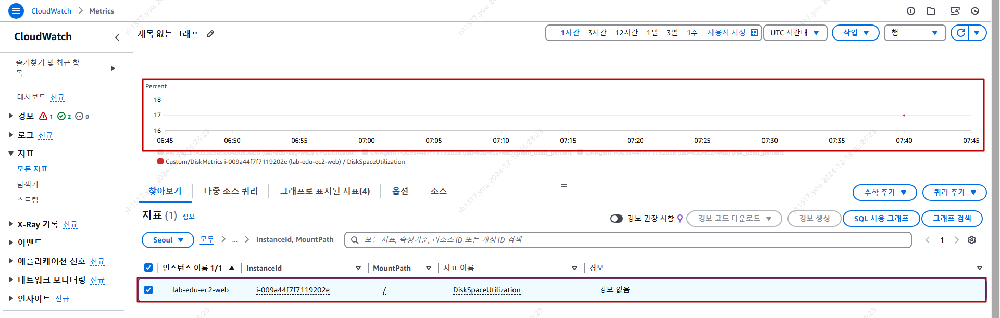
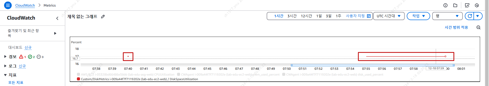

## Table of Contents
- [Table of Contents](#table-of-contents)
- [Custom Metric을 통해 EC2 Disk 사용량 수집](#custom-metric을-통해-ec2-disk-사용량-수집)
  - [1. Web Server에 CloudWatch 접근 권한 할당](#1-web-server에-cloudwatch-접근-권한-할당)
  - [2. Custom Metric 생성 및 CloudWatch 게시 스크립트 실행](#2-custom-metric-생성-및-cloudwatch-게시-스크립트-실행)
  - [3. Custom Metric 수집된 데이터 확인](#3-custom-metric-수집된-데이터-확인)
- [Custom Metric을 주기적으로 CloudWatch로 게시하는 설정](#custom-metric을-주기적으로-cloudwatch로-게시하는-설정)
  - [1. Web Server에 Cron 설치](#1-web-server에-cron-설치)
  - [2. Cron 설정](#2-cron-설정)
  - [3. 설정 결과 확인](#3-설정-결과-확인)

## Custom Metric을 통해 EC2 Disk 사용량 수집

### 1. Web Server에 CloudWatch 접근 권한 할당

- VS Code IDE Terminal 접속

- Web Serverd에 CloudWatch 접근 권한 할당

  ```bash
  aws iam attach-role-policy --role-name lab-edu-role-ec2 --policy-arn arn:aws:iam::aws:policy/CloudWatchFullAccess
  ```

- Web Serverd에 할당된 권한 목록 조회

  ```bash
  aws iam list-attached-role-policies --role-name lab-edu-role-ec2
  ```

### 2. Custom Metric 생성 및 CloudWatch 게시 스크립트 실행

- Web Server SSH 접속 명령어 실행

    ```bash
    ssh web-server
    ```

- Custom Metric 생성 스크립트가 있는 디렉토리로 이동

    ```bash
    /root/streamlit-project/scripts
    ```

- 스크립트 실행

    ```bash
    sh ./create_custom_metric.sh
    ```

### 3. Custom Metric 수집된 데이터 확인

- **CloudWatch 콘솔 메인 화면 → `모든 지표` 탭 → `Custom/DiskMetrics` 선택 → `InstanceId, MountPath` 선택**

- `lab-edu-ec2-web` 선택 → `그래프` 확인

  

<br>

## Custom Metric을 주기적으로 CloudWatch로 게시하는 설정

### 1. Web Server에 Cron 설치

- VS Code IDE Terminal 접속

- Web Server SSH 접속 명령어 실행

  ```bash
  ssh web-server
  ```

- Cron 설치 명령어 실행

  ```bash
  sudo yum install cronie -y
  ```

- Cron 실행

  ```bash
  sudo systemctl start crond
  sudo systemctl enable crond
  ```

### 2. Cron 설정 

> 앞에서 사용 했던 Custom Metric 생성 스크립트를 매분마다 실행하도록 설정하는 내용

- Crontab 에디터 오픈 명령어

  ```bash
  sudo crontab -e
  ```

- 매분 마다 `create_custom_metric.sh` 스크립트를 실행해 `/var/log/disk-metric.log`에 기록하고 CloudWatch로 게시하는 설정

  ```bash
  * * * * * sudo bash /root/streamlit-project/scripts/create_custom_metric.sh >> /var/log/disk-metric.log 2>&1
  ```

### 3. 설정 결과 확인 

- tail 명령어를 이용해 `/var/log/disk-metric.log`에 기록된 내용 확인

  ```bash
  $ tail -f /var/log/disk-metric.log
  Disk usage (17%) for / sent to CloudWatch in ap-northeast-2
  Disk usage (17%) for / sent to CloudWatch in ap-northeast-2
  Disk usage (17%) for / sent to CloudWatch in ap-northeast-2
  Disk usage (17%) for / sent to CloudWatch in ap-northeast-2
  Disk usage (17%) for / sent to CloudWatch in ap-northeast-2
  Disk usage (17%) for / sent to CloudWatch in ap-northeast-2
  Disk usage (17%) for / sent to CloudWatch in ap-northeast-2
  Disk usage (17%) for / sent to CloudWatch in ap-northeast-2
  ```

- **CloudWatch 콘솔 메인 화면 → `모든 지표` 탭 → `Custom/DiskMetrics` 선택 → `InstanceId, MountPath` 선택**

- `lab-edu-web-web` 선택 → `그래프` 확인

  


