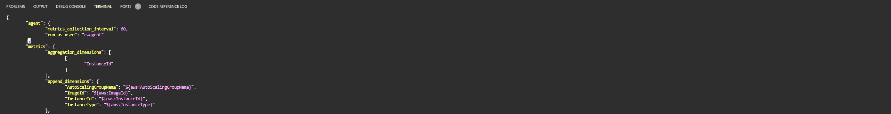
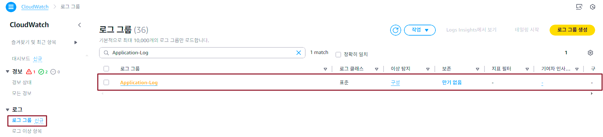
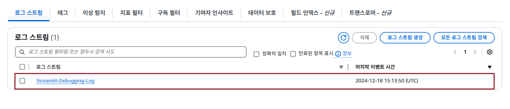
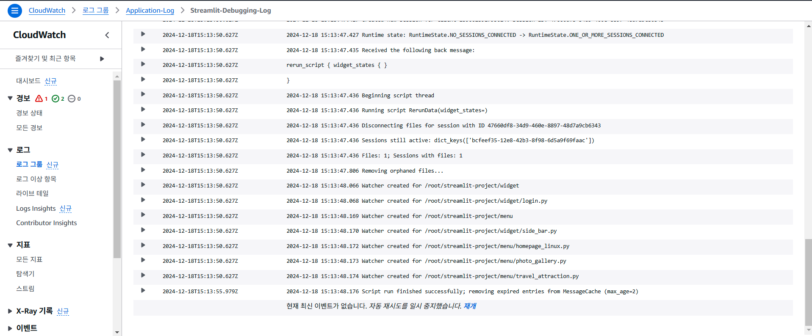

## Table of Contents
- [Table of Contents](#table-of-contents)
- [CloudWatch Agent 이용 Application Log 수집](#cloudwatch-agent-이용-application-log-수집)
  - [1. Web 서버 접속](#1-web-서버-접속)
  - [2. Streamlit Web Server 로그 설정](#2-streamlit-web-server-로그-설정)
  - [3. CloudWatch Agent Log 수집 설정](#3-cloudwatch-agent-log-수집-설정)
  - [4. Custom Log 수집된 데이터 확인](#4-custom-log-수집된-데이터-확인)

## CloudWatch Agent 이용 Application Log 수집

### 1. Web 서버 접속

- VS Code IDE Terminal 접속 → SSH 명령어 실행

    ```bash
    ssh web-server
    ```

### 2. Streamlit Web Server 로그 설정

- streamlit 프로세스 ID 확인

  ```bash
  $ ps -ef | grep streamlit
  root      315823  309874  0 08:42 pts/1    00:00:13 /usr/bin/python3 /usr/local/bin/streamlit run /root/streamlit-project/main.py --server.port 80 --logger.level=DEBUG
  ```

- streamlit 프로세스 강제 종료

  ```bash
  kill -9 315823
  ```

- streamlit 실행 및 logging 설정 추가

  > root 권한으로 실행 (sudo su -)

  ```bash
  nohup streamlit run /root/streamlit-project/main.py --server.port 80 --logger.level=DEBUG 2> /var/log/streamlit.log &
  ```

### 3. CloudWatch Agent Log 수집 설정

- CloudWatch Agent 설정 파일 열기

  ```bash
  vim /opt/aws/amazon-cloudwatch-agent/bin/config.json
  ```

- `agent`와 `metrics` 필드 사이에 `logs` 필드 추가

  

- 아래이 `logs` 필드 내용 추가

  ```json
  "logs": {
    "logs_collected": {
      "files": {
        "collect_list": [
          {
          "file_path": "/var/log/streamlit.log",
          "log_group_name": "Application-Log",
          "log_stream_name": "Streamlit-Debugging-Log"
          }
        ]
      }
    }
  },
  ```

- 설정 변경 사항 적용

  ```bash
  sudo /opt/aws/amazon-cloudwatch-agent/bin/amazon-cloudwatch-agent-ctl -a fetch-config -m ec2 -c file:/opt/aws/amazon-cloudwatch-agent/bin/config.json -s
  ```

### 4. Custom Log 수집된 데이터 확인

- **CloudWatch 콘솔 메인 화면 → `로그 그룹` 탭 → `Application-Log` 선택 → `InstanceId, MountPath` 선택**

  

- `Streamlit-Debugging-Log` 로그 스트림 선택 → `그래프` 확인

  

- 로그 수집 결과 확인

  