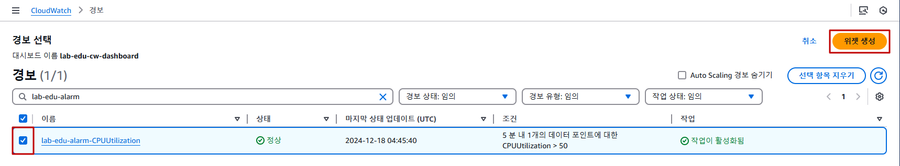
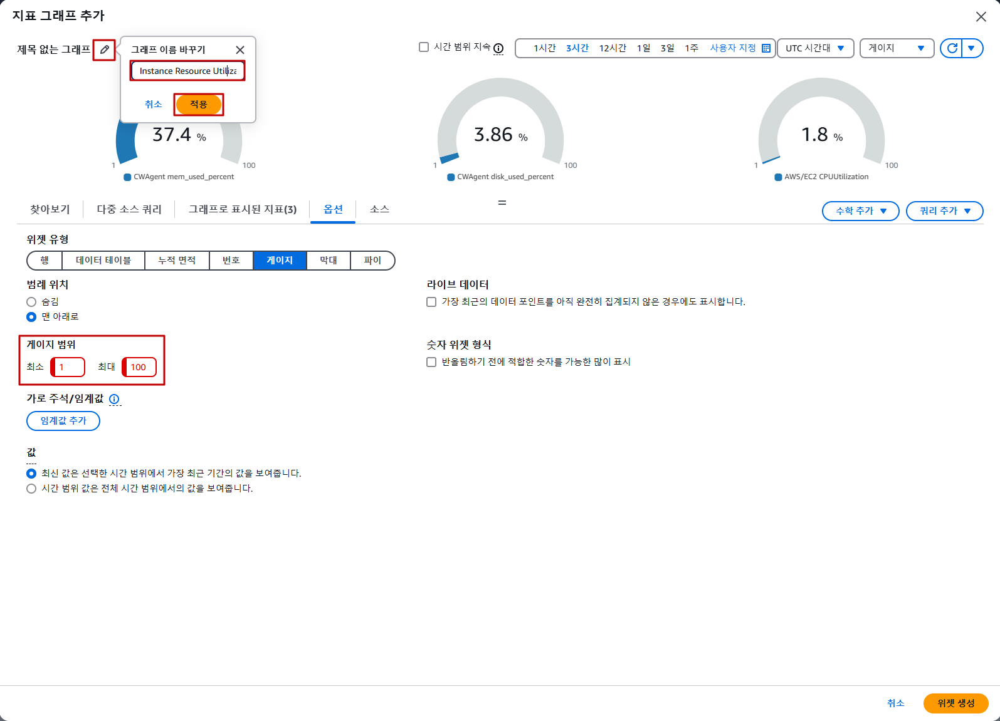

## Table of Contents
- [Table of Contents](#table-of-contents)
- [CloudWatch Custom Dashboard 생성](#cloudwatch-custom-dashboard-생성)
  - [1. Custom Dashboard 생성](#1-custom-dashboard-생성)
  - [2. Dashboard 알림판 생성](#2-dashboard-알림판-생성)
  - [3. Alarm 위젯 생성](#3-alarm-위젯-생성)
  - [4. EC2 Metric 위젯 생성 (게이지 타입)](#4-ec2-metric-위젯-생성-게이지-타입)
  - [5. EC2 Metric 위젯 생성 (행 타입)](#5-ec2-metric-위젯-생성-행-타입)
  - [5. EC2 Log Table 위젯 생성](#5-ec2-log-table-위젯-생성)

## CloudWatch Custom Dashboard 생성

### 1. Custom Dashboard 생성

- **CloudWatch 콘솔 메인 화면 → `대시보드` 탭 → `대시보드 생성` 버튼 클릭**

  

- 대시보드 이름 설정 `lab-edu-cw-dashboard` → `대시보드 생성` 버튼 클릭

  

### 2. Dashboard 알림판 생성

- `기타 콘텐츠 유형` 탭 → `텍스트 / 이미지` 선택 → `다음` 버튼 클릭

  

- 마크다운 내용 입력 창에 아래 코드 입력 → `위젯 추가` 버튼 클릭

  

  ```markdown
  ## Operational Dashboard for Lab

  ####
  ####

  ### **Application Information**
  - [Application Source Code Repository](https://github.com/CJ-CloudWave-Public-Hands-on-Lab/streamlit-project.git)
  - [Application Manual Documents](https://github.com/CJ-CloudWave-Public-Hands-on-Lab/hol_basic)

  ####
  ####

  ### **This week's on-call schedule**

  |     Date      | On-Call Person |        E-mail         |     Phone     |
  | :-----------: | :------------: | :-------------------: | :-----------: |
  | April 3, 2023 | Alice Johnson  |  alice.j@example.com  | 010-1234-5678 |
  | April 4, 2023 |   Bob Smith    |   bob.s@example.com   | 010-2345-6789 |
  | April 5, 2023 | Charlie Brown  | charlie.b@example.com | 010-3456-7890 |
  | April 6, 2023 |  Diana Parker  |  diana.p@example.com  | 010-4567-8901 |
  | April 7, 2023 |   Edward Lee   | edward.l@example.com  | 010-5678-9012 |
  | April 8, 2023 |  Fiona Wright  |  fiona.w@example.com  | 010-6789-0123 |
  | April 9, 2023 |  George Davis  | george.d@example.com  | 010-7890-1234 |

  ####
  ####

  ### **Command to start streamlit application**
  ``` bash
  streamlit run main.py --server.port 80 
  ``` 

- 위젯 크기 조절

  

### 3. Alarm 위젯 생성

- 우측 상단의 `+` 버튼 클릭

  

- `cloudwatch` 탭 → `경보` 선택 → `다음` 버튼 클릭

  

- `lab-edu-alarm-CPUUrilization` 체크 → `위젯 생성` 버튼 클릭

  

- 위젯 이름 지정 `Application Alarm Status` → `대시보드에 추가` 버튼 클릭

  

- 위젯 크기 조절

  

### 4. EC2 Metric 위젯 생성 (게이지 타입)

- 우측 상단의 `+` 버튼 클릭

- `cloudwatch` 탭 → `지표` → `게이지` 항목 선택 → `다음` 버튼 클릭

  

- `CWAgent` 선택 → `InstanceId` 선택 → `mem_used_percent`, `disk_used_percent` 체크 → `Instance Id` 값 복사

  

- `모두` 링크 클릭 

  

- 검색 창에 복사한 `InstanceId` 입력 → `EC2 > 인스턴스별 지표` 선택

  

- `CPUUtilization` 체크 → `옵션` 탭 클릭

  

- 게이지 범위 `최소`=1, `최대`=100 입력 → 제목 수정 버튼 클릭 → `Instance Resource Utilization` 입력 → `적용` 버튼 클릭 → `위젯 생성` 버튼 클릭

  

- 위젯 사이즈 조정

  

### 5. EC2 Metric 위젯 생성 (행 타입)

- 우측 상단의 `+` 버튼 클릭

- `cloudwatch` 탭 → `지표` → `행` → `다음` 버튼 클릭

- 검색 창에 복사한 `InstanceId` 입력 → `EC2 > 인스턴스별 지표` 선택

- 검색 창에 `Network` 입력 → `NetworkIn`, `NetworkOut` 체크 → 제목 수정 버튼 클릭 → `Instance Network Metric` 입력 → `적용` 버튼 클릭 → `위젯 생성` 버튼 클릭

  

- 위젯 사이즈 조정

  

### 5. EC2 Log Table 위젯 생성

- 우측 상단의 `+` 버튼 클릭

- `cloudwatch` 탭 → `로그` 선택 → `로그 테이블` 선택 → `다음` 버튼 클릭

  

- 선택 기준 입력 창에 `Application-Log` 입력 → `로그` 선택 → `로그 테이블` 선택 → `다음` 버튼 클릭

  

- `쿼리 실행` 버튼 클릭 → `위젯 생성` 버튼 클릭

  

- 우측 상단의 `저장` 버튼 클릭

  