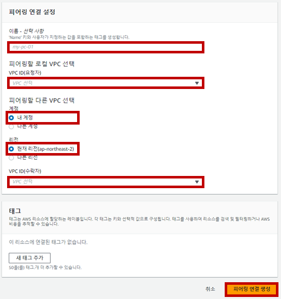
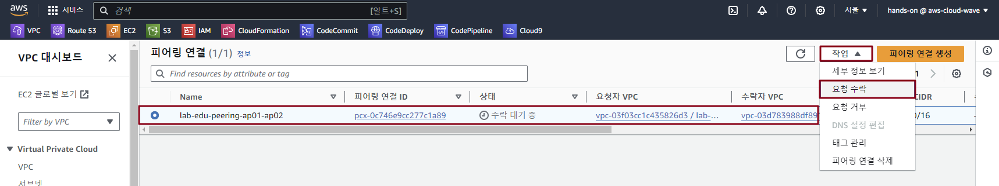

## Table of Contents
- [Table of Contents](#table-of-contents)
- [Single Region VPC Peering 구성](#single-region-vpc-peering-구성)
  - [1. VPC Peering Resource 생성](#1-vpc-peering-resource-생성)
  - [2. Routing Table 수정](#2-routing-table-수정)
  - [3. Network 통신 테스트](#3-network-통신-테스트)

## Single Region VPC Peering 구성

### 1. VPC Peering Resource 생성

- **VPC 콘솔 메인 화면 → `피어링 연결` 리소스 탭 → `피어링 연결 생성` 버튼 클릭**

- VPC Peering 생성 정보 입력 → `피어링 연결 생성` 버튼 클릭

    - 이름: lab-edu-peering-ap01-ap02

    - VPC ID(요청자):lab-edu-vpc-ap-01

    - 계정: 내 계정

    - 리전: 현재 리전
 
    - VPC ID(수락자): lab-edu-vpc-ap-02

        

- 피어링 연결 리소스 탭으로 이동 → "lab-edu-peering-ap01-ap02" 리소스 선택 → '작업' 버튼 클릭 → '요청 수락' → '요청 수락'

    

### 2. Routing Table 수정

- **VPC 콘솔 메인 화면 → 라우팅 테이블 탭 → `lab-edu-rtb-pri-01` 선택 → `라우팅` 탭 → `라우팅 편집` 버튼 클릭**

- 라우팅 테이블 경로 생성 정보 입력

    - `라우팅 추가` 버튼 클릭

    - 대상: 10.10.0.0/16

    - 대상: 피어링 연결 (lab-edu-peering-ap01-ap02)

    - `변경 사항 저장` 버튼 클릭

- **VPC 콘솔 메인 화면 → `라우팅 테이블` 탭 → `lab-edu-rtb-2nd-pri-01` 선택 → `라우팅` 탭 → `라우팅 편집` 버튼 클릭**

- 라우팅 테이블 경로 생성 정보 입력

    - `라우팅 추가` 버튼 클릭

    - 대상: 10.0.0.0/16

    - 대상: 피어링 연결 (lab-edu-peering-ap01-ap02)

    - `변경 사항 저장` 버튼 클릭

### 3. Network 통신 테스트

- **EC2 메인 콘솔 화면으로 이동 → `인스턴스 리소스` 탭 → `lab-edu-ec2-network-2nd-ap` 선택 → `Private IP` 주소 복사**

- VS Code IDE Terminal 화면으로 이동 → ssh 명령어 실행

    ```bash
    ssh web-server
    ```

- ICMP 통신 테스트 진행 (`lab-edu-ec2-network-2nd-ap` ping TEST)

    ```bash
    ping {2ND_VPC_NETWORK_SERVER_PRIVATE_IP}
    PING 10.10.40.140 (10.10.40.140) 56(84) bytes of data.
    64 bytes from 10.10.40.140: icmp_seq=1 ttl=255 time=0.451 ms
    64 bytes from 10.10.40.140: icmp_seq=2 ttl=255 time=0.473 ms
    64 bytes from 10.10.40.140: icmp_seq=3 ttl=255 time=0.384 ms
    64 bytes from 10.10.40.140: icmp_seq=4 ttl=255 time=0.536 ms
    ```
<br><br>