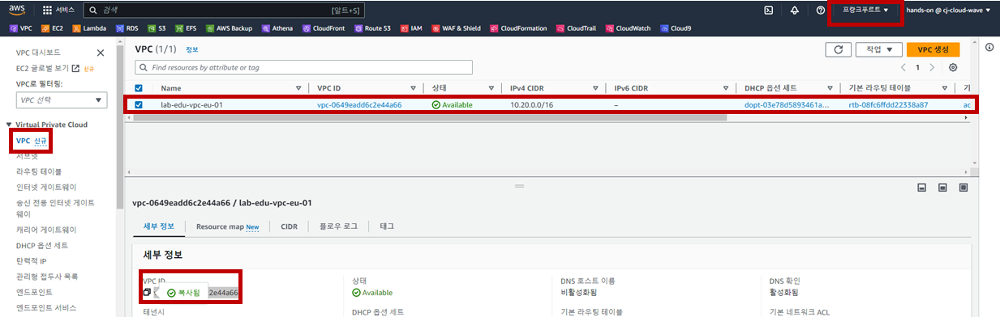

## Table of Contents
- [Table of Contents](#table-of-contents)
- [Multi Region VPC Peering 구성](#multi-region-vpc-peering-구성)
  - [1. 프랑크푸르트 리전 VPC ID 확인](#1-프랑크푸르트-리전-vpc-id-확인)
  - [2. VPC Peering Resource 생성](#2-vpc-peering-resource-생성)
  - [3. VPC Peering 수락](#3-vpc-peering-수락)
  - [4. Routing Table 수정](#4-routing-table-수정)
  - [5. Network 통신 테스트](#5-network-통신-테스트)

## Multi Region VPC Peering 구성

### 1. 프랑크푸르트 리전 VPC ID 확인

- **프랑크푸르트 리전으로 이동 → VPC 콘솔 메인 화면 → `VPC` 리소스 탭 → `lab-edu-vpc-eu-01` 선택 → 세부화면의 `VPC ID` 복사**

    

### 2. VPC Peering Resource 생성

- **서울 리전으로 이동 → VPC 콘솔 메인 화면 → `피어링 연결` 리소스 탭 → `피어링 연결 생성` 버튼 클릭**

- VPC Peering 생성 정보 입력

    - 이름: lab-edu-peering-ap01-eu01

    - VPC ID(요청자):lab-edu-vpc-ap-01

    - 계정: 내 계정

    - 리전: 다른 리전 → ***eu-central-1***

    - VPC ID(수락자): {FRANKFURT_REGION_VPC_ID}

- `피어링 연결 생성` 버튼 클릭 

### 3. VPC Peering 수락

- **프랑크푸르트 리전으로 이동 → `VPC` 콘솔 메인 화면 → `피어링 연결` 리소스 탭**

- 수락 대기 상태의 Peering 리소스 선택 → `작업` → `요청 수락` → `요청 수락`

### 4. Routing Table 수정

- **서울 리전으로 이동 → `VPC` 콘솔 메인 화면 → `라우팅 테이블` 탭 → `lab-edu-rtb-pri-01` 선택 → `라우팅` 탭 → `라우팅 편집` 버튼 클릭**

- 라우팅 테이블 경로 생성 정보 입력

    - `라우팅 추가` 버튼 클릭

    - 대상: 10.30.0.0/16

    - 대상: 피어링 연결 (lab-edu-peering-ap01-eu01)

    - `변경 사항 저장` 버튼 클릭

- **프랑크푸르트 리전으로 이동 → `VPC` 콘솔 메인 화면 → `라우팅 테이블` 탭 → `lab-edu-rtb-eu-pri-01` 선택 → `라우팅` 탭 → `라우팅 편집` 버튼 클릭**

- 라우팅 테이블 경로 생성 정보 입력

    - `라우팅 추가` 버튼 클릭

    - 대상: 10.0.0.0/16

    - 대상: 피어링 연결 (lab-edu-peering-ap01-eu01)

    - `변경 사항 저장` 버튼 클릭

### 5. Network 통신 테스트

- **프랑크푸르트 리전으로 이동 → EC2 메인 콘솔 화면 → `인스턴스 리소스` 탭 → `lab-edu-ec2-network-eu` 선택 → `Private IP` 주소 복사**

- VS Code IDE Terminal 화면으로 이동 → ssh 명령어 실행

    ```bash
    ssh web-server
    ```

- ICMP 통신 테스트 진행 (`FRANKFURT_NETWORK_SERVER_PRIVATE_IP` ping TEST)

    ```bash
    ping {FRANKFURT_NETWORK_SERVER_PRIVATE_IP}
    PING 10.30.40.64 (10.30.40.64) 56(84) bytes of data.
    64 bytes from 10.30.40.64: icmp_seq=1 ttl=127 time=225 ms
    64 bytes from 10.30.40.64: icmp_seq=2 ttl=127 time=225 ms
    64 bytes from 10.30.40.64: icmp_seq=3 ttl=127 time=225 ms
    64 bytes from 10.30.40.64: icmp_seq=4 ttl=127 time=225 ms
    ```
<br><br>