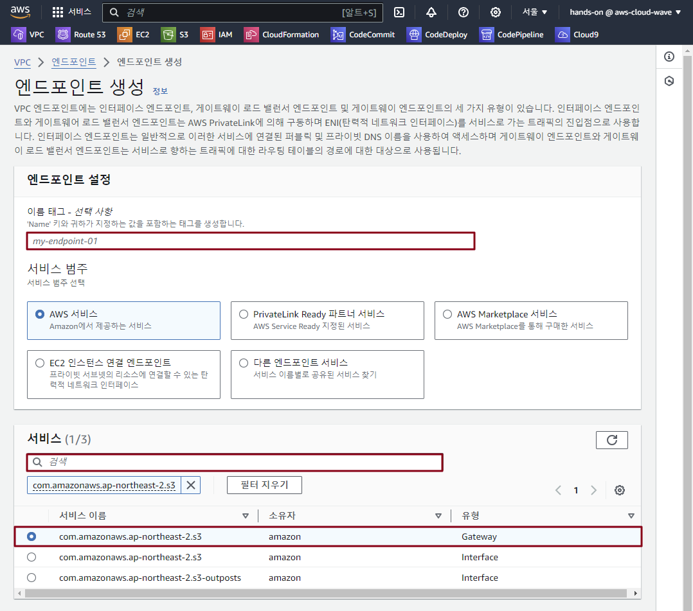
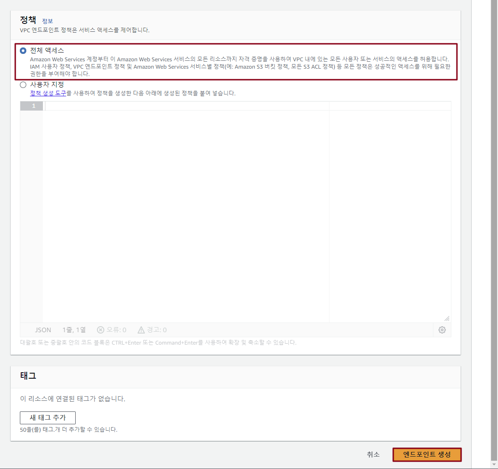
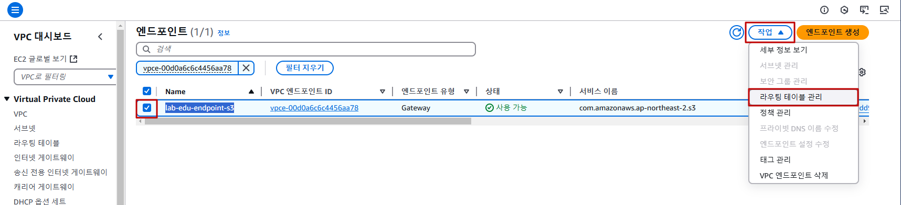
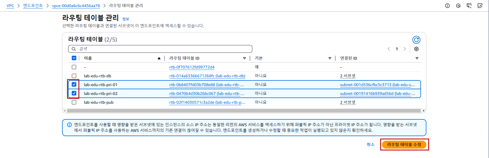

## Table of Contents
- [Table of Contents](#table-of-contents)
- [S3 버킷용 VPC Endpoint 생성 (Gateway Type)](#s3-버킷용-vpc-endpoint-생성-gateway-type)
  - [1. Web Server S3 접근 테스트](#1-web-server-s3-접근-테스트)
    - [1.1 Web Server 접속](#11-web-server-접속)
    - [1.2 S3 Bucket 접근 설정](#12-s3-bucket-접근-설정)
    - [1.3 S3 Bucket 객체 리스트 조회](#13-s3-bucket-객체-리스트-조회)
  - [2. S3 Bucket Endpoint 생성](#2-s3-bucket-endpoint-생성)
- [S3 Bucket Policy 수정](#s3-bucket-policy-수정)
  - [1. Bucket Policy 설정](#1-bucket-policy-설정)
  - [2. Bucket 접근 제한 확인](#2-bucket-접근-제한-확인)
    - [2.1 VS Code 서버와 Web 서버의 S3 접근 권한이 있는지 확인](#21-vs-code-서버와-web-서버의-s3-접근-권한이-있는지-확인)
    - [2.2 VS Code 서버에서 S3 객체 리스트 조회 테스트](#22-vs-code-서버에서-s3-객체-리스트-조회-테스트)
    - [2.3 Web 서버에서 S3 객체 리스트 조회 테스트](#23-web-서버에서-s3-객체-리스트-조회-테스트)
- [VPC Endpoint에서 접근하는 트래픽만 허용하는 S3 Bucket Policy 생성](#vpc-endpoint에서-접근하는-트래픽만-허용하는-s3-bucket-policy-생성)
  - [1. Bucket Policy 생성](#1-bucket-policy-생성)
  - [2. VPC Endpoint 통신 설정](#2-vpc-endpoint-통신-설정)
  - [3. Bucket 접근 제한 확인](#3-bucket-접근-제한-확인)
    - [3.1 VS Code 서버에서 S3 객체 리스트 조회 테스트](#31-vs-code-서버에서-s3-객체-리스트-조회-테스트)
    - [3.2 Web 서버에서 S3 객체 리스트 조회 테스트](#32-web-서버에서-s3-객체-리스트-조회-테스트)

## S3 버킷용 VPC Endpoint 생성 (Gateway Type)

### 1. Web Server S3 접근 테스트

#### 1.1 Web Server 접속

- VS Code IDE Terminal 접속 → SSH 명령어 실행

    ```bash
    ssh web-server
    ```

#### 1.2 S3 Bucket 접근 설정

- `ACCOUNT_ID` 값을 변수에 할당

  ```bash
  ACCOUNT_ID=$(aws sts get-caller-identity | jq -r .Account)
  ```

- 버킷 이름을 `BUCKET_NAME` 변수에 할당

  ```bash
  BUCKET_NAME="lab-edu-bucket-image-$ACCOUNT_ID"
  ```

#### 1.3 S3 Bucket 객체 리스트 조회

```bash
$ aws s3 ls "s3://$BUCKET_NAME"
2024-12-16 05:26:33      47921 cocker_spaniel.jpg
2024-12-16 05:26:33      64638 corgi.jpg
2024-12-16 05:26:33      74181 german_shepherd.jpg
2024-12-16 05:26:33      88081 golden_retriever.jpg
2024-12-16 05:26:33      41784 husky.jpg
2024-12-16 05:26:33      33828 jack_russell_terrier.jpg
2024-12-16 05:26:33      44155 jack_terrier.jpg
2024-12-16 05:26:33      65919 pug.jpg
2024-12-16 05:26:33      52571 shiba_inu.jpg
```

### 2. S3 Bucket Endpoint 생성

- **VPC 콘솔 메인 화면 → `엔드포인트` 리소스 탭 → `엔드포인트 생성` 버튼 클릭**

- 엔드포인트 생성 정보 입력

    - 이름: lab-edu-endpoint-s3

    - 서비스 이름 검색 창에 `com.amazonaws.ap-northeast-2.s3` 입력

    - `유형` 필드의 값이 `Gateway`인 항목 선택

        

    - VPC: lab-edu-vpc-ap-01

        

    - 정책: 전체 액세스

    - `엔드포인트 생성` 버튼 클릭

        

## S3 Bucket Policy 수정

> 💡 **Bucket Policy를 설정하는 이유** <br>
> - 앞에서 버킷에 설정 한 Policy는 Nat Gateway IP를 기반으로 접근하는 경우 Allow 하도록 설정했다.
> - 해당 정책을 수정해서 VPC Endpoint로 접근하는 경우만 Allow 하도록 수정해서 실제로 트래픽이 내부 트래픽만 허용하는지 확인한다.

### 1. Bucket Policy 설정

- S3 콘솔 메인 화면 → `lab-edu-bucket-image-{ACCOUNT_ID}` 버킷 클릭 → `권한` 탭

- `버킷 정책` 필드의 `삭제` 버튼 클릭

- 화면에 팝업된 확인 창에 `삭제` 텍스트 입력 → `삭제` 버튼 클릭 

### 2. Bucket 접근 제한 확인

#### 2.1 VS Code 서버와 Web 서버의 S3 접근 권한이 있는지 확인

  > 💡 **S3 접근 권한을 확인하는 이유**
  > - VS Code Server에는 S3 접근 권한이 존재있기 때문에 Bucket Policy에 추가 설정이 없어도 객체 조회가 가능하다.
  > - Web Server에는 S3 접근 권한이 없기 때문에 Nat Gateway를 이용해서 접근해도 객체 리스트 조회가 불가능 하다.

- VS Code IDE Terminal 접속

- Web Server에 할당된 권한 목록 조회

  > 💡 Web Server에는 S3 접근 권한이 없는 것을 확인한다.

  ```bash
  $ aws iam list-attached-role-policies --role-name lab-edu-role-ec2
  {
      "AttachedPolicies": [
          {
              "PolicyName": "AmazonEC2FullAccess",
              "PolicyArn": "arn:aws:iam::aws:policy/AmazonEC2FullAccess"
          },
          {
              "PolicyName": "CloudWatchFullAccess",
              "PolicyArn": "arn:aws:iam::aws:policy/CloudWatchFullAccess"
          }
      ]
  }
  ```

- VS Code Server에 할당된 권한 목록 조회

  > 💡 VS Code Server에는 S3 접근 권한이 존재하는 것을 확인한다.

  ```bash
  $ aws iam list-attached-role-policies --role-name lab-edu-role-vscode
  {
      "AttachedPolicies": [
          {
              "PolicyName": "AmazonEC2FullAccess",
              "PolicyArn": "arn:aws:iam::aws:policy/AmazonEC2FullAccess"
          },
          {
              "PolicyName": "IAMFullAccess",
              "PolicyArn": "arn:aws:iam::aws:policy/IAMFullAccess"
          },
          {
              "PolicyName": "AmazonVPCFullAccess",
              "PolicyArn": "arn:aws:iam::aws:policy/AmazonVPCFullAccess"
          },
          {
              "PolicyName": "AmazonS3FullAccess",
              "PolicyArn": "arn:aws:iam::aws:policy/AmazonS3FullAccess"
          },
          {
              "PolicyName": "AWSCloudFormationFullAccess",
              "PolicyArn": "arn:aws:iam::aws:policy/AWSCloudFormationFullAccess"
          }
      ]
  }
  ```

#### 2.2 VS Code 서버에서 S3 객체 리스트 조회 테스트

- VS Code Serverd Terminal로 이동

- `ACCOUNT_ID` 값을 변수에 할당

  ```bash
  ACCOUNT_ID=$(aws sts get-caller-identity | jq -r .Account)
  ```

- 버킷 이름을 `BUCKET_NAME` 변수에 할당

  ```bash
  BUCKET_NAME="lab-edu-bucket-image-$ACCOUNT_ID"
  ```

- 버킷 내부 객체 리스트 조회

  ```bash
  $ aws s3 ls "s3://$BUCKET_NAME"
  2024-12-16 05:26:33      47921 cocker_spaniel.jpg
  2024-12-16 05:26:33      64638 corgi.jpg
  2024-12-16 05:26:33      74181 german_shepherd.jpg
  2024-12-16 05:26:33      88081 golden_retriever.jpg
  2024-12-16 05:26:33      41784 husky.jpg
  2024-12-16 05:26:33      33828 jack_russell_terrier.jpg
  2024-12-16 05:26:33      44155 jack_terrier.jpg
  2024-12-16 05:26:33      65919 pug.jpg
  2024-12-16 05:26:33      52571 shiba_inu.jpg
  ```

#### 2.3 Web 서버에서 S3 객체 리스트 조회 테스트

- VS Code Terminal에서 ssh 명령을 통해 Web Server 접속

    ```bash
    $ ssh web-server
    ```

- `ACCOUNT_ID` 값을 변수에 할당

  ```bash
  ACCOUNT_ID=$(aws sts get-caller-identity | jq -r .Account)
  ```

- 버킷 이름을 `BUCKET_NAME` 변수에 할당

  ```bash
  BUCKET_NAME="lab-edu-bucket-image-$ACCOUNT_ID"
  ```

- 버킷 내부 객체 리스트 조회

  ```bash
  $ aws s3 ls "s3://$BUCKET_NAME"
  
  An error occurred (AccessDenied) when calling the ListObjectsV2 operation: User: arn:aws:sts::************:assumed-role/lab-edu-role-ec2/i-009a44f7f7119202e is not authorized to perform: s3:ListBucket on resource: "arn:aws:s3:::lab-edu-bucket-image-************" because no identity-based policy allows the s3:ListBucket action
  ```

## VPC Endpoint에서 접근하는 트래픽만 허용하는 S3 Bucket Policy 생성

> 💡 **Bucket Policy를 적용 후 바뀌는 부분** <br>
> - 이번 단계에서는 VPC Endpoint를 사용할 수 있는 Subnet을 지정하는데 Web Server가 배치 되어 있는 Private Subnet 01, 02번에 적용한다.
> - Bucket Policy가 적용되기 전에는 VS Code Server에서만 S3 객체 리스트 조회가 가능 했지만,
> - VPC Endpoint로 접근하는 트래픽은 허용하는 버킷 정책을 추가해 Web Server에는 버킷 접근 권한이 없지만 객체 리스트 조회가 가능해진다. 

### 1. Bucket Policy 생성

- VS Code Terminal 접속 → Shell Script 폴더로 이동

    ```bash
    cd /Workshop/support_files/policy
    ```

- Bucket Policy 생성 Script 실행

    ```bash
    sudo sh ./s3_bucket_policy_endpoint.sh
    ```

- 정책 반영 명령어 실행

    ```bash
    ACCOUNT_ID=$(aws sts get-caller-identity --query Account --output text)
    ```

    ```bash
    BUCKET_NAME="lab-edu-bucket-image-$ACCOUNT_ID"
    ```

    ```bash
    aws s3api put-bucket-policy --bucket $BUCKET_NAME --policy file://s3_bucket_policy_endpoint_output.json
    ```

### 2. VPC Endpoint 통신 설정 

- **VPC 콘솔 메인 화면 → `엔드포인트` 리소스 탭 → `lab-edu-endpoint-s3` 선택 → `작업` → `라우팅 테이블 관리` 버튼 클릭**

  

- `lab-edu-rtb-pri-01`, `lab-edu-rtb-pri-01` 선택 → `라우팅 테이블 수정` 버튼 클릭

  

### 3. Bucket 접근 제한 확인

#### 3.1 VS Code 서버에서 S3 객체 리스트 조회 테스트

- VS Code Serverd Terminal로 이동

- `ACCOUNT_ID` 값을 변수에 할당

  ```bash
  ACCOUNT_ID=$(aws sts get-caller-identity | jq -r .Account)
  ```

- 버킷 이름을 `BUCKET_NAME` 변수에 할당

  ```bash
  BUCKET_NAME="lab-edu-bucket-image-$ACCOUNT_ID"
  ```

- 버킷 내부 객체 리스트 조회

  ```bash
  $ aws s3 ls s3://$BUCKET_NAME
  2024-12-16 05:26:33      47921 cocker_spaniel.jpg
  2024-12-16 05:26:33      64638 corgi.jpg
  2024-12-16 05:26:33      74181 german_shepherd.jpg
  2024-12-16 05:26:33      88081 golden_retriever.jpg
  2024-12-16 05:26:33      41784 husky.jpg
  2024-12-16 05:26:33      33828 jack_russell_terrier.jpg
  2024-12-16 05:26:33      44155 jack_terrier.jpg
  2024-12-16 05:26:33      65919 pug.jpg
  2024-12-16 05:26:33      52571 shiba_inu.jpg
  ```

#### 3.2 Web 서버에서 S3 객체 리스트 조회 테스트

- VS Code Terminal에서 ssh 명령을 통해 Web Server 접속

    ```bash
    $ ssh web-server
    ```

- `ACCOUNT_ID` 값을 변수에 할당

  ```bash
  ACCOUNT_ID=$(aws sts get-caller-identity | jq -r .Account)
  ```

- 버킷 이름을 `BUCKET_NAME` 변수에 할당

  ```bash
  BUCKET_NAME="lab-edu-bucket-image-$ACCOUNT_ID"
  ```

- 버킷 내부 객체 리스트 조회

  ```bash
  $ aws s3 ls s3://$BUCKET_NAME
  2024-12-16 05:26:33      47921 cocker_spaniel.jpg
  2024-12-16 05:26:33      64638 corgi.jpg
  2024-12-16 05:26:33      74181 german_shepherd.jpg
  2024-12-16 05:26:33      88081 golden_retriever.jpg
  2024-12-16 05:26:33      41784 husky.jpg
  2024-12-16 05:26:33      33828 jack_russell_terrier.jpg
  2024-12-16 05:26:33      44155 jack_terrier.jpg
  2024-12-16 05:26:33      65919 pug.jpg
  2024-12-16 05:26:33      52571 shiba_inu.jpg
  ```
