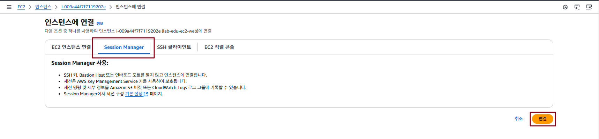
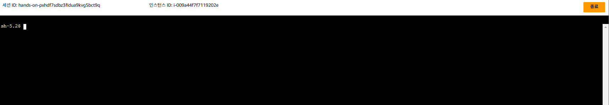
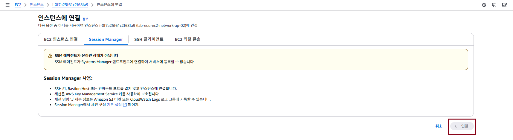

## Table of Contents
- [Table of Contents](#table-of-contents)
- [SSM Session Manager용 VPC Endpoint 생성 (Interface Type)](#ssm-session-manager용-vpc-endpoint-생성-interface-type)
  - [1. Web Server에 System Manager 접근 권한 할당](#1-web-server에-system-manager-접근-권한-할당)
  - [2. Session Manager 테스트용 서버 생성](#2-session-manager-테스트용-서버-생성)
  - [3. SSM 이용 Network Server 접속 테스트](#3-ssm-이용-network-server-접속-테스트)
    - [3.1 Web Server SSM 접속 테스트](#31-web-server-ssm-접속-테스트)
    - [3.2 Network Server SSM 접속 테스트](#32-network-server-ssm-접속-테스트)
  - [4. SSM VPC Endpoint용 Security Group 생성](#4-ssm-vpc-endpoint용-security-group-생성)
  - [5. VPC Endpoint 생성](#5-vpc-endpoint-생성)
  - [6. SSM 이용 Network Server 접속](#6-ssm-이용-network-server-접속)

## SSM Session Manager용 VPC Endpoint 생성 (Interface Type)

### 1. Web Server에 System Manager 접근 권한 할당

- VS Code IDE Terminal 접속

- Web Serverd에 CloudWatch 접근 권한 할당

  ```bash
  aws iam attach-role-policy --role-name lab-edu-role-ec2 --policy-arn arn:aws:iam::aws:policy/AmazonSSMManagedInstanceCore
  ```

- Web Serverd에 할당된 권한 목록 조회

  ```bash
  aws iam list-attached-role-policies --role-name lab-edu-role-ec2
  ```

- Web Server 재부팅

  ```bash
  WEB_SERVER_NAME=lab-edu-ec2-web
  aws ec2 reboot-instances --instance-ids $(aws ec2 describe-instances --filters "Name=tag:Name,Values=$WEB_SERVER_NAME" --query "Reservations[].Instances[].InstanceId" --output text)
  ```

### 2. Session Manager 테스트용 서버 생성

- VS Code IDE Terminal 접속

- Network 서버 생성 스크립트 폴더로 이동

  ```bash
  cd /Workshop/script/
  ```

- 서버 생성 스크립트 실행

  ```
  $ sh ./create_ec2_instance.sh
  VPC found: vpc-09eccafd33dba5dd9
  PRIVATE_SUBNET_02 found: subnet-00191416b939ad56d
  VPC found: sg-096e997fb542142ab
  Security Group Rule created successfully: SSH
  Security Group Rule created successfully: ICMP
  NETWORK_EC2_02 created successfully: 10.0.41.148, i-0f7a25f61c2f68fa9
  {
      "IamInstanceProfileAssociation": {
          "AssociationId": "iip-assoc-07dd9a57b17c7e8c0",
          "InstanceId": "i-0f7a25f61c2f68fa9",
          "IamInstanceProfile": {
              "Arn": "arn:aws:iam::602229900482:instance-profile/lab-edu-role-ec2",
              "Id": "AIPAYYN5TATBENR7IZ4FZ"
          },
          "State": "associating"
      }
  }
  Configuration created successfully: /home/ubuntu/.ssh/config
  ```

- Network Server SSH 접속

  ```bash
  ssh network-server
  ```

### 3. SSM 이용 Network Server 접속 테스트

> - Web Server가 배치된 `Private Subnet 01`은 Nat Gateway Route 정보가 반영되어 있기 때문에 Session Manager로 접속이 가능하고,
> - Network Server가 배치된 `Private Subnet 02`은 Nat Gateway Route 정보가 없기 때문에 외부에서 Session Manager로 접속이 불가능한 상태다.
> - 각 서버에 Session Manager 접속 테스트를 통해 접속 가능 여부를 확인한다.

#### 3.1 Web Server SSM 접속 테스트

- **EC2 콘솔 메인 화면 → `인스턴스` 리소스 탭 → `lab-edu-ec2-web` 선택 → `연결` 버튼 클릭**

- `Session Manager` 탭으로 이동 → `연결` 버튼 클릭

  

- Web Server Terminal 접속 상태 확인

  

#### 3.2 Network Server SSM 접속 테스트

- **EC2 콘솔 메인 화면 → `인스턴스` 리소스 탭 → `lab-edu-ec2-network-ap-02` 선택 → '연결' 버튼 클릭**

- `Session Manager` 탭으로 이동 → `연결` 버튼 비활성화 상태 확인

  

### 4. SSM VPC Endpoint용 Security Group 생성

- **EC2 콘솔 메인 화면 → `보안 그룹` 리소스 탭 → `보안 그룹 생성` 버튼 클릭**

- 보안그룹 생성 정보 입력

    - 보안그룹 이름: lab-edu-sg-endpoint-interface

    - VPC: lab-edu-vpc-ap-01

    - 인바운드 규칙:

        - 유형: HTTPS / 포트 범위: 443 / 소스: 10.0.0.0/16

        - 유형: UDP / 포트 범위: 53 / 소스: 10.0.0.0/16

    - `보안 그룹 생성` 버튼 클릭

### 5. VPC Endpoint 생성

- **VPC 콘솔 메인 화면 → `엔드포인트` 리소스 탭 → `엔드포인트 생성` 버튼 클릭**

- 엔드포인트 생성 정보 입력 (ssm)

    - 이름: lab-edu-endpoint-ssm

    - 서비스 이름 / 소유자 / 유형: com.amazonaws.ap-northeast-2.ssm / amazon / Interface

    - VPC: lab-edu-vpc-ap-01

    - 서브넷: lab-edu-sub-pri-01, lab-edu-sub-pri-02

    - 보안그룹: lab-edu-sg-endpoint-interface

    - `엔드포인트 생성` 버튼 클릭

- 엔드포인트 생성 정보 입력 (ssmessages)

    - 이름: lab-edu-endpoint-ssmessages

    - 서비스 이름 / 소유자 / 유형: com.amazonaws.ap-northeast-2.ssmessages / amazon / Interface

    - VPC: lab-edu-vpc-ap-01

    - 서브넷: lab-edu-sub-pri-01, lab-edu-sub-pri-02

    - 보안그룹: lab-edu-sg-endpoint-interface

    - `엔드포인트 생성` 버튼 클릭

- 엔드포인트 생성 정보 입력 (ec2messages)

    - 이름: lab-edu-endpoint-ec2messages

    - 서비스 이름 / 소유자 / 유형: com.amazonaws.ap-northeast-2.ec2messages / amazon / Interface

    - VPC: lab-edu-vpc-ap-01

    - 서브넷: lab-edu-sub-pri-01, lab-edu-sub-pri-02

    - 보안그룹: lab-edu-sg-endpoint-interface

    - `엔드포인트 생성` 버튼 클릭

### 6. SSM 이용 Network Server 접속

- **EC2 콘솔 메인 화면 → `인스턴스` 리소스 탭 → `lab-edu-ec2-network-ap-02` 선택 → `연결` 버튼 클릭**

- `Session Manager` 탭으로 이동 → `연결` 버튼 클릭 → 연결 


