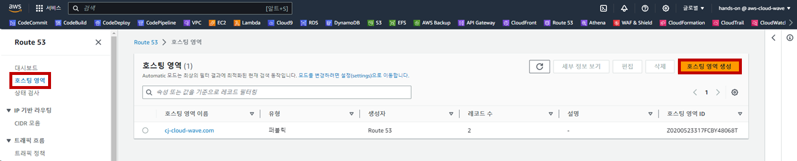
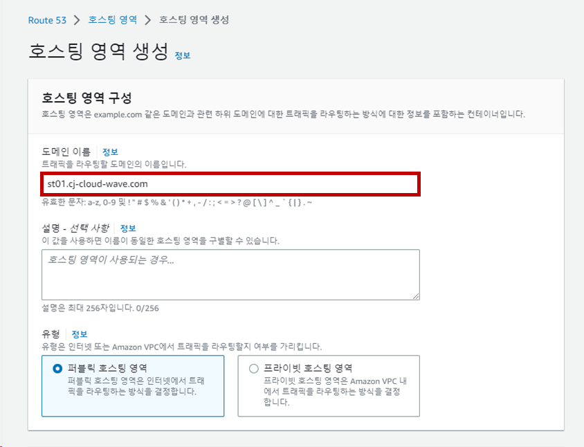
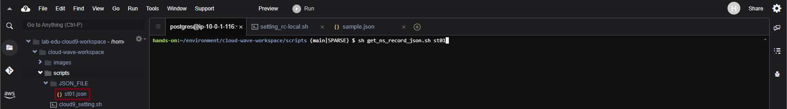

## Table of Contents
- [Table of Contents](#table-of-contents)
- [Create Route 53 Hosting Zone](#create-route-53-hosting-zone)
  - [1. Route 53 Public Hosted Zone 생성](#1-route-53-public-hosted-zone-생성)
  - [2. Public Hosted Zone NS Record 생성](#2-public-hosted-zone-ns-record-생성)
  - [3. 서울, 버지니아, 프랑크프루트 Web Server Public IP 메모](#3-서울-버지니아-프랑크프루트-web-server-public-ip-메모)

## Create Route 53 Hosting Zone

### 1. Route 53 Public Hosted Zone 생성

- **Route 53 콘솔 화면 → `호스트 영역` 리소스 탭 → `호스팅 영역 생성` 버튼 클릭**

    

- 도메인 이름: **`st + 개인 사물함 번호`.cj-cloud-wave.com** 
   > <span style="color:yellowgreen">DOMAIN_NAME_EXAMPLE:</span> `st01`.cj-cloud-wave.com

    

### 2. Public Hosted Zone NS Record 생성

- VS Code IDE Terminal 화면으로 이동 
  
- Script 폴더로 이동

    ```bash
    /Workshop/scripts
    ```

- Public Hosted Zone NS Record 정보 수집 Script 실행

    ```bash
    # sh get_ns-record_json.sh st01
    sh get_ns_record_json.sh [개인 사물함 번호]
    ```

- JSON_FILE 폴더 아래 JSON 파일 확인 → Slack으로 강사에게 공유

    

### 3. 서울, 버지니아, 프랑크프루트 Web Server Public IP 메모

- EC2 콘솔 메인 화면 → `인스턴스` 탭 → 서울 리전 → `lab-edu-ec2-web` 선택 → `Public IP` 주소 복사 → 메모장 붙여 넣기

- 버지니아 리전 → `lab-edu-ec2-web-us` 선택 → `Public IP` 주소 복사 → 메모장 붙여 넣기

- 프랑크프루트 리전 → `lab-edu-ec2-web-eu` 선택 → `Public IP` 주소 복사 → 메모장 붙여 넣기

    ```
    ap-northeast-2  3.34.197.127
    us-east-1       44.208.22.154
    eu-central-1    54.93.237.6
    ```

<br>