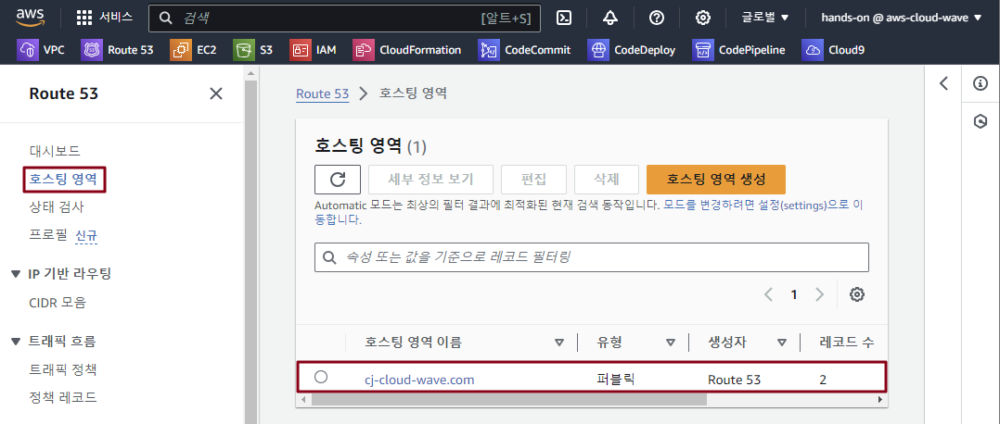
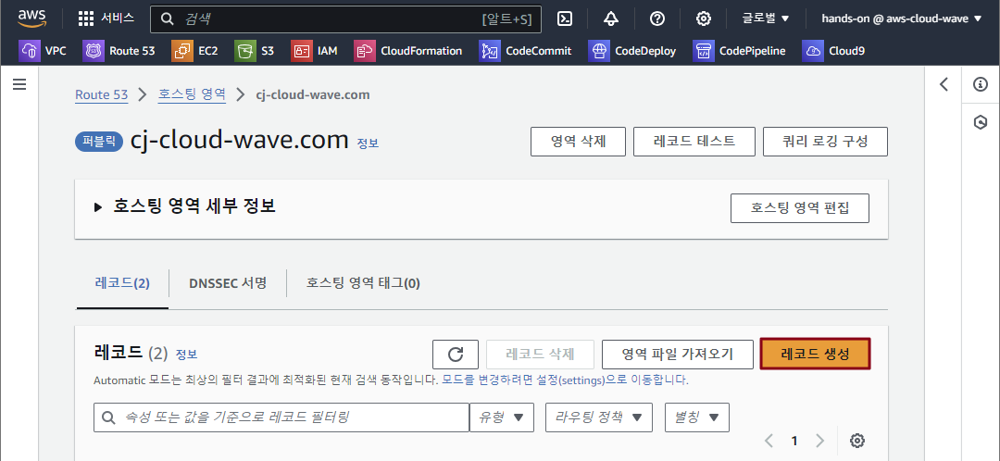
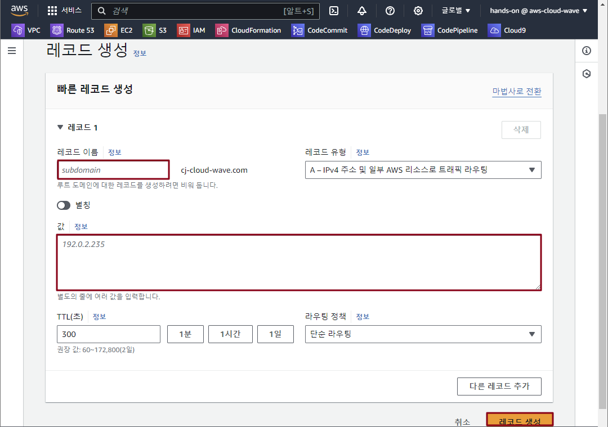
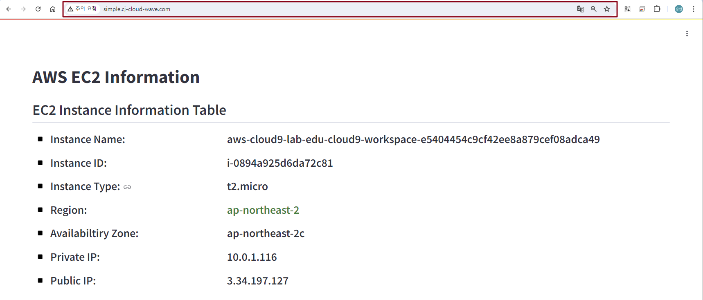
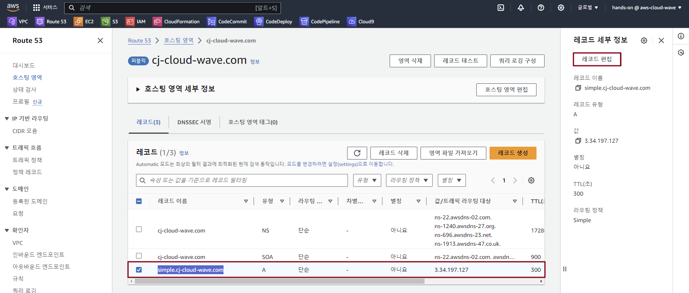
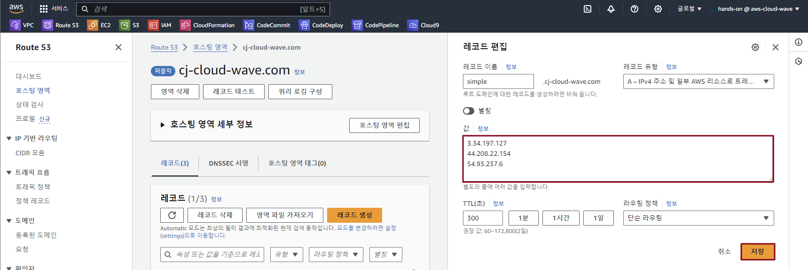

## Table of Contents
- [Table of Contents](#table-of-contents)
- [Route 53 Simple Routing Policy](#route-53-simple-routing-policy)
  - [1. Single Value Simple Routing Policy 생성](#1-single-value-simple-routing-policy-생성)
  - [2. Web 서비스 접속 테스트 (http://simple.stxx.cj-cloud-wave.com/ 접속)](#2-web-서비스-접속-테스트-httpsimplestxxcj-cloud-wavecom-접속)
  - [3. Multy Value Simple Routing Policy 생성](#3-multy-value-simple-routing-policy-생성)
  - [4. Linux `dig` 명령어 이용 DNS record 값 반영 확인](#4-linux-dig-명령어-이용-dns-record-값-반영-확인)

## Route 53 Simple Routing Policy

### 1. Single Value Simple Routing Policy 생성

- **Route 53 메인 콘솔 화면 → `호스팅 영역` 리소스 탭 → `stxx.cj-cloud-wave.com` 클릭**

    

- `레코드 생성` 버튼 클릭

    

- Routing Policy 생성 정보 입력

    - 레코드 이름: ***<span style="color:orange">simple</span>.cj-cloud-wave.com***

    - 레코드 유형: ***A***

    - 값: ***<span style="color:orange">ap-northeast-2</span> web server public ip***

    - TTL(option): ***10초***

    

### 2. Web 서비스 접속 테스트 (http://simple.stxx.cj-cloud-wave.com/ 접속)
  


### 3. Multy Value Simple Routing Policy 생성

- Route 53 레코드 편집 화면으로 이동 → `simple.cj-cloud-wave.com` 레코드 클릭 → `레코드 편집` 버튼 클릭

    

- 값 수정 → `저장` 버튼 클릭
  
    - ***<span style="color:orange">ap-northeast-2</span> web server public ip***

    - ***<span style="color:orange">us-east-1</span> web server public ip***

    - ***<span style="color:orange">eu-central-1</span> web server public ip***

        

### 4. Linux `dig` 명령어 이용 DNS record 값 반영 확인

- VS Code IDE Terminal 화면 이동 → `dig` 명령 입력

    ```bash
    $ dig simple.cj-cloud-wave.com

    ; <<>> DiG 9.16.48-RH <<>> simple.cj-cloud-wave.com
    ;; global options: +cmd
    ;; Got answer:
    ;; ->>HEADER<<- opcode: QUERY, status: NOERROR, id: 42468
    ;; flags: qr rd ra; QUERY: 1, ANSWER: 3, AUTHORITY: 0, ADDITIONAL: 1

    ;; OPT PSEUDOSECTION:
    ; EDNS: version: 0, flags:; udp: 4096
    ;; QUESTION SECTION:
    ;simple.cj-cloud-wave.com.      IN      A

    ;; ANSWER SECTION:
    simple.cj-cloud-wave.com. 1     IN      A       54.93.237.6
    simple.cj-cloud-wave.com. 1     IN      A       3.34.197.127
    simple.cj-cloud-wave.com. 1     IN      A       44.208.22.154

    ;; Query time: 70 msec
    ;; SERVER: 10.0.0.2#53(10.0.0.2)
    ;; WHEN: Sat Jun 29 00:02:45 UTC 2024
    ;; MSG SIZE  rcvd: 101
    ```

<br>