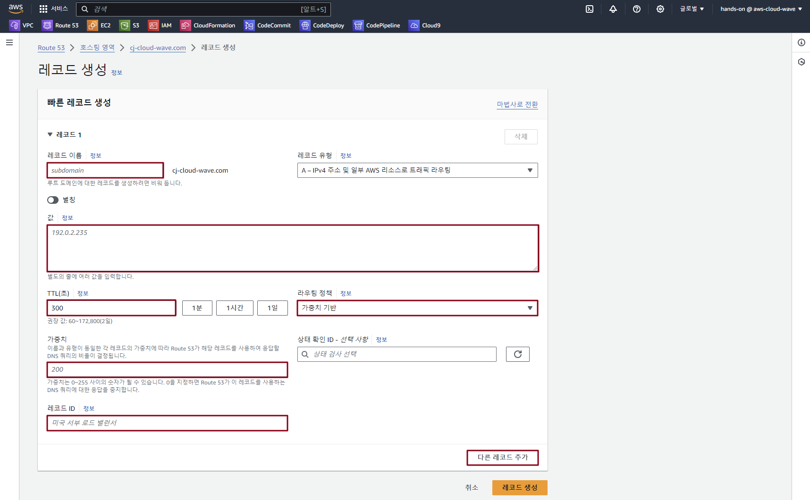

## Table of Contents
- [Table of Contents](#table-of-contents)
- [Route 53 Weighted Routing Policy](#route-53-weighted-routing-policy)
  - [1. Weighted Routing Policy 생성](#1-weighted-routing-policy-생성)
  - [2. Linux `dig` 명령어 이용 DNS record 값 반영 확인](#2-linux-dig-명령어-이용-dns-record-값-반영-확인)

## Route 53 Weighted Routing Policy

### 1. Weighted Routing Policy 생성 

- **Route 53 메인 콘솔 화면 → `호스팅 영역` 리소스 탭 → `stxx.cj-cloud-wave.com` 클릭**

- `레코드 생성` 버튼 클릭

- Routing Policy 생성 정보 입력 (서울 리전) → `다른 레코드 추가` 버튼 클릭

    - 레코드 이름: ***<span style="color:orange">weighted</span>.cj-cloud-wave.com***

    - 레코드 유형: ***A***

    - 값: ***<span style="color:orange">ap-northeast-2</span> web server public ip***

    - TTL(option): ***1초***

    - Routing Policy: 가중치 기반

    - Weight: 60

    - Record id: ap-northeast-2

    

- Routing Policy 생성 정보 입력 (버지니아 리전) → `다른 레코드 추가` 버튼 클릭

    - 레코드 이름: ***<span style="color:orange">weighted</span>.cj-cloud-wave.com***

    - 레코드 유형: ***A***

    - 값: ***<span style="color:orange">us-east-1</span> web server public ip***

    - TTL(option): ***1초***

    - Routing Policy: 가중치 기반

    - Weight: 30

    - Record id: us-east-1

- Routing Policy 생성 정보 입력 (프랑크프루트 리전) → `레코드 생성` 버튼 클릭

    - 레코드 이름: ***<span style="color:orange">weighted</span>.cj-cloud-wave.com***

    - 레코드 유형: ***A***

    - 값: ***<span style="color:orange">eu-central-1</span> web server public ip***

    - TTL(option): ***1초***

    - Routing Policy: 가중치 기반

    - Weight: 10

    - Record id: eu-central-1

### 2. Linux `dig` 명령어 이용 DNS record 값 반영 확인

- VS Code IDE Terminal 화면 이동 → `dig` 명령 입력 

  > 여러 차례 시도 시 ANSWER SECTION 값이 바뀌게 된다.

  ```Bash
  # 첫 번째 도메인 주소 검색 시도
  $ dig weighted.cj-cloud-wave.com

  ; <<>> DiG 9.16.48-RH <<>> weighted.cj-cloud-wave.com
  ;; global options: +cmd
  ;; Got answer:
  ;; ->>HEADER<<- opcode: QUERY, status: NOERROR, id: 7098
  ;; flags: qr rd ra; QUERY: 1, ANSWER: 1, AUTHORITY: 0, ADDITIONAL: 1

  ;; OPT PSEUDOSECTION:
  ; EDNS: version: 0, flags:; udp: 4096
  ;; QUESTION SECTION:
  ;weighted.cj-cloud-wave.com.    IN      A

  ;; ANSWER SECTION:
  weighted.cj-cloud-wave.com. 1   IN      A       3.34.197.127

  ;; Query time: 0 msec
  ;; SERVER: 10.0.0.2#53(10.0.0.2)
  ;; WHEN: Sat Jun 29 00:18:36 UTC 2024
  ;; MSG SIZE  rcvd: 71
  ```

  ```bash
  # 두 번째 도메인 주소 검색 시도
  $ dig weighted.cj-cloud-wave.com

  ; <<>> DiG 9.16.48-RH <<>> weighted.cj-cloud-wave.com
  ;; global options: +cmd
  ;; Got answer:
  ;; ->>HEADER<<- opcode: QUERY, status: NOERROR, id: 4630
  ;; flags: qr rd ra; QUERY: 1, ANSWER: 1, AUTHORITY: 0, ADDITIONAL: 1

  ;; OPT PSEUDOSECTION:
  ; EDNS: version: 0, flags:; udp: 4096
  ;; QUESTION SECTION:
  ;weighted.cj-cloud-wave.com.    IN      A

  ;; ANSWER SECTION:
  weighted.cj-cloud-wave.com. 1   IN      A       44.208.22.154

  ;; Query time: 30 msec
  ;; SERVER: 10.0.0.2#53(10.0.0.2)
  ;; WHEN: Sat Jun 29 00:18:39 UTC 2024
  ;; MSG SIZE  rcvd: 71
  ```

<br>