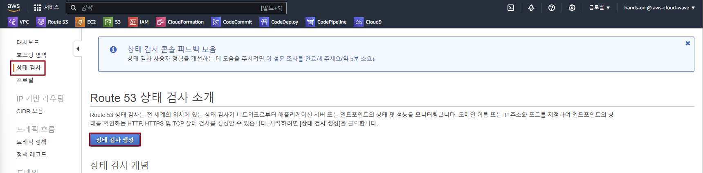
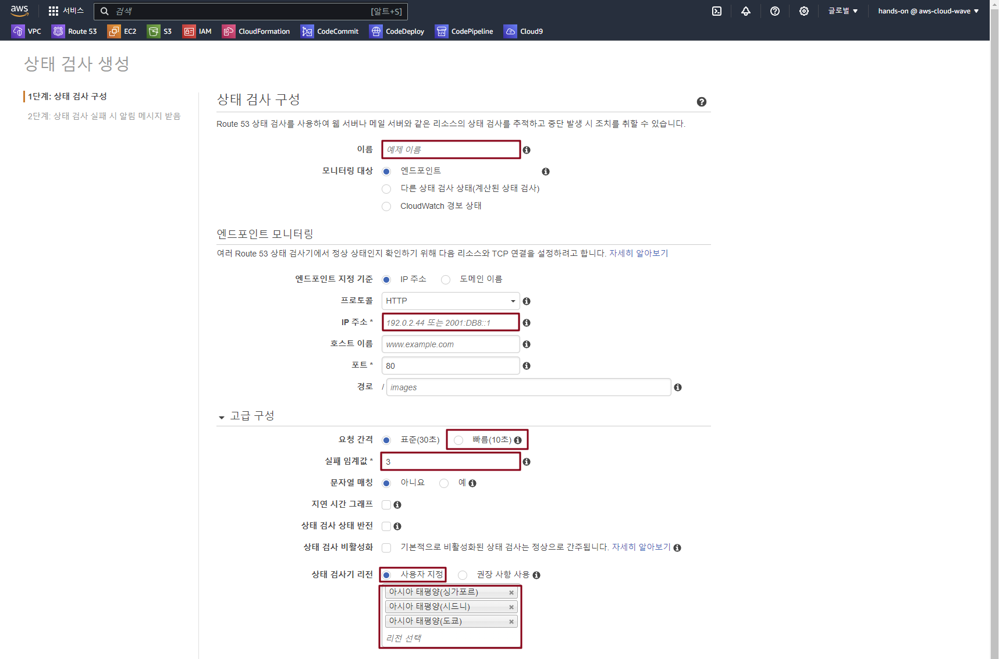
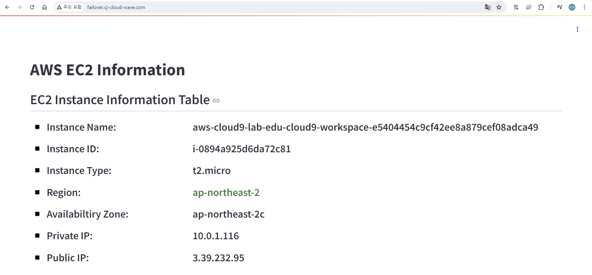
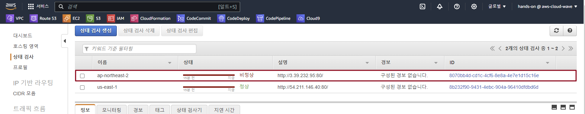
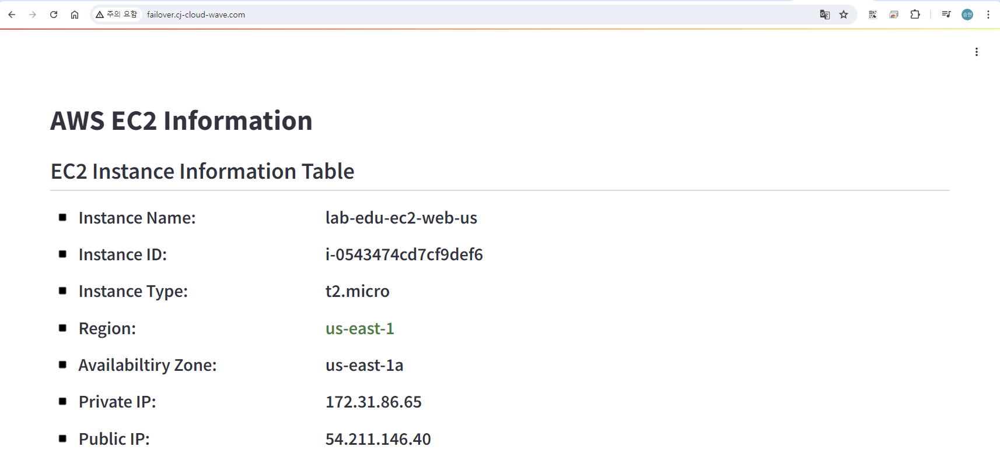

## Table of Contents
- [Table of Contents](#table-of-contents)
- [Route 53 Failover Routing Policy](#route-53-failover-routing-policy)
  - [1. Route 53 Health Check 생성](#1-route-53-health-check-생성)
  - [2. Fail-over Routing Policy 생성](#2-fail-over-routing-policy-생성)
  - [3. Failover 테스트](#3-failover-테스트)
    - [3.1 Web 서비스 접속 테스트](#31-web-서비스-접속-테스트)
    - [3.2 서울 리전 Web Server 중지](#32-서울-리전-web-server-중지)
    - [3.2 Web 서비스 접속 테스트](#32-web-서비스-접속-테스트)

## Route 53 Failover Routing Policy

### 1. Route 53 Health Check 생성

- **Route 53 메인 콘솔 화면 → `상태 검사` 리소스 탭 → `상태 검사 생성` 버튼 클릭**

    

- `서울 리전` 상태 검사기 생성 정보 입력

    - 이름: ap-northeast-2

    - IP 주소: ***ap-northeast-2 web server public ip***

    - `고급 구성` → 요청 간격: 빠름 (10초)

    - `고급 구성` → 실패 임계값: 1

    - `고급 구성` → 상태 검사기 리전: 사용자 지정
  
        - 아시아 태평양(도쿄)
        - 아시아 태평양(시드니)
        - 아시아 태평양(싱가포르)

        

- `버지니아 리전` 상태 검사기 생성 정보 입력

    - 이름: us-east-1

    - IP 주소: ***us-east-1 web server public ip***

    - `고급 구성` → 요청 간격: 빠름 (10초)

    - `고급 구성` → 실패 임계값: 1

    - `고급 구성` → 상태 검사기 리전: 사용자 지정
  
        - 미국 동부(버지니아 북부)
        - 미국 서부(캘리포니아 북부)
        - 미국 서부(오레곤 북부)

### 2. Fail-over Routing Policy 생성 

- **Route 53 메인 콘솔 화면 → `호스팅 영역` 리소스 탭 → `stxx.cj-cloud-wave.com` 클릭**

- `레코드 생성` 버튼 클릭

- `서울 리전` Routing Policy 생성 정보 입력

    - 레코드 이름: ***failover.cj-cloud-wave.com***

    - 레코드 유형: ***A***

    - 값: ***ap-northeast-2 web server public ip***

    - TTL(option): ***1초***

    - Routing Policy: 장애 조치

    - Failover record type: Primary

    - Health check: ap-northeast-2

    - Record id: ap-northeast-2

- `다른 레코드 추가` 버튼 클릭

- `버지니아 리전` Routing Policy 생성 정보 입력

    - 레코드 이름: ***failover.cj-cloud-wave.com***

    - 레코드 유형: ***A***

    - 값: ***us-east-1 web server public ip***

    - TTL(option): ***1초***

    - Routing Policy: 장애 조치

    - Failover record type: Secondary

    - Health check: us-east-1

    - Record id: us-east-1

- `레코드 생성` 버튼 클릭

### 3. Failover 테스트 

#### 3.1 Web 서비스 접속 테스트 

- `http://failover.stxx.cj-cloud-wave.com/` 주소로 웹 브라우저에서 접속

#### 3.2 서울 리전 Web Server 중지

- EC2 콘솔 메인 화면 → `인스턴스` 리소스 탭 → `lab-edu-ec2-web` 선택 → `인스턴스 상태` 버튼 클릭 → `인스턴스 중지` 버튼 클릭

- **Route 53 메인 콘솔 화면 → `상태 검사` 리소스 탭 → `ap-northeast-2` 상태 값 확인 (정상 → 비정상)**

    

#### 3.2 Web 서비스 접속 테스트

> 서울 리전의 Web Server가 종료 된 후 버지니아 리전의 Web Server로 트래픽이 변경되어 흘러 가는지 확인

- `http://failover.stxx.cj-cloud-wave.com/` 주소로 웹 브라우저에서 접속

    

 