## Table of Contents
- [Table of Contents](#table-of-contents)
- [GitHub Repository 생성](#github-repository-생성)
  - [1. GitHub, CodeDeploy에 적용할 IAM User \& Role 생성](#1-github-codedeploy에-적용할-iam-user--role-생성)
    - [1.1 GitHub용 IAM User 생성](#11-github용-iam-user-생성)
    - [1.2 GitHub용 Access Key / Secret key 생성](#12-github용-access-key--secret-key-생성)
    - [1.3 CodeDeploy용 IAM Role 생성](#13-codedeploy용-iam-role-생성)
  - [2. 개인용 GtiHub 계정에 Repository 생성](#2-개인용-gtihub-계정에-repository-생성)
  - [3. VS Code IDE 서버 Local Repository와 GitHub Repository 연동](#3-vs-code-ide-서버-local-repository와-github-repository-연동)
  - [4. GitHub Repository 설정](#4-github-repository-설정)
    - [4.1 Access Key 등록](#41-access-key-등록)
- [CodeDeploy 생성](#codedeploy-생성)
  - [1. CodeDeploy Application 생성](#1-codedeploy-application-생성)
- [CodeDeploy Agent 설정](#codedeploy-agent-설정)
  - [1. CodeDeploy Agent 설치](#1-codedeploy-agent-설치)
- [GitHub Actions 설정](#github-actions-설정)
  - [1. GitHub Actions 코드 구성](#1-github-actions-코드-구성)
  - [2. GitHub Actions YAML Code](#2-github-actions-yaml-code)

## GitHub Repository 생성

### 1. GitHub, CodeDeploy에 적용할 IAM User & Role 생성

#### 1.1 GitHub용 IAM User 생성

- VS Code Terminal 접속 → Project 디렉토리 이동

  ```bash
  cd /Workshop
  ```

- IAM User 생성 명령어 실행

  ```bash
  aws iam create-user --user-name lab-edu-user-github
  ```

- IAM User에 정책 할당 명령어 실행

  ```bash
  aws iam attach-user-policy --user-name lab-edu-user-github --policy-arn arn:aws:iam::aws:policy/AWSCodeDeployFullAccess
  ```

- 할당 된 정책 확인 명령어

  ```bash
  aws iam list-attached-user-policies --user-name lab-edu-user-github
  ```

#### 1.2 GitHub용 Access Key / Secret key 생성

- Acces Key, Secret Key 생성 명령

  ```bash
  aws iam create-access-key --user-name lab-edu-user-github > ~/.ssh/access_key.json
  ```

- 생성된 Access / Secret Key 정보 확인 (FILE_PATH: `~/.ssh/access_key.json`)

  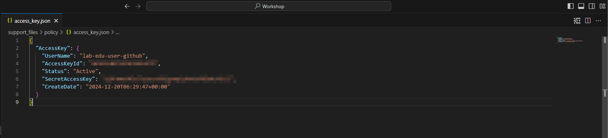

#### 1.3 CodeDeploy용 IAM Role 생성

- VS Code Terminal 접속 → Project 디렉토리 이동

  ```bash
  cd /Workshop
  ```

- IAM Role 생성 명령어 실행

  ```bash
  aws iam create-role --role-name lab-edu-role-codedeploy --assume-role-policy-document file://support_files/policy/codedeploy_trust_policy.json
  ```

- IAM Role에 정책 할당 명령어 실행

  ```bash
  aws iam attach-role-policy --role-name lab-edu-role-codedeploy --policy-arn arn:aws:iam::aws:policy/service-role/AWSCodeDeployRole
  ```

- 할당 된 정책 확인 명령어

  ```bash
  aws iam list-attached-role-policies --role-name lab-edu-role-codedeploy
  ```

### 2. 개인용 GtiHub 계정에 Repository 생성

- 개인 GitHub 계정 로그인 → `Repositories` 탭 → `New` 버튼 클릭

  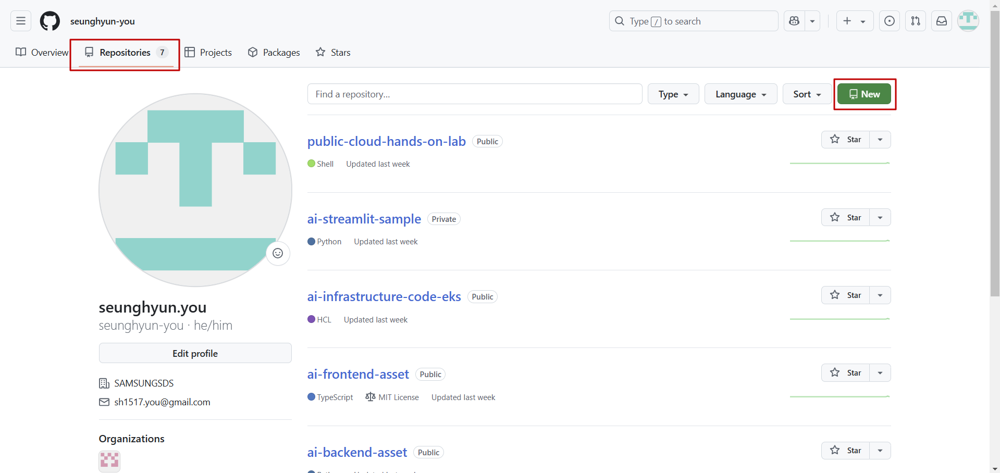

- Repository name: `cloud-wave` 입력 → `Create repository` 버튼 클릭

  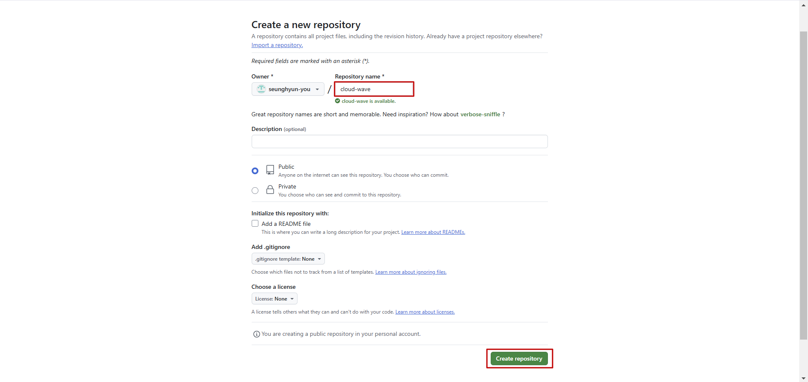

### 3. VS Code IDE 서버 Local Repository와 GitHub Repository 연동

- VS Code IDE Terminal 화면 이동
 
- Git Local 저장소 초기화

  ```bash
  git init
  git branch -M main
  ```

- Remote Repository(GitHub) 등록

  ```bash
  git remote add origin https://github.com/seunghyun-you/cloud-wave.git
  ```

- Source Code 배포

  ```bash
  git add .
  git commit -m "first commit"
  git push -u origin main
  ```

### 4. GitHub Repository 설정

#### 4.1 Access Key 등록

- 개인 GitHub Repository 접속 → `Settings` 탭 → `Secrets and variables` 선택 → `Actions` 선택 → `New repository secret` 버튼 클릭

  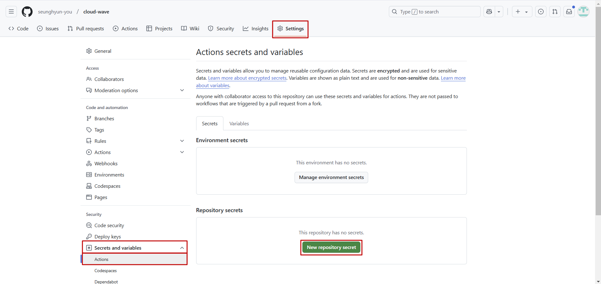

- Access key 정보 입력 → `Add secret` 버튼 클릭

  - Name: AWS_ACCESS_KEY

  - Secret: [AWS_ACCESS_KEY_VALUE]

    > `~/.ssh/access_key.json` 파일을 복사해서 붙여넣기

    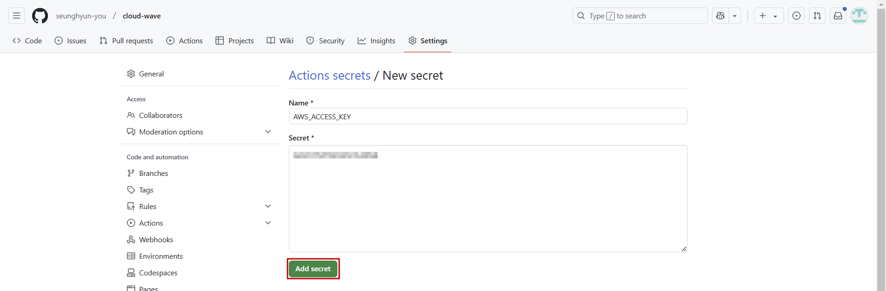

- Sccess key 정보 입력 → `Add secret` 버튼 클릭

  - Name: AWS_SECRET_KEY

  - Secret: [AWS_SECRET_KEY_VALUE]

<br>


## CodeDeploy 생성

### 1. CodeDeploy Application 생성

- **CodeDeploy 콘솔 메인 화면 → `애플리케이션` 탭 → `애플리케이션 생성` 버튼 클릭**

  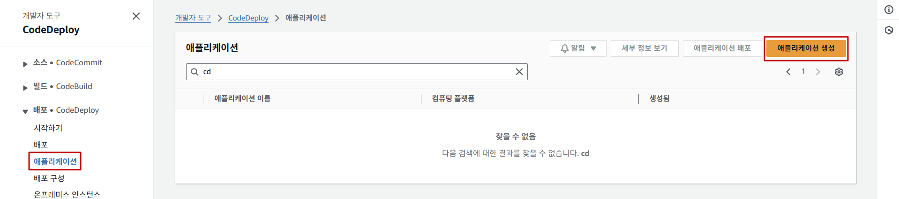

- Application 생성 정보 입력

  - 애플리케이션 이름: lab-edu-cd-application-streamlit

  - 컴퓨팅 플랫폼: EC2/온프레미스

    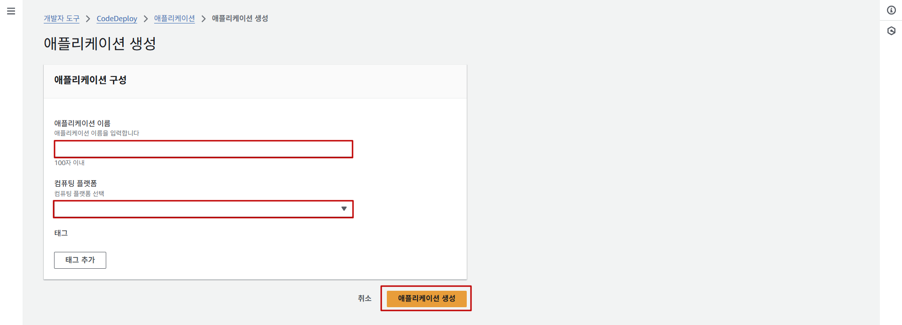

- `배포 그룹 생성` 버튼 클릭

  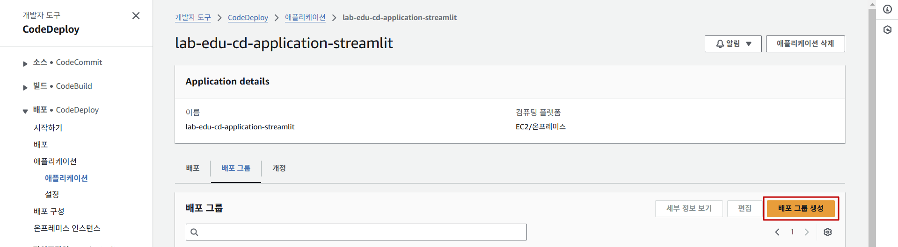

- 배포 그룹 생성 정보 입력

  - 배포 그룹 이름: lab-edu-cd-deploygroup

  - 서비스 역할: lab-edu-role-codedeploy

    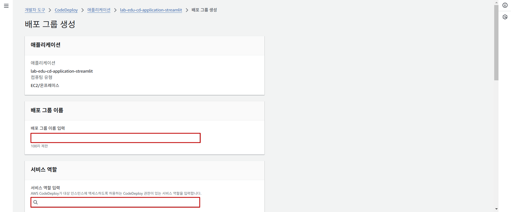

  - `Amazon EC2 인스턴스` 체크

  - 키: Name

  - 값: lab-edu-ec2-web

    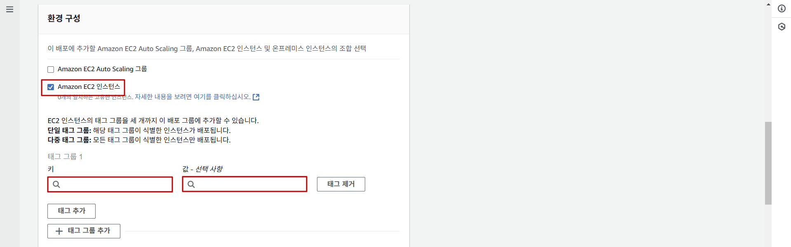

  - 기본 스케줄러 값 : 1일

    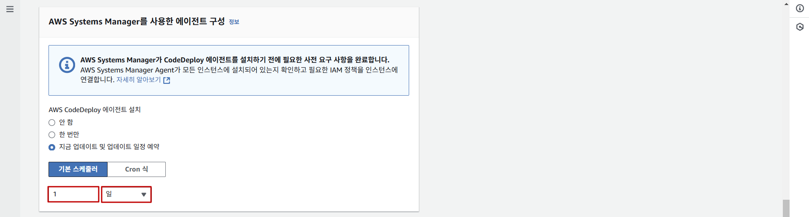

  - `로드 밸런싱 활성화` 체크 해제 → `배포 그룹 생성` 버튼 클릭

    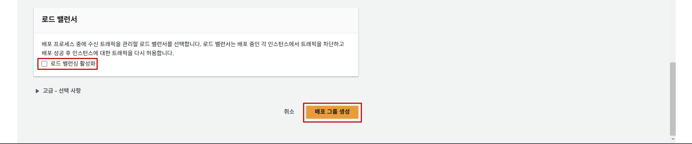

<br>


## CodeDeploy Agent 설정

### 1. CodeDeploy Agent 설치

- VS Code IDE Terminal 접속 → SSH 명령어 실행

    ```bash
    ssh web-server
    ```

- 관련 패키지 다운로드

    ```bash
    sudo yum update -y && sudo yum install ruby -y && sudo yum install wget -y
    ```

- CodeDeploy Agent 설치 프로그램 다운로드

    ```bash
    wget https://aws-codedeploy-ap-northeast-2.s3.ap-northeast-2.amazonaws.com/latest/install
    ```

- 설치 파일 실행 권한 할당

    ```bash
    chmod +x ./install
    ```

- 설치 파일 이용 최신 버전 설치 

    ```bash
    sudo ./install auto
    ```

- CodeDeploy Agent 서비스 실행 및 상태 확인 명령

    ```bash
    systemctl status codedeploy-agent   # sudo service codedeploy-agent status
    systemctl start codedeploy-agent    # sudo service codedeploy-agent start
    ```

<br>


## GitHub Actions 설정

### 1. GitHub Actions 코드 구성

- VS Code IDE 접속

- `New Folder` 버튼 클릭

  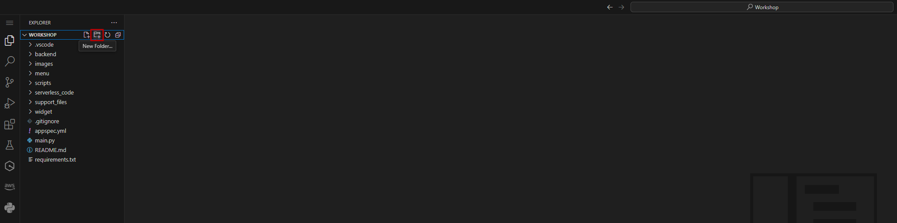

- 폴더명 입력: .github/workflows

  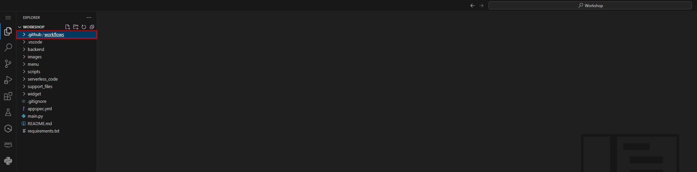

- `.github` 클릭 → `workflows` 클릭 → `New Files` 클릭 → 파일명 입력: streamlit.yml

  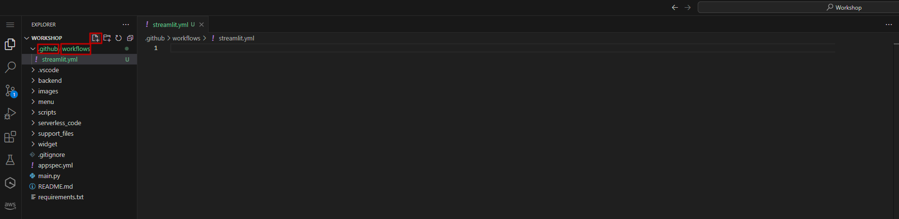

- `streamlit.yml` 파일에 CI Code 입력

  ```yaml
  name: Streamlit CI

  on:
    push:
      branches: [ "main" ]

  env:
    AWS_REGION: ap-northeast-2

  jobs:
    build-and-test:
      runs-on: ubuntu-latest
      strategy:
        max-parallel: 4
        matrix:
          python-version: [3.11]
      steps:
      - uses: actions/checkout@v3
      - name: Set up Python ${{ matrix.python-version }}
        uses: actions/setup-python@v3
        with:
          python-version: ${{ matrix.python-version }}
      - name: Install Dependencies
        run: |
          python -m pip install --upgrade pip
          pip install -r requirements.txt
      - name: Test with pytest
        run: |
          pip install pytest
          pytest --collect-only || true

    core-realese:
      needs: build-and-test
      runs-on: ubuntu-latest
      steps:
        # Step 1
        - name: Configure AWS credentials
          uses: aws-actions/configure-aws-credentials@v3
          with:
            aws-access-key-id: ${{ secrets.AWS_ACCESS_KEY }}
            aws-secret-access-key: ${{ secrets.AWS_SECRET_KEY }}
            aws-region: ${{ env.AWS_REGION }}

        # Step 2
        - name: Create CodeDeploy Deployment
          id: deploy
          run: |
            aws deploy create-deployment \
              --application-name lab-edu-cd-application-streamlit \
              --deployment-group-name lab-edu-cd-deploygroup \
              --deployment-config-name CodeDeployDefault.OneAtATime \
              --github-location repository=${{ github.repository }},commitId=${{ github.sha }}
  ```

### 2. GitHub Actions YAML Code 

- VS Code IDE Terminal 접속

- GitHub로 GitHub Actions YAML Code 배포

  ```bash
  git add .
  git commit -m "create github actions yaml code"
  git push
  ```

- 개인 GitHub Repository 접속 → `Actions` 탭 → `create github actions yaml code` 선택

  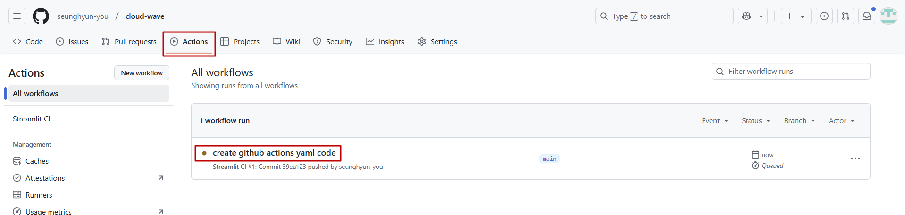

- `build-and-test`, `core-realese` Job의 Success 확인

  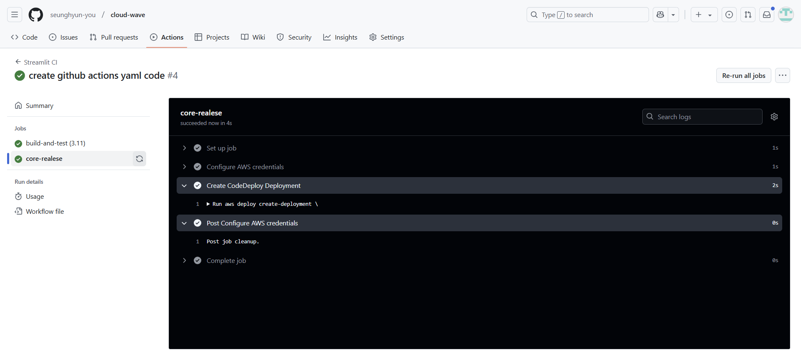

- **CodeDeploy 콘솔 메인 화면 → `배포` 탭 → 배포 내역에 상태 값이 `성공`으로 반영 되었는지 확인**

  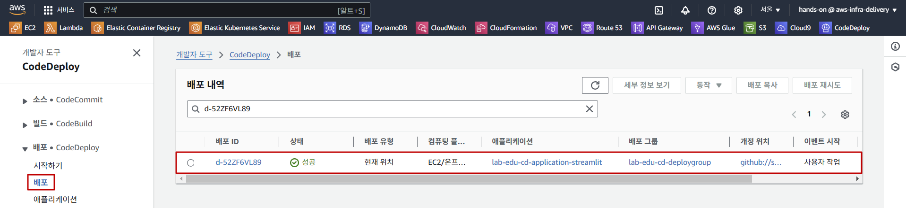

- VS Code IDE Terminal 접속 → SSH 명령어 실행

  > 💡 서버에 코드 배포가 잘 진행되었는지 확인하기 위해 접속 후 CodeDeploy Agent 로그를 확인한다.

  ```bash
  ssh web-server
  ```

- 로그 파일 확인 `/opt/codedeploy-agent/deployment-root/deployment-logs/codedeploy-agent-deployments.log`

  > 💡 AWS Console에서 CodeDeploy 배포 탭에서 확인한 `배포 ID`와 아래의 로그 파일에 확인되는 `배포 ID`를 확인해서 실제로 start script가 실행 됐음을 확인한다.

  ```bash
  vim /opt/codedeploy-agent/deployment-root/deployment-logs/codedeploy-agent-deployments.log
  ```

  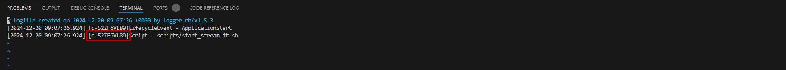