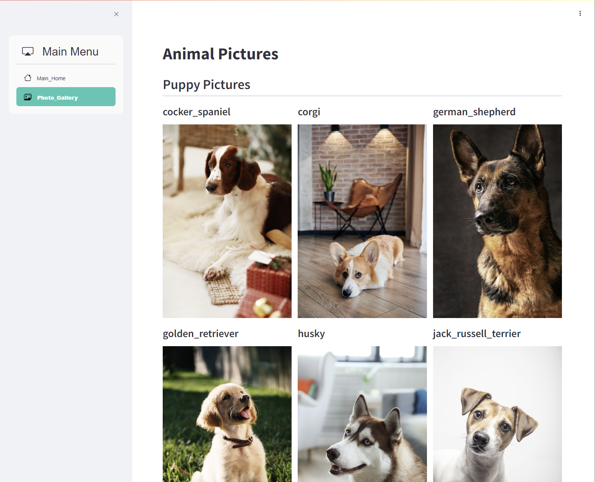
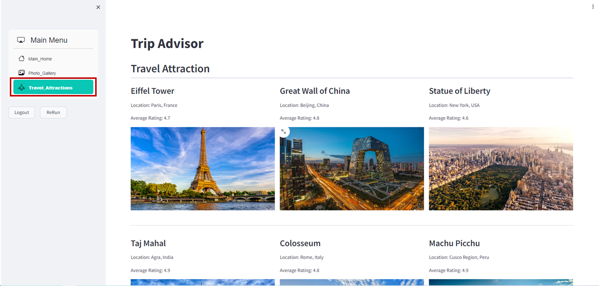

## Table of Contents
- [Table of Contents](#table-of-contents)
- [Application, Amazon S3 연동 코드 배포](#application-amazon-s3-연동-코드-배포)
  - [1. Application 코드 수정](#1-application-코드-수정)
  - [2. Application 테스트](#2-application-테스트)
- [Application, Aurora PostgreSQL 연동 코드 배포](#application-aurora-postgresql-연동-코드-배포)
  - [1. Login 기능 구현을 위한 users 테이블 생성](#1-login-기능-구현을-위한-users-테이블-생성)
  - [2. Streamlit 서비스 Login 기능 활성화](#2-streamlit-서비스-login-기능-활성화)
  - [3. Backend service 설정 및 실행](#3-backend-service-설정-및-실행)
  - [4. 서비스 코드 배포](#4-서비스-코드-배포)
  - [5. 웹 서비스 접속 테스트](#5-웹-서비스-접속-테스트)
- [Travel Attraction Page 생성](#travel-attraction-page-생성)
  - [1. Streamlit 서비스 attraction 페이지 활성화](#1-streamlit-서비스-attraction-페이지-활성화)
  - [3. 서비스 코드 배포](#3-서비스-코드-배포)
  - [4. 웹 서비스 접속 테스트](#4-웹-서비스-접속-테스트)

## Application, Amazon S3 연동 코드 배포

### 1. Application 코드 수정

- VS Code 코드 편집기 실행 → `main.py` 파일 오픈 → 설정 값 수정

    ```python
    def side_bar():
    with st.sidebar.container():
        selected_page = option_menu(
            menu_title="Main Menu", 
            #options=["Main_Home"],                   # 주석처리
            options=["Main_Home", "Photo_Gallery"],   # 주석제거
            # options=["Main_Home", "Photo_Gallery", "Travel_Attractions"],
            icons=['bi bi-house', 'bi bi-images', 'bi bi-airplane-engines'],
            ...
        )
    ```

- Commit → Push

    ```cmd
    git add .
    git commit -m "update main page"
    git push origin main
    ```
    
### 2. Application 테스트

- EC2 접속 정보 확인: 서울 리전 → EC2 콘솔 메인 화면 → `인스턴스` 탭으로 이동 → *lab-edu-ec2-bastion* 선택 → Public IPv4 주소 복사

- Web Service 접속 테스트 → `Photo_Gallery` 페이지 활성화 확인

    

<br>


## Application, Aurora PostgreSQL 연동 코드 배포

### 1. Login 기능 구현을 위한 users 테이블 생성 

- VS Code IDE 접속 → PostgreSQL `trip_advisor` 데이터베이스 접속

  ```bash
  psql –U user –d trip_advisor –h {RDS_AURORA_ENDPOINT}   # 앞에서 메모장에 저장한 RDS Aurora 엔드포인 정보 입력
  Password for user user: {RDS_AURORA_PASSWORD}           # 생성과정에 입력했던 패스워드 입력
  ```

- VS Code IDE → SQL Query Sample 파일 열기 (`support_files/sql_query/create_users_teabl.sql`) → 내용 복사 → 붙여넣기

  - 테이블 생성 Query

      ```sql
      CREATE TABLE users (
          id SERIAL PRIMARY KEY,
          username VARCHAR(50) UNIQUE NOT NULL,
          email VARCHAR(255) UNIQUE NOT NULL,
          password VARCHAR(255) NOT NULL
      );
      ```

  - 데이터 입력 Query

      ```sql
      INSERT INTO users (username, email, password) 
      VALUES ('user', 'user@admin.abc', 'qwer1234');
      ```

### 2. Streamlit 서비스 Login 기능 활성화

- VS Code 코드 편집기 실행 → `main.py` 파일 오픈 → 설정 값 수정

    ```python
    if 'logged_in' not in st.session_state:
    # st.session_state['logged_in'] = True          # 주석처리
    # RDS Database Login Session / Login Function
    st.session_state['logged_in'] = False           # 주석제거
    ```

    ```python
    def side_bar():

        ...

        col1, col2, col3 = st.columns(3)                        #주석해제
        with col1:                                              #주석해제
            # RDS Database Login Session / Logout Function      #주석해제     
            if st.button('Logout', use_container_width=True):   #주석해제
                st.session_state['logged_in'] = False           #주석해제
                st.rerun()                                      #주석해제
        with col2:                                              #주석해제
            if st.button('ReRun', use_container_width=True):    #주석해제
                st.rerun()                                      #주석해제
    ```

### 3. Backend service 설정 및 실행

- VS Code 코드 편집기 → `backend/db_connection.py` 파일 오픈 → 설정 값 수정

    ```python
    def get_db_connection():
    conn = psycopg2.connect(
        host='localhost',           # localhost → {RDS_AURORA_ENDPOINT} 정보로 변경
        database='trip_advisor',
        user='user',
        password='qwer1234'
    )
    return conn
    ```

- VS Code 코드 편집기 → `appspec.py` 파일 오픈 → 설정 값 수정

  ```yaml
  version: 0.0
  os: linux
  files:
  - source: /
      destination: /root/streamlit-project
      runas: root
  file_exists_behavior: OVERWRITE
  hooks:
  ApplicationStop:
      # - location: scripts/stop_streamlit.sh     #주석처리
      - location: scripts/stop_applications.sh    #주석해제
  ApplicationStart:
      # - location: scripts/start_streamlit.sh     #주석처리
      - location: scripts/start_applications.sh    #주석해제
  ValidateService:
    - location: scripts/finish_streamlit.sh
  ```

### 4. 서비스 코드 배포 

- VS Code Termainal → Commit → Push

    ```cmd
    git add .
    git commit -m "update login function"
    git push origin main
    ```

### 5. 웹 서비스 접속 테스트

- EC2 접속 정보 확인: 서울 리전 → EC2 콘솔 메인 화면 → `인스턴스` 탭으로 이동 → *lab-edu-ec2-bastion* 선택 → Public IPv4 주소 복사

- Web Service 접속 테스트 (ID: `user` / PW: `qwer1234`)

    

<br>


## Travel Attraction Page 생성

### 1. Streamlit 서비스 attraction 페이지 활성화

- VS Code 코드 편집기 실행 → `main.py` 파일 오픈 → 설정 값 수정

    ```python
    def side_bar():
    with st.sidebar.container():
        selected_page = option_menu(
            menu_title="Main Menu", 
            # options=["Main_Home"],                   
            # options=["Main_Home", "Photo_Gallery"],                       # 주석처리
            options=["Main_Home", "Photo_Gallery", "Travel_Attractions"],   # 주석제거
            icons=['bi bi-house', 'bi bi-images', 'bi bi-airplane-engines'],
            ...
        )
    ```

### 3. 서비스 코드 배포 

- VS Code Termainal → 소스코드 Commit → Push

    ```cmd
    git add .
    git commit -m "update login function"
    git push origin main
    ```

### 4. 웹 서비스 접속 테스트

- EC2 접속 정보 확인: 서울 리전 → EC2 콘솔 메인 화면 → `인스턴스` 탭으로 이동 → *lab-edu-ec2-bastion* 선택 → Public IPv4 주소 복사

- Web Service 접속 테스트 → `Travel_Attractions` 페이지 활성화 확인

    


